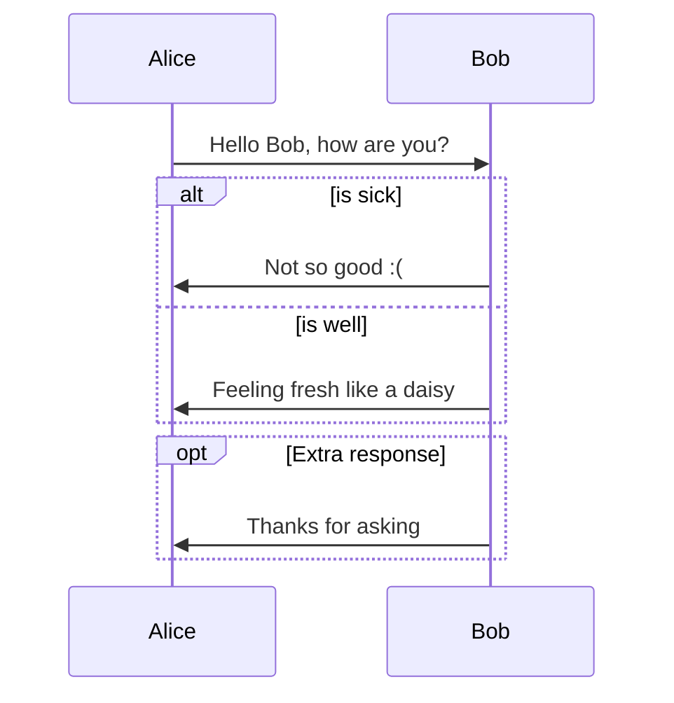
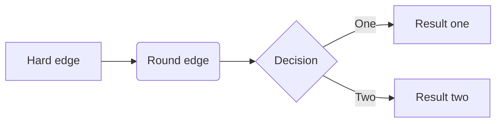
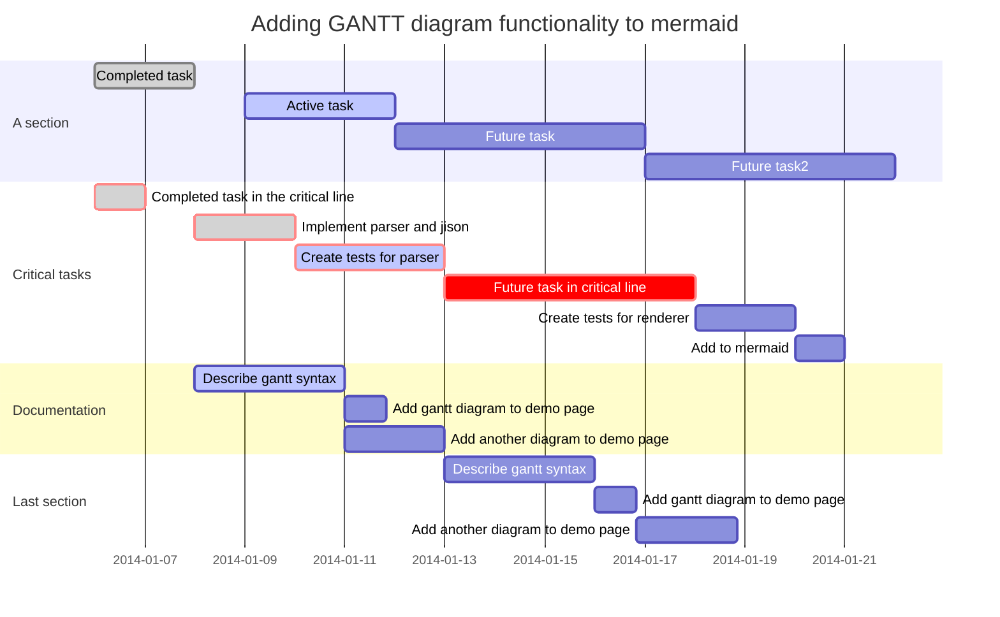
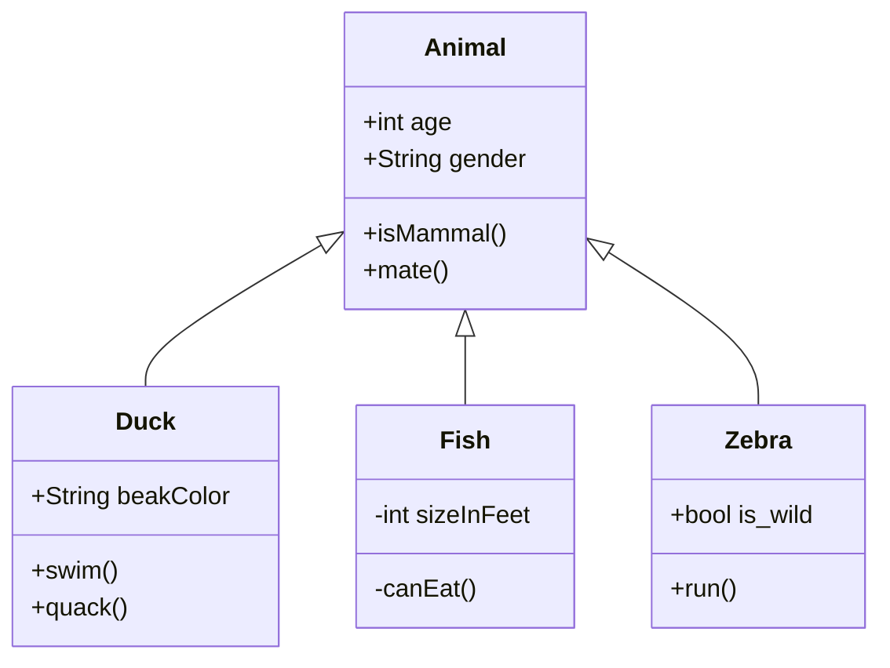
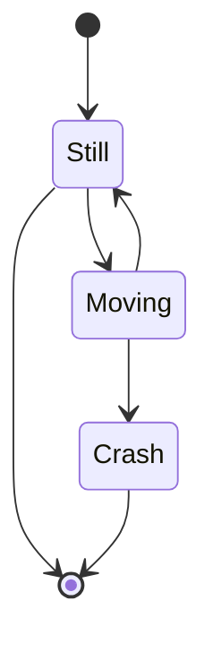
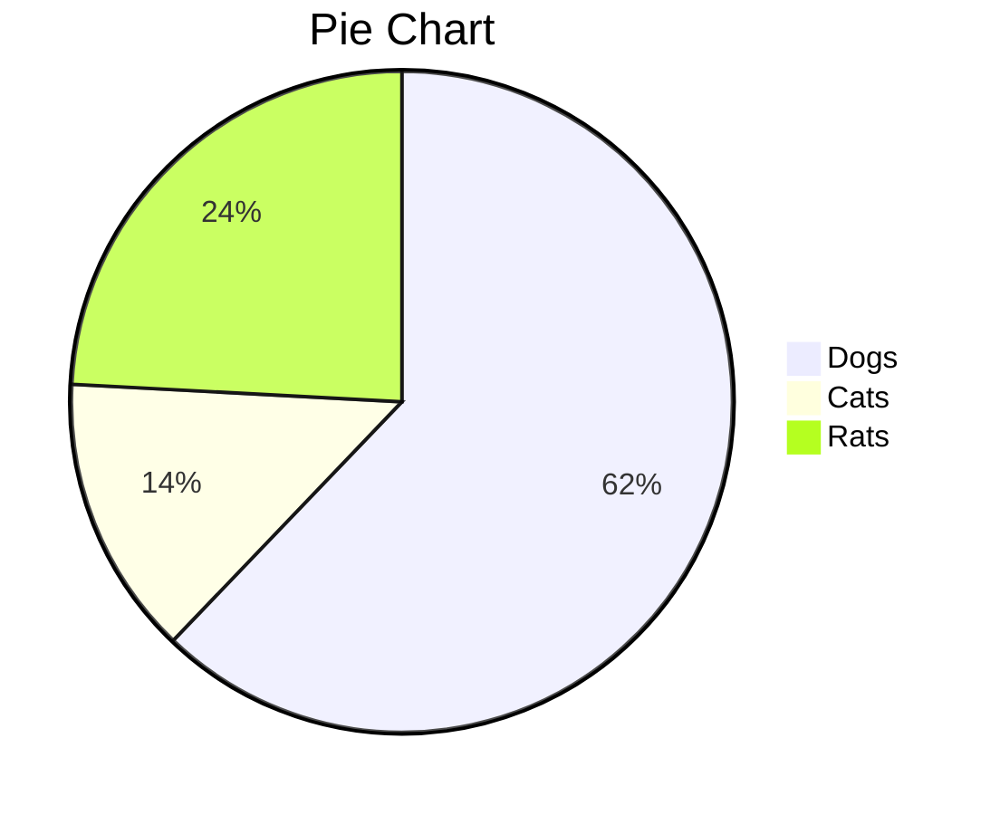

# Typora的Markdown用法

## 概述

**Markdown**由[Daring Fireball](http://daringfireball.net/)开发的; 原版的指导用法在[这里](http://daringfireball.net/projects/markdown/syntax). 实际上, 不同的语法解析引擎或编辑器采用不同的Markdown语法. **Typora**使用Github Flavored Markdown.

[toc]

## 1.Block Elements

### 段落和换行Paragraph and line breaks

段落, 就是一行或者多行连续的文本. 在Markdown源码中, 段落要被两行以上的空行分隔. 在Typora中, 你只需一个空行(按一下`回车Return`)就能创建新段落.

按下`shift`+`回车`可以换行(**line break**). 而普遍的markdown解析引擎会忽略单一的换行; 想让其他解析引擎识别换行, 需要在文本行后面加上两个空格,  或者只插入一个`<br/>`.

### 标题Headers

在一行的开头使用1~6个井号(`#`), 创建不同级别的标题. 例如:

```markdown
# This is an H1

## This is an H2

###### This is an H6
```

### 引用块Blockquotes

使用`>`符号表示引用块. 例如

```markdown
> This is a blockquote with two paragraphs. This is first paragraph.
>
> This is second pragraph. Vestibulum enim wisi, viverra nec, fringilla in, laoreet vitae, risus.


> This is another blockquote with one paragraph. There is three empty line to seperate two blockquote.
```

### 列表

使用`*`+空格表示无序列表, 可以使用`+`或`-`代替`*`;

使用`1.`+ 空格表示有序列表; 源码如下:

```markdown
## un-ordered list
*   Red
*   Green
*   Blue

## ordered list
1.  Red
2. 	Green
3.	Blue
```

### 任务列表

在无序列表中后接`[ ]`或`[x]`, 可以表示任务列表; 如

```markdown
- [ ] a task list item
- [ ] list syntax required
- [ ] normal **formatting**, @mentions, #1234 refs
- [ ] incomplete
- [x] completed
```

### 代码块

Github Flavored Markdown支持代码块. 原始的markdown语法并不支持.

使用代码块: 输入\`\`\`, 然后回车即可. 也可以在\`\`\`后加上使用语言的名字, Typora会进行语法高亮. 源码如:

```markdown
Here's an example:

​```
function test() {
  console.log("notice the blank line before this function?");
}
​```

syntax highlighting:
​```ruby
require 'redcarpet'
markdown = Redcarpet.new("Hello World!")
puts markdown.to_html
​```
```


### 数学式

Typora使用**MathJax**引擎渲染*LaTex*数学表达式.

想要添加数学表达式, 输入`$$`, 然后回车; 随后触发一个输入区域, 接受*Tex/LaTex*源码. 如:
$$
\mathbf{V}_1 \times \mathbf{V}_2 =  \begin{vmatrix}
\mathbf{i} & \mathbf{j} & \mathbf{k} \\
\frac{\partial X}{\partial u} &  \frac{\partial Y}{\partial u} & 0 \\
\frac{\partial X}{\partial v} &  \frac{\partial Y}{\partial v} & 0 \\
\end{vmatrix}
$$
markdown源码如下:

```markdown
$$
\mathbf{V}_1 \times \mathbf{V}_2 =  \begin{vmatrix}
\mathbf{i} & \mathbf{j} & \mathbf{k} \\
\frac{\partial X}{\partial u} &  \frac{\partial Y}{\partial u} & 0 \\
\frac{\partial X}{\partial v} &  \frac{\partial Y}{\partial v} & 0 \\
\end{vmatrix}
$$
```

更多内容请参考[https://support.typora.io/Math/](https://support.typora.io/Math/)

### 表格

 输入`|First Header| Second Header|`, 然后回车, 将会创建一个两行的表格.

然后, 在表格上有一个工具栏, 你可以使用相应按钮调整, 对齐和删除表格.如下:

| First Header | Second Header |
| ------------ | ------------- |
| Content Cell | Content Cell  |
| Content Cell | Content Cell  |

完整的源码如下:

```markdown
| First Header  | Second Header |
| ------------- | ------------- |
| Content Cell  | Content Cell  |
| Content Cell  | Content Cell  |
```

### 脚注

```markdown
你可以这样创建一个脚注[^脚注].

[^脚注]: 这里是一些关于脚注的文本
```

上面圆面的效果如下:

你可以这样创建一个脚注[^脚注].

[^脚注]: 这里是一些关于脚注的文本

鼠标停留在`脚注`上标, 会显示关于脚注的内容.

### 水平线

输入`***`或`---`后按回车

***

###  YAML Front Matter

Typora支持 [YAML Front Matter](http://jekyllrb.com/docs/frontmatter/). 在本文的最顶部输入`---`, 然后按回车键; 这将会触发一个输入区域, 你可以从Typora的菜单栏中插入元数据块.

### 目录Table of Contents

输入`[toc]`然后按回车; Typora将会自动生成并维护该目录

## 2.Span Elements

### 链接Links

Markdown支持两类链接: 行内链接和引用链接.

#### 行内链接Inline Links

形式: `[link name](link)`, `[link name](link "title")`; 例子如下:

```markdown
This is [an example](http://example.com/ "Title") inline link.

[This link](http://example.net/) has no title attribute.
```

效果如下:

This is [an example](http://example.com/ "Title") inline link. 

[This link](http://example.net/) has no title attribute. 

#### 引用链接Reference Links

两种形式: 

* `[name][id]`+`[id]: URL "Optional title"`; 

* `[name][]`+`[name]: URL "Optional title"`

例子如下:

```markdow
This is [an example][id] reference-style link.

Then, anywhere in the document, you define your link label on a line by itself like this:

[id]: http://example.com/  "Optional Title Here"

[Google][]
And then define the link:

[Google]: http://google.com/
```

效果如下:

This is [an example][id] reference-style link.

Then, anywhere in the document, you define your link label on a line by itself like this:

[id]: http://example.com/  "Optional Title Here"

[Google][]
And then define the link:

[Google]: http://google.com/

### 内部链接Internal Links

可以设置指向标题的链接

形式:

* `[name](#header)`
  * `[指向本节](#内部链接Internal Links)`: [指向本节](#内部链接Internal Links)
  * `[指向上小节](#引用链接Reference Links)`:[指向上小节](#引用链接Reference Links)

### URLs

可以直接插入URLs作为链接

形式:  `<URL>`;

	* 邮件: `<name@mail.com>`, <name@mail.com>
 * 网站: `<www.bing.com>`, <www.bing.com>
 * 文件:`<C:\>`, <C:\>

### 图片

形式: ``

可以直接将图片拖入

更多细节: <https://support.typora.io/Images/>

### 标记和文本

| 源码         | 作用 |   效果   |
| :----------- | :--: | :------: |
| \*text\*     | 斜体 |  *text*  |
| \_text\_     | 斜体 |  _text_  |
| \*\*text\*\* | 粗体 | **text** |
| \_\_text\_\_ | 粗体 | __text__ |
| \`text\`     |      |  `text`  |
| \~\~text\~\~|删除线|~~test~~|
| \<u\>text\</u\> |下划线|<u>text</u>|

### 表情Emoji:smile:

Input emoji with syntax `:smile:`.

User can trigger auto-complete suggestions for emoji by pressing `ESC` key, or trigger it automatically after enabling it on preference panel. Also, inputting UTF-8 emoji characters directly is also supported by going to `Edit` -> `Emoji & Symbols` in the menu bar (macOS).

### 行内数学公式

To use this feature, please enable it first in the `Preference` Panel -> `Markdown` Tab. Then, use `$` to wrap a TeX command.

For example: `$\lim_{x \to \infty} \exp(-x) = 0$`: $\lim_{x \to \infty} \exp(-x) = 0$$

### 下标

To use this feature, please enable it first in the `Preference` Panel -> `Markdown` Tab. Then, use `~` to wrap subscript content. For example: `H~2~O`, `X~long\ text~`

H~2~O,  X~long\ text~

### 上标

To use this feature, please enable it first in the `Preference` Panel -> `Markdown` Tab. Then, use `^` to wrap superscript content. For example: `X^2^`.
X^2^

### 高亮

To use this feature, please enable it first in the `Preference` Panel -> `Markdown` Tab. Then, use `==` to wrap highlight content. For example: `==highlight==`.

==highlight==

### 图

[在线教程](https://support.typora.io/Draw-Diagrams-With-Markdown/)

#### 顺序图Sequence Diagrams

This feature uses [js-sequence](https://bramp.github.io/js-sequence-diagrams/), which turns the following code block into a rendered diagram

~~~sequence
Alice->Bob:Hello Bob, how are you?
Note right of Bob : Bob thinks
Bob-->Alice: I am good thanks!
~~~

#### 流程图Flowcharts

This feature uses [flowchart.js](http://flowchart.js.org/), which turns the following code block into a rendered diagram

```flow
st=>start: Start
op=>operation: Your Operation
cond=>condition: Yes or No?
e=>end

st->op->cond
cond(yes)->e
cond(no)->op
```

### Mermaid

Typora also has integration with [mermaid](https://knsv.github.io/mermaid/#/), which supports sequence diagrams, flowcharts, Gantt charts, class and state diagrams, and pie charts.

#### Sequence Diagrams

For more details see [these instructions](https://mermaid-js.github.io/mermaid/#/sequenceDiagram).



#### Flowcharts

For more details see [these instructions](https://mermaid-js.github.io/mermaid/#/flowchart).



#### Gantt Charts

For more details see [these instructions](https://mermaid-js.github.io/mermaid/#gantt).



#### Class Diagrams

For more details see [these instructions](https://mermaid-js.github.io/mermaid/#/classDiagram).



#### State Diagrams

For more details see  [these instructions](https://mermaidjs.github.io/#/stateDiagram).



#### Pie Charts



## HTML

You can use HTML to style content what pure Markdown does not support. For example, use `<span style="color:red">this text is red</span>` to add text with red color.

### Embed Contents

Some websites provide iframe-based embed code which you can also paste into Typora. For example:

```Markdown
<iframe height='265' scrolling='no' title='Fancy Animated SVG Menu' src='http://codepen.io/jeangontijo/embed/OxVywj/?height=265&theme-id=0&default-tab=css,result&embed-version=2' frameborder='no' allowtransparency='true' allowfullscreen='true' style='width: 100%;'></iframe>
```

### Video

You can use the `<video>` HTML tag to embed videos. For example:

```Markdown
<video src="xxx.mp4" />
```

### Other HTML Support

You can find more details [here](https://support.typora.io/HTML/).

[GFM]: https://help.github.com/articles/github-flavored-markdown/