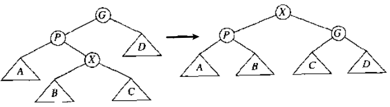
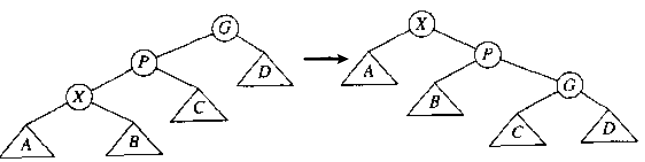

# 总结

* 树
* 二叉查找树
* 树如何用于实现操作系统的文件系统

[toc]

# 4.1 预备知识

树的递归定义

* 一棵树(A tree)是节点的集合
* 该集合可以为空, 可以不为空; 若非空, 该集合由一个根(root)节点和零或多个非空的子树组成
  * 这些子树中的根节点通过一条有向边与父树的根节点连接

由递归定义可得:

* 若一颗树有n个节点, 那么其中一个节点是根节点, 有n-1个子节点和n-1条边

名词解释

* 树叶(leaf): 没有子节点的节点
* 兄弟(sibling): 具有相同父节点的节点

* 路径(path): 节点序列$n_1, n_2, ..., n_k$; 对于$1 \le i \lt k$, $n_i$是$n_{i+1}$的父节点

* 路径的长度(length): 该路径上的边的数量
  * 若路径有$k$个节点, 则长度为$k-1$
  * 从每个节点到它自己有一条长为0的路径
* 内部路径长度(internal path length): 所有节点的深度之和
* 节点的深度(depth): 从根节点到该节点的路径长度
  * 根节点的深度为0
* 节点的高度(height): 从该节点到最远叶节点的路径长度
  * 所有叶节点的高度为0
* 树的高度: 树的根节点的高度, 等于最深的叶节点的深度

* 祖先(ancestor)与后裔(descendant): 对于从$n_1$到$n_2$的路径, $n_1$是$n_2$的祖先, $n_2$是$n_1$的后裔
  * 若$n_1 \ne n_2$,  $n_1$是$n_2$的真祖先(proper ancestor), $n_2$是$n_1$的后裔(proper descendant)

## 树的实现

一种实现

```c
typedef struct TreeNode *PtrNode;
struct TreeeNode
{
    ElementType Element;
    PtrToNode FirstChild;
    PtrToNode NextSibling;
};
```

## 树的遍历及应用

树的应用之一: 许多常用的操作系统中的目录结构

# 4.2 二叉树

二叉树的特点

* 每个节点至多有两个子节点

二叉树的性质: 若二叉树有$N$个节点

* 二叉树的平均深度是$O(\sqrt{N})$
* 二叉树的特殊类型--二叉查找树, 的平均深度是$O(\log_2 N)$
* 二叉树的最大深度(最坏情况)是$N-1$

## 二叉树的实现

```c
typedef struct TreeNode *PtrToNode;
typedef struct PtrToNode Tree;

struct TreeNode
{
    ElementType Element;
    Tree Left;
    Tree Right;
};
```

## 二叉树的应用

二叉查找树

表达式树(expression tree); 用于编译器设计

# 4.3 查找树ADT-二叉查找树

二叉查找树, 是二叉树的一种重要应用

* 对于每个节点, 其左子树中所有节点的键值都小于该节点的键值, 右子树的都大于该节点的键值
* 假设所有二叉查找树出现的可能性相等, 所有节点的平均深度是$O(\log_2 N)$

算法分析

* 除了插入操作和删除操作外, 其他所有操作都是$O(\log_2 N)$

## 删除操作

```c
SearchTree Delete(ElementType X, SearchTree T)
{
  Position TmpCell;
  if (T != NULL){
    Error("Element not found");
  } else if (X < T->Element) {
    T->Left = Delete(X, T->Left);
  } else if (X > T->Element) {
    T->Right = Delete(X, T->Right);
  } else if (T->Left && T->Right) { // T有两个子树的情况
    TmpCell = FindMin(T->Right);
    T->Element = TmpCell->Element;
    T->Right = Delete(T->Element, T->Right);
  } else { // T有一个或零个子树的情况
    TmpCell = T;
    if (T->Left == NULL) // 同时处理有一个右子树和没有子树这两种情况
      T = T->Right;
    else if (T->Right == NULL)
      T = T->Left;
    free(TmpCell);
  }
  return T;
}
```

# 4.4 AVL树

> AVL, 是Adelson, Velskii和Landis的缩写

AVL树, 是带有平衡条件的二叉查找树

* 平衡要求
  * 对于每个节点, 其左右子树的高度之差最多为1
  * 空树的高度, 被定义为-1
* 树的深度是$O(\log_2 N)$

旋转操作(rotation) : 用于恢复平衡

* 执行旋转操作后, 树的高度维持不变

* 两类操作: 
  * 单旋转(single rotation) 
  * 双旋转(double rotation)

# 4.5 伸展树Splay Tree

前提

* 对于二叉查找树来说, 只要相对不常发生的话, 每次操作在最坏情况下的运行时间$O(N)$是可以接受的; 而且, 对于任一访问操作来说, 即使花费$O(N)$, 可能仍然很快
* 二叉查找树的主要问题是: 可能(并不少见地)出现一系列访问操作, 而这些访问操作花费$O(N)$

伸展树

* 要求
  * 允许任一特定操作有$O(N)$最坏情况时间边界
  * 每次操作的摊还时间是$O(\log_2 N)$
* 基本思路: 只要某一节点被访问, 必须移动该节点
  * 当某一节点被访问后, 在访问路径上执行一系列的AVL树旋转操作, 将其移到树的根部
  * 在这一系列操作中重组树的结构

算法分析:

* 从一个空的伸展树开始, 对该树连续进行$M$次操作, 至多消耗$O(M\log_2 N)$时间
* 在最坏情况下, 单个操作可能会消耗$O(N)$时间
* 每次操作的摊还时间为$O(\log_2 N)$

摊还运行时间(amortized running time)

* 若$M$次操作的操作序列在最坏情况下的总运行时间为$O(MF(N))$, 则每次操作的摊还运行时间为$O(F(N))$

## 伸展操作

假设$X$是一个非根部的节点, 它在需要旋转操作的访问路径上

* 若$X$的父节点是该树的根节点, 则只需旋转$X$和根节点
* 否则, $X$有一个父节点$P$和一个祖父节点$G$; 此时有两种情况
  * zig-zag(之字形)情况: 执行AVL的双旋转操作
    * 
  * zig-zig(一字形)情况: 进行下图转换
    * 

作用:

* 将被访问的节点移到根部
* 将访问路径上的大部分节点的深度大约减少一半; 将某些浅节点最多向下移动两个层次

# 4.6 树的遍历

四种遍历策略

* 中序(inorder)遍历: 左子树, 当前节点, 右子树
* 后序(postorder)遍历: 左右子树, 当前节点
* 先序(preorder)遍历: 当前节点, 左右子树
* 层序(level-order)遍历: 先处理深度为$D$的节点, 再处理深度为$D+1$的节点

层序遍历不是递归进行的, 它使用队列; 其余三种遍历递归进行, 使用栈;

# 4.7 B树

阶为$M$的B树是一颗具有以下结构特性的树
* 根节点要么是叶节点(没有子节点), 要么有2至$M$个子节点
* 除了根节点外, 所有非叶节点的节点有$\lceil M/2 \rceil$至$M$个子节点
* 所有叶节点的深度相同

B树的一种定义

* 所有数据储存在叶节点中

* 每个内部节点(即非叶节点)中包含指向子节点的指针$P_1, P_2,..., P_M$, 和对应的子树中最小键值$k_1, k_2,..., k_3$
  * 当指针为NULL时, 对应的$k_i$是未定义的
* 对于所有节点, 子树$P_i$的所有键值都小于子树$P_{i+1}$

算法分析

* M阶的B树的深度至多为$\lceil \log_{\lceil M/2 \rceil}N \rceil$
* 在路径上的每个节点, 需要$O(\log_2 M)$时间以确定选择哪个分支; (通常使用二分查找)
* 插入操作和删除操作需要$O(M)$时间以调整该节点的所有信息
  * 因此, 每次插入和删除操作在最坏情况下的运行时间是$O(M\log_MN) = O((M/\log_2 M)\log_2 N)$
* 访问操作需要$O(\log_2 N)$时间来完成

说明

* 经验表明, 就运行时间而言, $M$最好为3或4

* 4阶B树, 也称为2-3-4树; 3阶B树, 也称为2-3树

B树与数据库

* B树的实际用途在于数据库系统; 在数据库系统中, B树被存储在物理磁盘上, 而不是主存中
* 此时, $M$值的选择为使得一个内部节点仍然能够装入一个磁盘区块的最大值, 通常范围是$32 \le M \le 256$
* 原因:
  * 对磁盘的访问要比任何的主存操作慢几个数量级; 应该尽量减少访问磁盘的次数
    * 只要$M$选择得合理, 磁盘访问所需的时间$O(\log_2 M)$和更新所需的时间$O(M)$, 相对而来说比磁盘访问时间快
  * 如果叶节点是满的, 它可以装满磁盘的一个区块; 这使得在很少的磁盘访问中找到所需的记录
    * 因为典型的B树的深度只有2或3, 而根(可能还有树的第一层)可以放在主存中