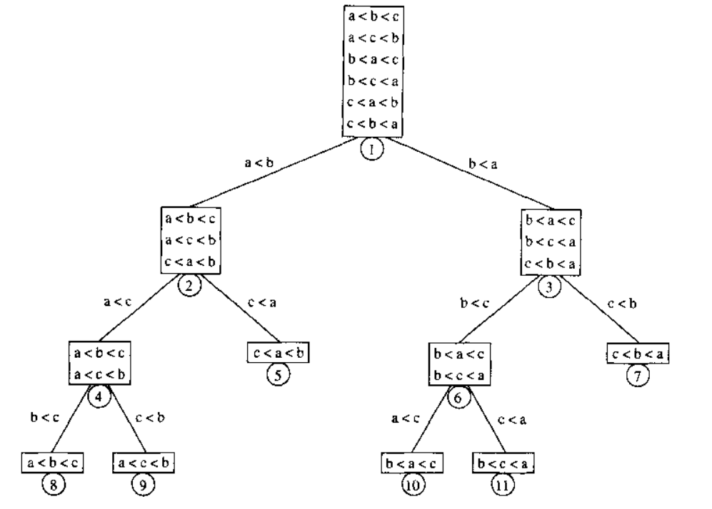

# 总结

* 外部排序(external sorting): 整个待排序列不能够放在主存中
* 内部排序(internal sorting): 整个待排序列能够放在内存中
  * 几种简单的$O(N^2)$的算法
  * 希尔排序, $o(N^2)$
  * 一些稍微复杂的$O(N\log_2 N)$的算法
* 任何通用的排序算法均需要$\Omega(N\log_2 N)$次比较

[toc]

# 1. 前提

以下描述的算法

* 是可以互换的
  * 都接受一个数组$A$和一个表示元素个数的整数$N$
    * 假设$N$已经被检查过, 是合法的
    * 按照C的惯例, 在数组中的元素从0开始

* 是基于比较的排序过程, 即算法只使用以下的操作
  * 赋值操作
  * $\lt$和$\gt$运算符, 而且使用这两个运算符可以得到一致的顺序

# 2. 插入排序

基本思路

* 只有单个元素的序列是有序的
* 若某个序列中前N个元素是有序的, 将第$N+1$个元素插入到前$N+1$个元素中的正确位置, 使得前$N+1$个元素有序

实现

```c
void InsertionSort(ElementType A[], int N)
{
  int j, P;
  ElementType Tmp;
  for (P = 1; P < N; P++) {
    Tmp = A[P];
    for (j = P; j > 0 && A[j-1] > Tmp; j--)	//
      A[j] = A[j-1];
    A[j] = Tmp;
  }
}
```

分析

* 由于嵌套循环, 且每个循环可以执行$N$次迭代, 插入排序是$O(N^2)$
* 精确计算: 对于P的每个值, 嵌套的循环的测试最多执行P+1次; 对于所有的P求和, 得到
  * $\sum_{i=2}^Ni=2+3+4+...+N=\Theta(N^2)$
* 分析指出, 平均情况下的插入排序是$\Theta(N^2)$
* 如果输入数据是有序的, 运行时间是$O(N)$

# 3. 一些简单排序算法的下界

排列的一个逆序(inversion), 是指在排列中的一对数$(A[i],A[j])$, 具有以下性质

* $A[i] \gt A[j]$, 其中$i \lt j$

* 如, 排列$34,8,64,51,32,21$中有九个逆序, 分别是$(34,8),(34,32),(34,21),(64,51),(64,32),(64,21),(51,32),(51,21),(32,21)$

逆序数, 是指排列中逆序的数量; 如上面例子的逆序数是9

## 两个定理

交换两个不按顺序排列的相邻元素, 恰好消除一个逆序

* 因此, 插入排序中需要执行的交换操作的次数, 等于逆序数

* 假设, $I$是原数组中的逆序数, $O(N)$是除了交换操作外的其他工作所需的时间, 则插入排序的运行时间是$O(I+N)$

假设输入数组是前N个整数的某个排列, 排列中没有重复的元素,  并且所有排列都是等可能的

* 对于有N个互异数的数组, 其平均逆序数是$N(N-1)/4$
  * 证明: 
    * 设一个有N个互异数的排列$L$, 和一个与$L$反序的排列$L_r$
    * 考虑在排列中任意一对数$(x,y)$, 且$y\gt x$, 这对数必定在$L$或$L_r$中表示一个逆序
    * 而$N$个互异数中总有$C_N^2=N(N-1)/2$对数; 那么, 在$L$和$L_r$中有$N(N-1)/2$个逆序
    * 因此, 平均逆序数是$N(N-1)/4$

* 通过交换相邻元素进行排序的任何算法平均需要$\Omega(N^2)$时间
  * 证明: 
    * 初始的平均逆序数是$N(N-1)/4 = \Omega(N^2)$, 而每次交换只减少一个逆序, 因此需要$\Omega(N^2)$次交换
  * 通过交换相邻元素进行排序的算法, 有插入排序, 冒泡排序和选择排序等等
  * 结论: 如果想要让排序算法的运行时间是$o(N^2)$, 即运行时间比二次时间小, 必须执行一些对非相邻元素的比较/交换操作

# 4. 希尔排序Shellsort

希尔排序, 名称源于它的发明者*Donald Shell*

* 又称缩小增量排序(diminishing increment sort); 因为随着算法的进行, 要比较的两个元素之间的距离逐渐减小, 直至排序的最后阶段; 在最后阶段, 将比较两个相邻元素.

* 基本思路: 有一个增量序列$h_1,h_2,...,h_t$, 其中$h_1=1$, 对其他增量没有要求
  * 设$h_k$是增量序列中的某个增量, $h_k$排序是指在相距$h_k$的元素之间进行排序
    * 通常$h_k$排序时使用插入排序
    * 每次$h_k$排序后, 对于每个$i$, 有$A[i] \le A[i+h_k]$
  * 依次使用$h_t,...,h_2,h_1$增量进行对应的$h_k$排序
* 增量序列的选择会影响希尔排序的性能
  * *Donoal Shell​*增量序列: $h_t=\lfloor N/2\rfloor, h_k=\lfloor h_{k+1}/2\rfloor$
  * 最坏情况运行时间: $\Theta(N^2)$
  * *Hibbard*增量序列: $1,3,7,...,2^k-1$
    * 最坏情况运行时间: $\Theta(N^{3/2})$
    * 平均运行时间: $O(N^{5/4})$
  * *Sedegwick*的几种增量序列: $1,5,19,41,109,...$
    * $h_i = (9\cdot4^i-9\cdot2^i+1)\space or \space (4^i-3\cdot2^i+1)$ 
    * 最坏情况运行时间: $\Theta(N^{4/3})$
    * 平均运行时间: $O(N^{7/6})$
  
* 希尔排序的重要性质
  * 一个被$h_k$排序的数组, 在进行$h_{k-1}$排序后, 仍保持$h_k$排序性

一种实现: $h_k$排序时进行插入排序, 增量序列为$Shell$序列

```c
void ShellSort(ElementType A[], int N)
{
  int i, j, Increment;
  ElementType Tmp;

  for (Increment = N / 2; Increment > 0; Increment /= 2) {
    for (i = Increment; i < N; i++) {
      Tmp = A[i];
      for (j = i; j >= Increment; j -= Increment) {
        if (Tmp < A[j-Increment])
          A[j] = A[j-Increment];
        else
          break;
      }
      A[j] = Tmp;
    }
  }
}
```

## 最坏情况分析

> 希尔排序的运行时间依赖于增量序列的选择, 而且证明会相当复杂.
>
> 希尔排序的平均情况分析是一个长期未解决的问题, 除非使用一些最简单的增量序列

定理: 使用*Shell*增量序列的希尔排序在最坏情况下的运行时间为$\Theta(N^2)$; 证明如下

* 证明: p224

定理: 使用*Hibbard*增量序列的希尔排序在最坏情况下的运行时间为$\Theta(N^{3/2})$; 证明如下

* 证明: p225

# 5. 堆排序

基本思路

* 构建一个包含$N$个元素的二叉堆
* 然后执行$N$次删除最小值操作, 将每次操作的结果放在一个数组中

* 分析
  * 整个算法最坏情况下花费$O(N\log_2 N)$时间
    * 构建一个有$N$个元素的二叉堆: 花费$O(N)$时间
    * 执行$N$次删除最小值操作:  花费$O(N\log_2 N)$时间
  * 需要另外一个数组以保存排序结果: 存储需求增加一倍

改进思路:

* 在每次执行删除最小值操作后, 堆的大小会缩小1个单元; 可以在那个单元上存放操作的结果
  * 这使得元素按递增顺序排列
* 若想要得到通常的递减顺序, 可以改变堆序的性质, 即改为最大堆; 
* 分析
  * 整个算法最坏情况下花1费$O(N\log_2 N)$时间
  * 不需要额外的空间存储结果

## 堆排序平均情况的分析

定理: 对$N$个互异项的随机排列进行堆排序, 所用的比较操作的平均次数为$2N\log_2 N-O(N\log_2\log_2 N)$

* 证明: p229

# 6. 归并排序

> 归并排序算法是递归算法的一个好例子

合并两个已排序的元素序列

* 设$Aptr$和$Bptr$指向两个已排序的元素数组A和B, 比较$A[Aptr]$和$B[Bptr]$, 将较小的元素放在第三个数组*Result*中, 并把指向较小元素的指针向前移动一个单元
* 若其中一个数组已遍历完, 将另一数组中剩余元素依次放入到*Result*数组中
* 可见, 只需遍历一次元素序列就能完成合并

基本思路: 采用分治策略, 设$N$为需要排序的元素数量

* 当$N=1$, 该元素序列是已排序的
* 否则, 递归地, 将前半部分的元素和后半部分的元素各自归并排序, 然后将排序后的两部分合并到一起
* 说明: 
  * 分: 将需要排序的序列分成两部分, 然后递归排序这两部分
  * 治: 合并两个已排序的部分

说明:

* 归并排序的运行时间为$O(N\log_2N)$
* 不适合用于主存排序(内部排序); 因为合并两个已排序的序列需要线性额外内存, 还要花费时间将数据拷贝到临时数组再拷贝回来
* 合并两个已排序的序列, 是大多数外部排序算法的基础之一

## 分析p232

假设元素数目$N$是2的幂, 则得出运行时间的递归关系:
$$
\begin{split}
&T(1)=1\\
&T(N)=2T(\frac{N}{2})+N
\end{split}
$$

求解$T(N)$ 
$$
(1)\quad T(N)=2T(\frac{N}{2})+N
$$

* 等式(1)的两边除以N得:

$$
(2)\quad \frac{T(N)}{N}=\frac{T(\frac{N}{2})}{\frac{N}{2}}+1
$$

* 等式(2)对于任意$N=2^x$有效, 有:

$$
\begin{split}
\frac{T(\frac{N}{2})}{\frac{N}{2}}=&\frac{T(\frac{N}{4})}{\frac{N}{4}}+1\\
\frac{T(\frac{N}{4})}{\frac{N}{4}}=&\frac{T(\frac{N}{8})}{\frac{N}{8}}+1\\
&\vdots\\
\frac{T(2)}{2}=&\frac{T(1)}{1}+1
\end{split}
$$

* 可见:

$$
\frac{T(N)}{N}=\frac{T(1)}{1}+\log_2N
$$

* 因此: $T(N)=N\log_2N+N=O(N\log_2N)$

# 7. 快速排序Quicksort

基本思路: 采用分治策略; 假设排序某个数组$S$

1. 若$S$的元素数为0或1, 则直接返回

2. 选择$S$中的一个元素$v$; 该元素被称为枢纽元(pivot)

3. 把除了$v$外的其余元素(即$S-\{v\}$)分成两个不相交的集合

   * $S_1=\{x\in S-\{v\}|x\le v\}$

   * $S_2=\{x\in S-\{v\}|x\ge v\}$

4. 返回这样的序列: $(quicksort(S_1),v,quicksort(S_2))$

说明:

* 上述的第三步骤中, 并没有清楚描述对等于枢纽元的元素的处理, 而这是具体设计上的决策; 一种方式是把大约一半的元素分到$S_1$, 而另外一半分到$S_2$

分析

* 最坏情况运行时间为$O(N^2)$; 通过一些工作可以避免这种情形

* 平均运行时间为$O(N\log N)$

## 枢纽元的选取策略

* 选取序列的第一元素作为枢纽元
  * 若输入是随机的, 则效果是可以的
  * 若输入是预排序的或反序的, 则所有元素要么划入$S_1$, 要么划入$S_2$
* 随机选取枢纽元: 这种策略很安全; 但是生成随机数是很昂贵, 比算法的其余部分的平均运行时间还长
* 三数中值分割法(Median-of-three Partitioning)
  * 做法: 使用左端, 右端和中心位置上的三个元素的中值, 将该中值作为枢纽元

## 分割策略

一种方法: 假设所有元素都不相同

1. 把枢纽元与最后的元素交换位置
   * 此时, 设$i$为第一个元素的位置, $j$为倒数第二个元素的位置
2. 当$i$在$j$的左边时, $i$右移, 跳过小元素直至遇到一个大元素, 然后$j$左移, 跳过大元素直至遇到小元素
   * 小元素, 是指比枢纽元小的元素; 而大元素是指比枢纽元大的元素
3. 当$i$和$j$停止移动时, 此时$i$指向一个大元素而$j$指向一个小元素
   1. 若$i$在$j$的左边, 则交换这两个元素, 然后重复第2步骤
   2. 否则, 交换枢纽元和$i$指向的元素

考虑序列中有相同的元素, 当$i$和$j$遇到与枢纽元相等的元素时, 有四种可能的做法

1. $i$不停止, $j$不停止: 若序列中所有元素都相同, 则分割不均匀
2. $i$停止, $j$不停止: 所有相同元素都在右部分
3. $i$不停止, $j$停止: 所有相同元素都在左部分
4. $i$停止, $j$停止: 若序列中所有元素都相同, 则分割均匀

* 因此, 选择第四种做法

## 快速排序对小数组的性能

* 快速排序在元素数$N\le20$时的性能不如插入排序

* 快速排序是递归的; 因此, 对$N>20$的序列进行快速排序时, 在递归过程中会出现$N\le20$的情形
* 优化: 对于小数组, 不递归地使用快速排序, 而选择对小数组高效的排序算法, 如插入排序
  * 相对于始终递归使用快速排序, 该优化可以节省大约$15\%$的运行时间
  * 这种做法也避免了一些特殊情况, 如: 使用三数中值分割法选取枢纽元时需要选取三个元素的中值而实际上只有一或两个元素
  * 通常选择的截止范围(cutoff range)是$N=10$; $N\in[5,20]$时性能也是类似的

## 分析p241

假设随机选取枢纽元, 不对小数组进行特别处理, 有
$$
\begin{split}
&T(0)=T(1)=1\\
&T(N)=T(i)+T(N-i-1)+cN,\;where\;i=|S_1|
\end{split}
$$
最坏情况: 枢纽元总是最小元素, 因此总是有$i=0$

* 可得: $T(N)=T(N-1)+cN,\;N\gt1$
* 推导可得: $T(N)=T(1)+c\sum_{i=2}^Ni=O(N^2)$

最好情况: 枢纽元总是在中间; 为了简化数学推导, 假设两个子序列恰好是原序列的一半大小

* 可得: $T(N)=2T(\frac{N}{2})+cN$
* 推导可得: $T(N)=N\cdot T(1)+cN\log_2N=O(N\log_2N)$

平均情况: $O(N\log_2N)$

* 具体证明: p244

## 选择问题

> 选择问题: 给定元素集合, 查找第k小的元素(或第k大)

与快速排序类似的算法可以用于解决选择问题

* 这种算法的前三步与快速排序相同, 因此被称为快速选择(quickselect)

快速选择算法的步骤: 设$|S_i|$表示某个元素集合$S_i$中元素的个数, 查找第$k$小的元素

1. 若$|S|=1$, 且$k=1$, 则返回$S$中唯一的元素
   * 如果使用小数组的截止(cutoff)方法, 且$|S|\le CUTOFF$, 则对$S$进行排序并返回第$k$小的元素
2. 选取枢纽元$v\in S$
3. 将$S-\{v\}$分割成$S_1$和$S_2$
4. 判断$k$与$|S_1|$的大小关系
   1. 若$k\le|S_1|$, 则第$k$小的元素在$S_1$中; 此时, 递归调用$quickselect(S_1,k)$, 并返回得到的结果
   2. 若$k=1+|S_1|$, 枢纽元就是第$k$小的元素; 此时, 返回枢纽元
   3. 其他情况(即$k\gt1+|S_1|$)下, 第$k$小的元素在$S_2$中; 此时, 要查找$S_2$中第$(k-|S_1|-1)$小的元素, 递归调用$quickselect(S_2,k-|S_1|-1)$, 返回得到的结果

分析

* 最坏情况的运行时间与快速排序相同: $O(N^2)$
* 平均运行时间是: $O(N)$

说明

* 通过仔细选取枢纽元, 可以避免最坏情况的出现, 从而保证该算法是$O(N)$

# 8. 大型结构的排序

> 上面章节的全部讨论中, 假设要被排序的元素是整数

在实际中, 常常需要通过某个键(key)对大型结构进行排序

* 例子: 假设有一些工资单的记录, 每条记录由名字, 地址, 电话号码, 财务信息(如工资)和税务信息组成; 此时, 想要通过某种信息(如名字)对这些记录进行排序

上述排序算法的基本操作之一是交换(swap); 像交换整数那样, 交换两个大型结构可能是非常昂贵的操作

* 通常的方法: 间接排序, 即对指向结构的指针进行排序; 此时, 输入数组中包含指向这些结构的指针
  * 比较操作: 通过指针得到键(key)以进行比较
  * 交换操作: 交换两个指针

# 9. 排序的一般下界

本节证明了以下定理

* 任何只用比较的排序算法在最坏情况下至少需要$\lceil \log_2(N!)\rceil$次比较
* 任何只用比较的排序算法在平均情况下至少需要$\log_2(N!)$次比较

以上的定理可推导出

本节有以下结论:

* 任何只用比较的排序算法在最坏情况下至少需要$\Omega(N\log_2N)$次比较
  * 这说明: 在最坏情况下, 归并排序和堆排序在一个常数因子范围内是最优的
* 任何只用比较的排序算法在平均情况下至少需要$\Omega(N\log_2N)$次比较
  * 这说明: 在平均情况下, 快速排序在一个常数因子范围内是最优的

在本节中, 假设所有元素都是互异的, 有$N$个元素

## 决策树

> 为了证明排序算法的下界, 使用到一种抽象概念, 决策树(decision tree)

对于只使用比较操作的排序算法, 决策树可以表示成一棵二叉树(也因为假设所有元素是互异的)

* 其中的每个节点都表示一组可能出现的元素排序, 是与已经执行的比较操作一致的
* 树的边是比较的结果
* 下图是某个算法的三元素排序的决策树



对于只使用比较操作的排序算法, 其决策树有以下的性质

* 最坏情况下的比较操作次数等于其决策树的最深叶节点的深度
* 平均的比较操作次数等于其决策树的所有叶节点的平均深度
* 其决策树可以表示一棵二叉树, 因此有二叉树的性质
  * 若$T$是一棵深度为$d$的二叉树, $T$最多有$2^d$个叶节点
  * 有$L$个叶节点的二叉树的深度至少是$\lceil \log_2L\rceil$
  * 有$L$个叶节点的二叉树的平均深度至少是$log_2L$

定理: 任何只用比较的排序算法在最坏情况下至少需要$\lceil \log_2(N!)\rceil$次比较

* 证明: 
  * 假设有N个互异的元素, 则有$A_N^N=N!$种可能的排序
  * 因此, 其深度至少是$\lceil \log_2(N!)\rceil$

定理: 任何只用比较的排序算法在最坏情况下至少需要$\Omega(N\log_2N)$次比较

* $$
  \begin{split}
  \log_2(N!)&=\log_2(N(N-1)(N-2)...(2)(1))\\
  &=\log_2N+\log_2(N-1)+\log_2(N-2)+...+\log_2(2)+\log_2(1)\\
  &\ge\log_2N+\log_2(N-1)+\log_2(N-2)+...+\log_2\frac{N}{2}\\
  &\ge\frac{N}{2}\log_2\frac{N}{2}\\
  &\ge\frac{N}{2}\log_2N-\frac{N}{2}\\
  &=\Omega(N\log_2N)
  \end{split}
  $$

定理: 任何只用比较的排序算法在平均情况下至少需要$\log_2(N!)$次比较

* 参考前面的证明和二叉树的性质

定理: 任何只用比较的排序算法在平均情况下至少需要$\Omega(N\log_2N)$次比较

# 10. 桶式排序

p250

# 11. 外部排序

外部排序模型

* 算法将在磁带上工作
  * 磁带可能是最受限制的存储媒体; 要访问磁带上的一个元素, 需要把磁带转动到正确的位置, 因此磁带必须要(正向或反向)连续顺序读取数据, 才能够实现有效访问
* 至少有三个磁带驱动器
  * 需要两个磁带驱动器以执行高效排序, 一个磁盘驱动器用于简化工作

## 一种简单的算法

问题的假设

* 有四盘磁带$T_{a1},T_{a2},T_{b1},T_{b2}$, 其中有两盘输入磁带和两盘输出磁带
* 数据最初在$T_{a1}$上
* 内存可以一次容纳(和排序)M个记录

基本的外部算法: 

1. 一次从输入磁带$T_{a1}$中读入M个记录; 然后在内存中进行排序, 并把已排序的记录交替地写到输出磁带$T_{b1}$或$T_{b2}$中
   * 将每组已排序的记录叫做run(顺串, 即有顺序的元素串)
2. 重复步骤1直至处理完所有元素后, 倒回这三个磁带$T_{a1}$, $T_{b1}$和$T_{b2}$
3. 从$T_{b1}$和$T_{b2}$中各自读入一个run, 然后将两个run合并成一个run, 把结果交替地写到$T_{a1}$或$T_{a2}$
   * 此时新的run是原来的run的两倍长
   * 注意: 此步骤是一边读入数据一边写出数据
4. 重复步骤3直至$T_{b1}$或$T_{b2}$为空; 此时可能剩余一个run在$T_{b1}$或$T_{b2}$中, 将其拷贝到适当的磁带上; 然后将全部四盘磁带倒回
5. 重复步骤3和4直至得到一个长为N的run; 在此期间, 根据情况, 两盘磁带a可能是输出磁带, 也可能是输入磁带, 两盘磁带b也是如此

分析:

* 需要进行$\lceil\log_2(\frac{N}{M})\rceil$次遍历, 外加上构建初始run所需的一次遍历

## 多路合并

如果有额外的磁带, 则可以将2路合并扩展成$k$路合并, 减少排序所需的遍历次数

假设有k盘输入磁带, 则k路合并的过程是

1. 最初, 从k个输入磁带中各读取一个元素, 放入优先队列中
2. 对优先队列执行一个删除最小值操作后, 得到最小元素, 将相应的输入磁带向前移动; 若该输入磁带上的run仍有元素, 将新元素插入到优先队列中
3. 把最小元素写到输出磁带中
4. 重复步骤2和3, 直至所有输入磁带为空

分析

* $k$路合并需要$2k$盘磁带

* 需要进行$\lceil\log_k(\frac{N}{M})\rceil$次遍历, 外加上构建初始run所需的一次遍历

## 多相合并

> 上述的$k$路合并需要$2k$盘磁带

只要满足条件, 只用$k+1$盘磁带也能高效完成$k$路合并

以下展示如何使用3盘磁带完成2路合并; 假设有三个磁带$T_1,T_2,T_3$, 其中$T_1$有一份会生成34个run的文件

* 首先, 把原始的34个run不均匀地分成两份: 这里是在$T_2$和$T_3$分别放入21个run和13run
* 然后, 合并$T_2$和$T_3$中的run直至$T_3$为空, 把合并后的13个run放入$T_1$, 然后倒回$T_1$和$T_3$
  * 此时, $T_1$有13个run, $T_2$有8个run, $T_3$为空
* 接着, 合并$T_1$和$T_2$中的run直至$T_2$为空, 把合并后的8个run放入$T_3$, 然后倒回$T_2$和$T_3$
* 重复如此实现合并

注意:

*  run最初的分配有很大的影响
  * 假设最初在$T_2$和$T_3$分别放入22个run和12run, 那么合并会慢不少
* 若run的个数是斐波那契数$F_N$, 最好将其分成两个斐波那契数$F_{N-1}$和$F_{N-2}$; 否则, 需要用一些dummy run来填充磁带, 使得run的个数是斐波那契数

k路合并使用第$k$阶斐波那契数用于分配run的个数

* 定义$k$阶斐波那契数为$F^{(k)}(N)=F^{(k)}(N-1)+F^{(k)}(N-2)+...+F^{(k)}(N-k)$
  * 初始条件: 
    * $当0\le N\le k-2,F^{(k)}(N)=0$
    * $F^{(k)}(k-1)=1$

## 替换选择

> 之前构建run的策略是, 读入可能多的元素并将其排序, 再把结果写到磁带中

替换选择, 另一种构建run的策略

* 开始时, 读取M个元素并放到一个优先队列中; M为内存可以一次存放的元素数量
* 每当执行一次删除最小值, 把最小元素写入磁带中, 再从输入磁带读入下一个元素
* 如果新元素比刚刚写出的元素大, 则将其加到优先队列中, 优先队列中的元素数量不变
* 否则, 不能把它放入当前run中; 此时优先队列中少了一个元素, 可以把新元素存入优先队列的死区(dead space), 直至完成run的构建; 这样的话, 该新元素可用于下一个run
* 重复如此直至优先队列的大小为零, 此时当前的run构建完成; 还可以使用死区中的所有元素通过建立一个新的优先队列来构建新的run

分析

* 若输入是随机分配的, 替换选择所生成的run平均长度为2M