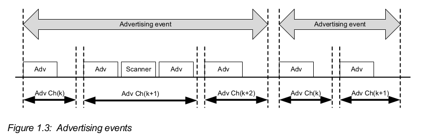
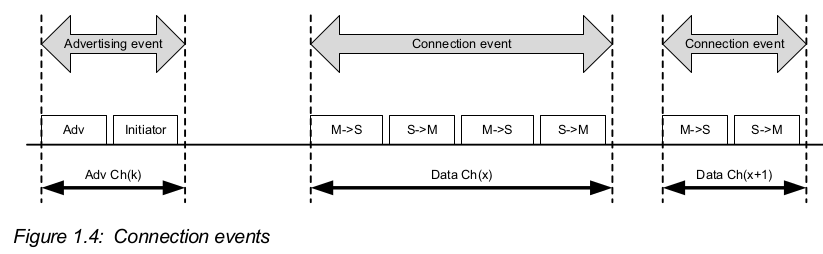
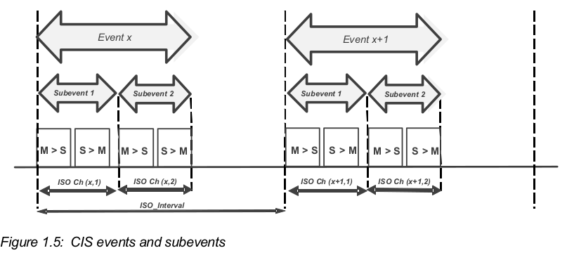
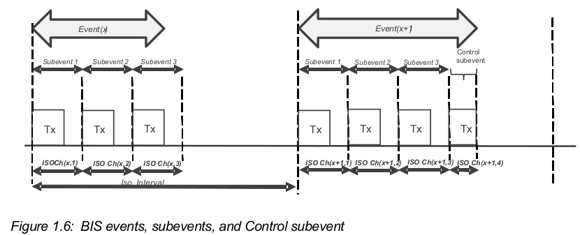
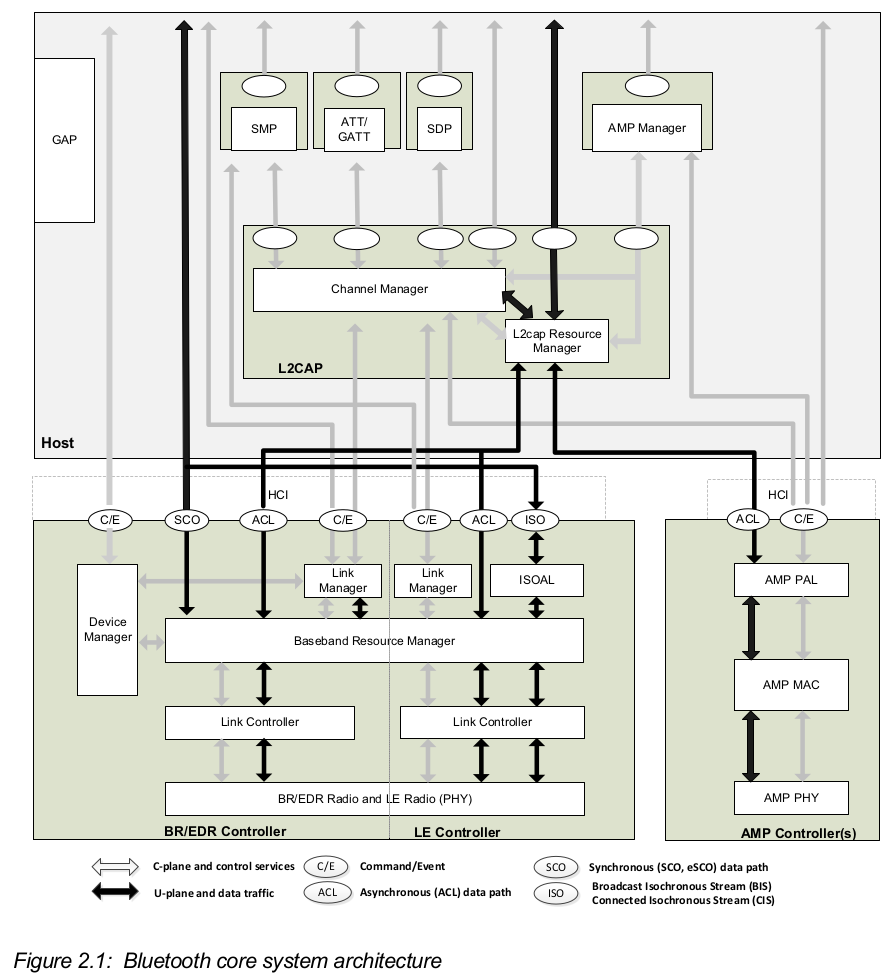

# Part A: Architecture

## 1 概述

蓝牙无线技术系统的两种形式

* Basic RateJ(BR)系统
  * 设备发现, 连接建立, 连接机制

  * 可选: Enhanced Data Rate(EDR) , Alternate Media Access Control and Physical(AMP)
  * 数据速率: 721.2kb/s for br, 2.1Mb/s for edr, 54Mb/s with the 802.11 AMP

* Low Energy(LE)系统
  * 设备发现, 连接建立, 连接机制

  * 相对BR/EDR而言, 降低电流消耗, 复杂度和费用
  * 针对用例和应用, LE可以提供更低数据速率和duty cycle
  * 可选的2Mb/s物理层数据速率
  * 等时数据传输

蓝牙核心系统由一个host和一个或多个controller组成

* host: 是一个逻辑实体, 由在non-core profile之下或在HCI之上的所有layer组成
* controller: 是一个逻辑实体, 由在HCI之下的所以layer组成
  * primary controller: 蓝牙核心只能有一个primary controller
  * secondary controller: 蓝牙核心可以有零个或多个secondary controller
* HCI: Host Controller interface

### 1.1 BR/EDR操作概述

* 工作频段: 2.4GHz的ISM频段, 无需申请许可证
* 跳频(Frqquency hopping)技术
* 数据速率: BR支持1Mb/s, EDR支持2Mb/s或3Mb/s

蓝牙BR/EDR的通讯基本形式: piconet(微微网)

* 其中有一个master设备和一个或多个slave设备

* master提供synchronization reference和frequency hopping pattern(跳频模式)
  * 跳频模式是由蓝牙地址的特定字段和master的时钟经过某种算法后得到的;
  * 基本跳频模式是, 将ISM以1Mhz分割成79个频道后的某种伪随机顺序
  * 自适应跳频技术: 改变跳频模式, 从而避开正在被使用的频率

#### Hierarchy

自下而上: 物理频道, 物理链路, 逻辑传输, 逻辑链路, L2CAP频道

物理频道

* 将ISM以1Mhz为单位分割成79个频道

slot

* 物理频道在时间尺度上被划分为slot
* 蓝牙通过Time-Division Duplex(TDD, 时分双工)实现全双工传输

* 在蓝牙设备之间传送数据: 首先被封装成数据包, 然后在slot中传送
  * 当条件允许时, 连续slot会被分配到同一数据包
  * 在数据传送或接受过程中可能发生跳频

物理链路(physical link)

* 通常在某个物理频道中, 在master和slave之间会建立一条物理链路
  * 除了inquiry scan物理频道和page scan物理频道; 这种频道没有相应的物理链路
* 物理链路提供双向数据包传输
  * 除了connectionless slave broadcast物理链路; 该链路提供单向数据包传输, 在一个master和无限多个slave之间

逻辑链路

* 一条物理链路可以用于一条或多条逻辑链路的传输
* 逻辑链路支持unicast synchronous, asynchronous和isochronous traffic, 还有broadcast traffic
* 逻辑链路上的traffic(运输)是multiplexed(多路复用); 通过调度slot实现

ACL逻辑传输(ACL logical transport)

* 在微微网中的设备都有一个默认的面对连接的异步逻辑传输, 这就是ACL
* 当设备加入微微网中, 会创建一个primary ACL
  * 除了connectionless slave broadcast设备; 该设备进入微微网后, 创建connectionless slave broadcast逻辑传输, 以监听connectionless slave broadcast数据包

Link Manager protocol(LMP)

* LMP是基带和物理层的控制协议
* LMP protocol是在primary ACL和active slave broadcast逻辑传输上传送

L2CAP层

* L2CAP层为应用和服务提供了逻辑频道的抽象概念
  * 应用数据的分割和重组, 基于共享逻辑链路的多频道的复用和解复用
* L2CAP的协议控制频道(protocol control channel), 是在默认ACL上的
* 在L2CAP层的应用数据可以在任意支持L2CAP协议的逻辑链路上传送

### 1.2 LE操作概述

* 工作频段: 2.4GHz的ISM频段, 无需申请许可证
* 跳频(Frqquency hopping)技术:
  * 跳频模式: 是ISM中的37个频率的伪随机顺序
  * 自适应跳频
* 速率: 
  * LE 1M PHY: 
    * 符号速率(symbol rate): 1Msym/s
    * 数据速率: 1Mb/s
  * (可选)LE Coded PHY: 支持错误纠正
    * 符号速率: 1Msym/s
    * S=2(即两个符号表示一位数据): 500kb/s
    * S=8: 125kb/s
  * (可选)LE 2M PHY:
    * 符号速率: 2Msym/s
    * 数据速率: 2Mb/s
  * 说明: LE 1M PHY和LE 2M PHY统称为LE Uncoded PHY

* 两种多址(multiple access)方案:
  * Frequency division multiple access(FDMA)
    * 将ISM频带以2MHz分割成40个物理频道; 其中3个作为主要的广播频道; 其他37个作为通用用途频道
  * Time division multiple access(TDMA)
    * 在传送数据包时, 某个设备在预定事件传送数;据包;  在预定的时间间隔后, 相应设备传送响应数据包

事件

* 物理频道在时间尺度上被分割为多个事件; 数据在事件中传送.
  * 事件可分为有: 广播事件, 扩展广播事件, 周期广播事件, 连接事件, 等时事件

广播

* 广播者(advertiser), 扫描者(scanner), 发起者(initiator)
  * 广播者: 在物理频道中传送广播包
  * 扫描者: 接收广播包, 但没有连接广播者的意图
  * 发起者: 在接受到可连接广播包后发起连接请求的设备
* 广播事件
* 在广播物理频道中的数据传送发生在广播事件中
  * 在每次广播事件的开始, 广播者根据广播事件类型发送一个相应的广播包; 根据广播包的类型, 扫描者可能会在同一物理频道中向广播者发送请求; 而后, 广播者可能会在同一物理频道作出响应
  * 在同一广播事件中, 广播者发送下一个广播包时会选择不同的广播物理频道
  * 广播者可以在广播事件中任一时间停止广播
  * 在某种广播事件开始时, 广播者总是在相同的物理频道发送第一个广播包

  * 

* 在单向通讯或广播通讯的情况下, LE设备可以使用广播事件完成整个通讯过程

建立ACL连接的过程

1. 广播者在可连接广播事件中发送可连接广播包
2. 在收到可连接广播包后, 发起者在相同物理频道中发起连接请求
3. 广播者收到并同意该连接请求; 此时, 广播事件结束, 连接事件开始
4. 说明: 一旦建立连接, 发起者成为master, 广播者成为slave

连接事件

* 用于在master和slave之间发送数据包
* 在每个连接事件的开始时都会channel hop(跳频道)
* 在连接事件中, master和slave在同一物理频道中交替地发送数据包
* master可以发起连接事件, 也可以在任何时间终止连接事件
* 

connected isochronous stream(CIS)

* 使用ACL连接时, master可以在一个等时物理频道中建立一个或多个等时连接
* 等时连接, 是通过CIS在master和slave之间传输等时数据
* CIS
  * 由CIS事件组成; CIS事件的出现间隔是固定的, 间隔是ISO_Interval
* CIS事件
  * CIS事件由一个或多个子事件组成; 在每个子事件中, master传送一次, slave回应一次
  * 如果在某次CIS事件中master和slave完成了等时数据的传输, 剩余的子事件不会有无线电传播, 该CIS事件被关闭
  * 每次子事件所使用的物理频道由频道选择算法决定的
  * 标识说明: ISO Ch(x, y)表示子事件所使用的物理频道; x表示CIS事件x, y表示CIS事件x中的子事件y
  * 

Broadcast Isochronous Stream(BIS)

* 设备使用BIS在等时物理频道中广播等时数据
* 由BIS事件组成; BIS事件的出现间隔是固定的, 间隔是ISO_Interval
* BIS事件
  * BIS事件由一个或多个子事件组成; 在每个子事件中, 广播设备会传送一次等时数据包
  * 每次子事件所使用的物理频道由频道选择算法决定的
  * 在所有子事件的后面可以有一个控制子事件, 该事件可以广播控制信息
  * 设备在传送BIT事件的同时传送周期广播事件, 里面包含BIS同步信息
    * 正在扫描的设备可以同步至周期广播事件, 获得包含的同步信息
  * 

Hierarchy

* 物理频道, 物理链路, 逻辑传输, 逻辑联络, L2CAP频道
* 在物理频道中,  master和slave设备之间建立物理链路
  * 物理链路提供在master和slave之间的双向数据包传输
  * slave可以同时与多台master建立物理链路
  * 一台设备可以同时是master和slave
  * slave和slave之间没有直接的物理链路
* 在一条物理链路中有一条或多条逻辑链路
  * 逻辑链路支持异步traffic; traffic是多路复用的
* Link Layer prtocol(LL), 是链路和物理层的控制协议, 在逻辑链路上传送
* 在微微网中的设备都有一条默认LE ACL, 用于传输LL protocol signaling
  * 当设备加入微微网时创建默认LE ACL
* L2CAP层给应用和服务提供一个逻辑频道的抽象概念
* 在L2CAP层之上有两个协议层
  * The Security Manager protocol(SMP): 使用固定的L2CAP频道使用安全功能
  * The Attribute protocol(ATT): 使用固定的L2CAP频道提供一种小量数据通讯的方式
    * ATT也用于BR/EDR

the Angle of Arrival(AoA)或Angle of Departure(AoD)

* 某一LE无线电能够探测到另一LE无线电的相对方向的方法

### 1.3 AMP操作概述

Alternate MAC/PHYs(AMP)

* 是在蓝牙核心系统中的secondary controller
* 当在两台设备之间通过BR/EDR无线电建立好L2CAP连接后, AMP管理器可以发现对方设备中可用的AMP; 如果两台设备都有AMP, 核心系统中的机制可以将BR/EDR controller的数据traffic转移至AMP controller

Protocol Adaptation Layer(PAL)

* PAL在MAC和PHY之上
* 每个AMP由一个PAL组成
* PAL负责将蓝牙协议和行为映射到底层MAC/PHY的特定协议

### 1.4 专门术语Nomenclature(p196)

见196页

## 2 核心系统架构

蓝牙核心系统由一个host, 一个主要controller和零个或多个次要controller组成

* 注意: 图中每个功能块仅用于辅助理解; 具体实现可能会不同
* 如图所示: 
  * BR/EDR Controller: 由Link Manager, Link Controller和BR/EDR Radio组成
  * AMP Controller: 由AMP PAL, AMP MAC和AMP PHY组成
  * LE Controller: 由Link Manager, Link Controller和LE Radio组成
  * BR/EDR Host: 由L2CAP, SDP和GAP组成
  * LE Host: 由L2CAP, SMP, Attribute protocol, GAP和Generic Attribute Profile(GATT)组成
  * BR/EDR/LE Host: 由BR/EDR Host和LE Host所需的组成
  * HCI(可选): 作为Controller和Host之间的接口

* 蓝牙核心系统协议有
  * 无线电协议(PHY)
  * Link Control and Link Manager protocol (LC/LM), 或Link Layer protocol(LL)
  * AMP PAL
  * Logical Link Control and Adaptation protocol(L2CAP)
  * AMP Manager protocol

* 蓝牙核心系统提供了三种服务
  * device control service: 改变蓝牙设备的行为和模式
  * transport control service: 创建, 修改和发布traffic bearers(channels and links)
  * data service:  向traffic bearer提交用于传送的数据
  * 前两种服务属于C-plane, 第三种服务属于U-plane

### 2.1 core architectureal block

Host architectural blocks

* channel manager: 使用L2CAP协议; 创建, 管理和关闭L2CAP频道
  * L2CAP频道用于传输服务协议和应用数据流
* L2CAP resource manger: 
  * 管理PDU分块的提交顺序, 和L2CAP频道之间的调度
  * traffic conformance policing: 保证应用所提交的L2CAP SDU是在其已协商好的QoS设置的范围中
* security Manager Protocol: SMP是pear-to-pear protocol, 用于生成encryption key和identity key
  * 仅用于LE
* Attribute Protocol
* AMP Manager protocol
* Generic Attribute Profile
* Generic Access Profile

BR/EDR/LE Controller architecturral blocks

* device manager
* Link manager
* Baseband resource manager
* Link manager
* PHY
* Isochronous Adaptation Layer

AMP Controller architectural blocks

* AMP HCI
* AMP PAL
* AMP MAC
* AMP PHY

## 3 数据传输架构

## 4 通讯拓扑和操作

## 5 安全性概述

## 6 蓝牙应用架构

## 7 共存与配合

## 8 使用BLE寻找方向

# Part B 缩写

