>  Vol 2: BR/EDR Controller

# Part A: Radio Specification

## 1 SCOPE

* unlicensed 2.4 GHz ISM band
* frequency hop transceiver
* two modulation modes
  * Basic Rate(mandatory)
    * use a shaped, binary FM modulation
    * symbol rate: 1Msym/s
    * gross air data rate: 1Mb/s
  * Enhanced Data Rate(optional)
    * use PSK modulation and has two variants: $\Pi$/4-DQPSK and 8DPSK
    * symbol rate: 1Msym/s
    * gross air data rate: 2Mb/s using $\Pi$/4-DQPSK , 3Mb/s using 8DPSK
* Time Division Duplex(TDD) scheme

Bluetooth radio requirement

* the operating conditions specified in Appendix A
* RF Test Specification

## 2 Frequency bands and channel arrangement

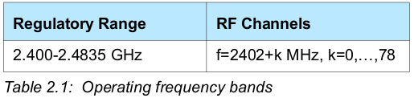

## 3 Transmitter characteristics

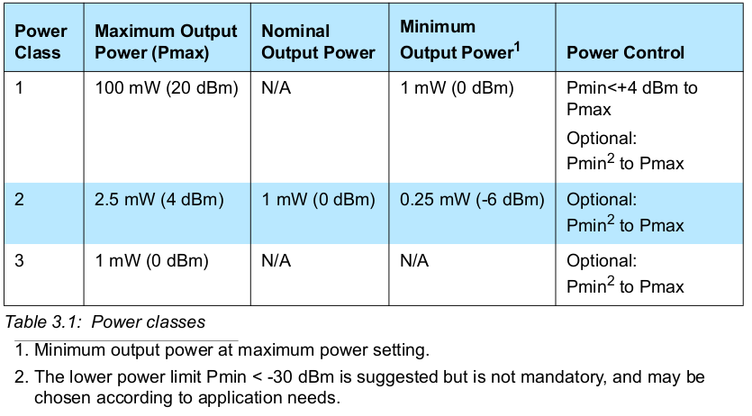

* Power class 1的设备必须要支持接收功率控制请求(received power control request); 而且, 最低功率必须小于等于+ 4 dBm
  * 对于Power class 2 和 3的设备, 这是可选的
  * 接收功率控制请求, 是接收设备通过LMP命令发出的
  * 功率步长(power step)最大为8 dB, 最小为2 dB
* 如果接收设备不支持发送功率控请求, 所传输的数据包的输出功率必须不能超过power class 2的最大输出功率
  * 也就是说, 此时的传输设备的功率应该是符合power class 2 或 3

* 在任何功率步长上, 所有支持的数据包类型的报头之间的传输功率电平差不能超过10 dB

# Part B: Baseband Specification

## 1 General description

> 说明蓝牙基带的正常运行流程

蓝牙系统的两种连接

* 点对点连接: 两台蓝牙设备共享一个物理频道
* 点对多点连接: 两台或多台蓝牙设备共享一个物理频道, 形成微微网
  * 在微微网中, 最多有7台slave处于活动状态, 只有一个master
  * master控制物理频道的访问权
* 携带connectionless slave broadcast物理链路的物理频道可以有无限多的slave

微微网(piconet)

* 不同的微微网的频率不能是同步的, 而每个微微网都有它自己的跳频序列

分散网(scatternet)

* 由有共同设备的微微网组成

数据包

* 数据以包的形式在空中传送
* Basic Rate数据包的通用格式
  * 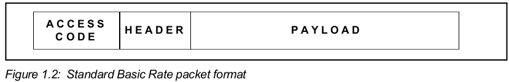
  * access code, header, playload
* Enhanced Data Rate数据包的通用格式
  * 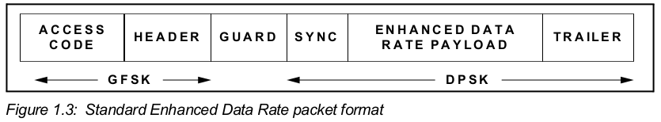
  * access code, header, guard period, synchronization sequence, enhanced data rate playload, trailer
  * guard period是用来进行转换调制模式的时间

### 1.1 Bluetooth clock

时钟的要求

* 循环周期大概是一天
* 每312.5${\mu}s$进行一次自增一, 以提供3.2kHz的时钟频率
* 如果使用计数器实现时钟, 需要一个28位的计数器

名词说明

* CLKR表示参考时钟(reference clock), 由自由运行的系统时钟得到
* CLKN表示本地时钟(native clock), 将参考时钟进行偏移得到
* CLKE表示预估时钟(estimated clock)
* CLK表示主时钟(mater clock), 将参考时钟加上time_base_offset和slave_offset得到

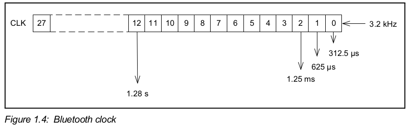

* $CLK_0$, $ CLK_1$, $ CLK_2$和$CLK_{12}$所对应的时间周期在蓝牙中是很重要的

时钟精度

* 在准备状态, hold模式, sniff模式, 和connectionless slave broadcast模式下, 参考时钟最坏情况下的精度是正负250ppm;
* 在其他情况下, 参考时钟最坏情况下的精度是正负20ppm;

### 1.2 蓝牙设备寻址bluetooth device addressing

蓝牙设备地址

* 每个蓝牙设备都应该有唯一的48位蓝牙设备地址(bluetooth device address, BD_ADDR)
* 蓝牙设备地址是满足IEEE 802-2014标准的48位扩展唯一标识符(EUI-48)
* 有效的EUI-48包含MAC地址块; MAC地址块由IEEE管理, 三种类型: MA-L, MA-M, MA-S

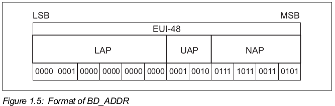

* LAP: Lower Address part
* UAP: Upper Address part
* NAP: Non-significant Address part

#### 1.2.1 保留地址

LAP保留地址: `0x9E8B00~0x9E8B3F`, 共64个

* `0x9E8B33`用于一般的inquiry(查询)
* 其余63个LAP用于特定类型设备的inquiry

* 这些地址不能用作BD_ADDR
* 最右一位是LSB(Least significant bit)

当使用LAP保留地址时, 在UAP上使用DCI(Default check initialization).

* DCI被定义为`0x00`

### 1.3 Access codes访问码

访问码, 是由LAP得到的

三种访问码

* 设备访问码(DAC, device access code): 从paged设备的BD_ADDR中得到
  * 在page, page scan和page response子状态中使用
* 频道访问码(CAC, channel access code): 从master的BD_ADDR的LAP中得到
  * 在连接状态, synchronization train子状态和synchronization scan子状态中使用, 作为在微微网物理频道交换的数据包的开头
* 查询访问码(IAC, inquiry access code): 
  * 在inquiry子状态中使用
  * 有一个通用IAC(GIACJ)用于通用inquiry, 63个专用IAC(DIAC)用于专用inquiry

## 2 物理频道

物理频道

* 位于蓝牙系统架构的最低层
* 每个蓝牙物理频道都有以下的特征:
  * 基础的伪随机跳频序列
  * slot timing
  * 访问码和数据包header的编码

* 当两个设备想要进行通讯时, 它们的收发器必须同时调整到相同的RF频率, 且它们都在对方的标称范围中

* 几个被定义的物理频道
  * the basic piconet channel和 adapted piconet channel: 用于在已连接设备之间的通讯
  * the inquiry scan channel: 用于发现蓝牙设备
  * the page scan channel: 用于连接蓝牙设备
  * the synchronization scan physical channel: 用于获得connectionless slave broadcast physical channel的时间和频率信息, 还可以用于恢复当前微微网的时钟
  * 蓝牙设备在某一时刻只能使用其中的一个频道; 为了支持并发, 设备使用时分多工

连接频道

* 蓝牙设备连接上物理频道, 是指蓝牙设备与该频道同步了时间, 频率和访问码

### 2.1 物理频道定义

除了synchronization scan物理频道, 其他物理频道根据以下信息所定义

* 基础的伪随机RF跳频序列: 由以下信息所决定
  * 蓝牙设备地址的UAP和LAP
  * 被选用的基本跳频序列
  * (对于adapted piconet物理频道) 用于物理链路的AFH_channel_map
* 数据包(slot)timing: 
  * 所有物理频道在时间尺度上划分为time slot
  * 物理频道的传送或接收事件发生在一个或多个time slot中
* 访问码

最大跳频速率: 

* (在连接状态, synchronization train子状态和synchronization scan子状态中)1600跳每秒
* (在inquiry和page子状态中)3200跳每秒

定义以下物理频道

* basic piconet physical channel
* adapted piconet physical channel
* page scan physical channel
* inquiry scan physical channel
* synchronization scan physical channel

### 2.2 Basic piconet physical channel

在连接状态中

* 默认使用basic piconet physical channel

* 可以使用adapted piconet physical channel

#### 2.2.1 Master-Slave definition

微微网中的master

* 根据定义, 通过paging发起连接的设备是master
* 在成功建立微微网后, 可以进行主从切换

basic piconet physical channel由master进行定义的

* master采用polling scheme控制basic piconet physical channel的traffic

#### 2.2.2 Hopping characteristics

Basic piconet physical channel使用基础跳频序列, 在所有rf频道中跳转; 跳频由以下所决定

* 蓝牙时钟
* master的BD_ADDR

关于basic channel hopping sequence的内容见2.6节

#### 2.2.3 Time slots

Basic piconet physical channel在时间上划分为time slot

* 每个time slot的长度为625${\mu}s$
* time slot的编号是master的时钟的高27位
  * 所以, time slot的编号范围是从$0$到$2^{27}-1$, 且编号是循环的

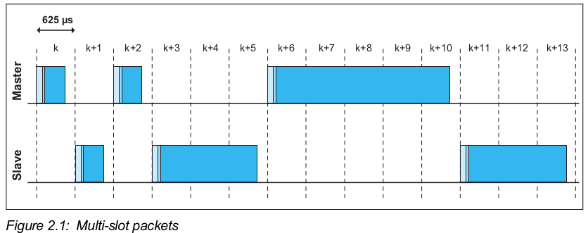

* 数据包的开头要与slot的开头对齐
* 数据包最多可以占有5个连续的time slot

slot pair

* 表示以一个从master向slave传送的slot开始的两个相邻time slot

#### 2.2.4 Piconet clocks

CLK

* CLK是微微网的主时钟
* CLK应该在微微网的timing和调度活动中使用

CLK是将CLKR加上time_base_offset和slave_offset得到的
* time_base_offset是用于与外部time base对齐, 与CLKR相加得到CLKN
  * 只有master才能改变time_base_offset
* slave_offset是用于与master CLK对齐, 与CLKN相加得到CLK;
  * 对于master, CLK就是CLKN, 所以slave_offset为0
  * 不同的slave都有不同的slave_offset, 而且会经常更新slave_offset以使得slave的CLK与master的CLKN近似

* 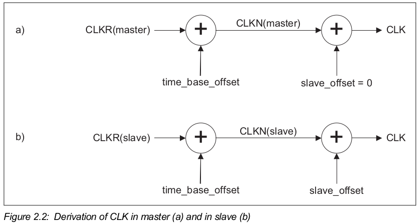

#### 2.2.5 Transmit/receive timing

* master应该在偶数编号的slot中开始传送, 即$CLK_1=0$
* slave应该在奇数编号的slot中开始传送, 即$CLK_1=1$

##### 2.2.5.1 Piconet physical channel timing

图中以单slot的数据包为例

* `f(k)`表示第k个time slot的channel hopping frequency
* 在传送数据包后, 被返回的数据包在$N\times625{\mu}s$后得到; N为大于0的奇数, 具体数值取决于被传送的数据包.
* 不确定性窗口(uncertainty window)是在准确时间附近的, 长度为$20{\mu}s$

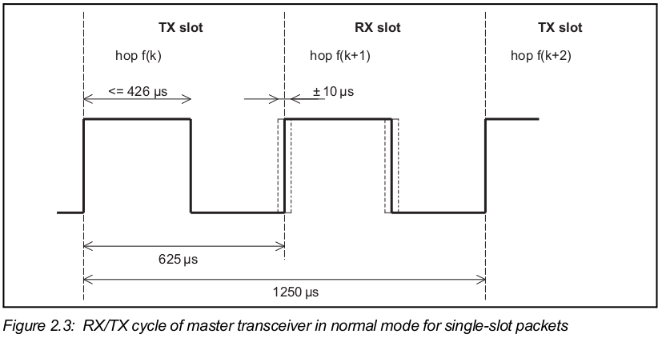

* master transmission使用master的$CLKN_2$, 即当前传送会被调度到在上一个master TX burst开始后的$M\times1250{\mu}s$, 其中M为大于0的偶数
  * 疑问: 为什么不是$M\times 620{\mu}s$,  其中M为大于0的偶数

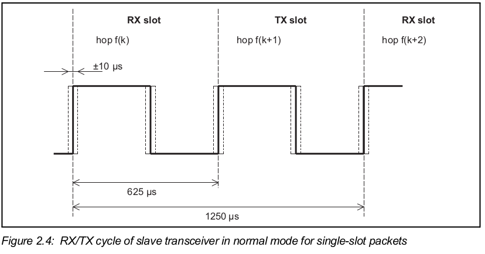

* slave会维护一个关于master的CLKN的估计; 通过slave的CLKN偏移得到
  * 该偏移量在每次接收master的数据包时更新
* slave transmission会被调度到slave RX数据包的开始后的$N\times625{\mu}s$, 其中N为大于0的正奇数

##### 2.2.5.2 Piconet physical channel re-synchronization

在微微网的物理频道中, 每200ms内slave没有收到master的数据包, slave会失去与master的同步性

* 如果使用低功率的时钟, 失去同步的时间会比200ms更短

* 在失去同步后, slave只有重新同步后才能发送信息

重新同步

* slave在rx slot中监听master

* slave的synchronization search window的长度从$20{\mu}s$开始增加
* 如果search window的长度超过$1250{\mu}s$, 连续的windows之间应该避免相互覆盖,  所以下一个window会移至不被覆盖的合适位置
  * 例如: $1250{\mu}s<长度{\le}2500{\mu}s$时, 连续window的位置应该是$f(k), f(k+4), ..f(k+4i)$

* 由于长度增加导致uncertainty window向前面的tx slot扩展, 此时依然使用rx hop frequency.
* 在slave重新同步时, master建议传送single slot数据包

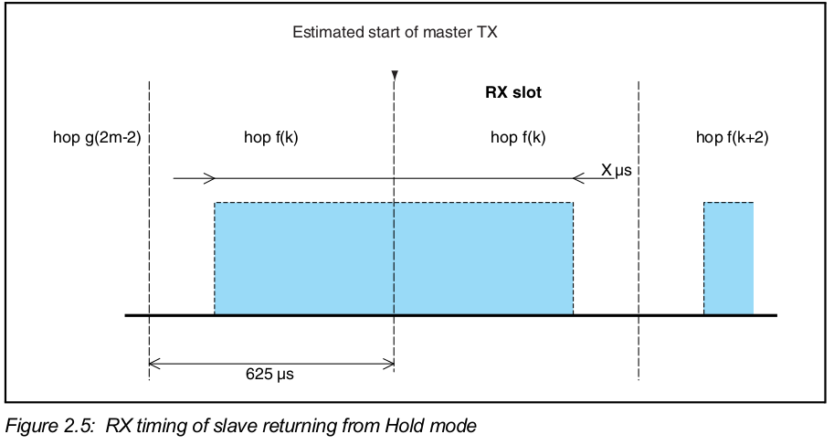

### 2.3 Adapted piconet physical channel

* 在adapted piconet physical channel上的物理链路应该至少使用$N_{min}$个RF频道
  * $N_{min}$为20

* adapted piconet physical channel使用adapted channel hooping sequence

### 2.4 page scan物理频道

虽然在建立连接前master和slave的角色是尚未定义的, 此时

* master表示paging设备, 该设备进入连接状态后成为master
* slave表示page scanning设备, 该设备进入连接状态后成为slave

#### 2.4.1 用于paging的CLKE

paging设备的CLKE是page scanning设备的CLKN的估计时钟

* paging设备, 也就是pager; page scanning设备, 也就是recipient
* 使用recipient的CLKN, pager可以加快连接建立的速度

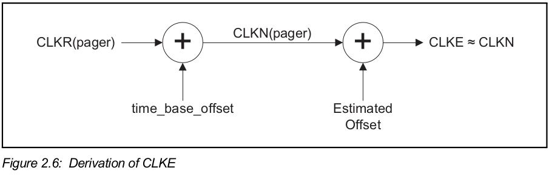

#### 2.4.2 Hopping characteristics

page scan物理频道使用的hopping pattern

* 是一个短的伪随机hopping序列, 由scanning设备的蓝牙地址决定

page scan物理频道的timing由scanning设备的CLKN决定

更多见2.6节

#### 2.4.3 paging procedure timing

在paging过程中, master应该传送paging message, 与要连接的slave相关.

* 由于paging信息是一个很短的数据包, hop速率是3200跳每秒;
  * 在单个tx slot区间中, paging设备应该在两个不同的hop频率上传送.
    * 第一次传送在$CLK_0=0$时间, 在$f(k)$ tx hopping 频率开始
    * 第二次传送在$CLK_0=1$开始, 在$f(k+1)$ tx hopping 频率开始
  * 在单个rx lsot区间中, paging设备应该在两个不同的hop频率上监听slave page响应信息
    * 第一次接收在$CLK_0=0$时间, 在$f'(k)$ rx hopping 频率开始
    * 第二次接收在$CLK_0=1$开始,  在$f'(k+1)$ rx hopping 频率开始
* 不确定性窗口是接收开头的${\pm}10{\mu}s$

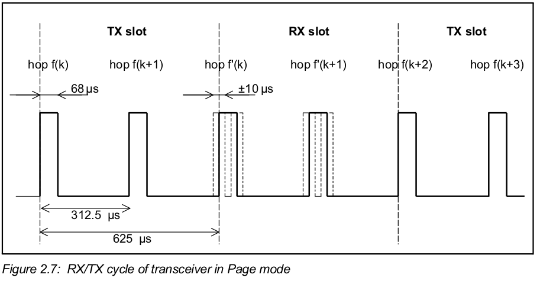

* $f(k)$  is used for the frequencies of the page hopping sequence and $f'(k)$ denotes the corresponding page response sequence frequencies.

#### 2.4.4 Page response timing

* 在收到master page message的$625{\mu}s$后, slave发送slave page response message; 然后, 假设master page message的hop frequency为f(k), 则slave在f(k+1)频率上监听master page response message.
* mater在发送page message后, 如果收到slave page response message, 则在离第一条page message$1250{\mu}s$后发送master page response message

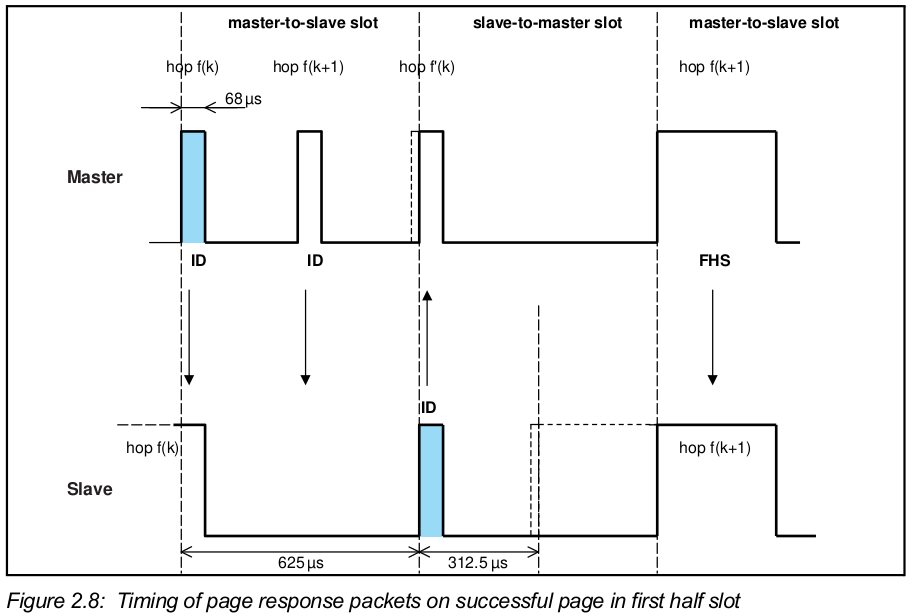

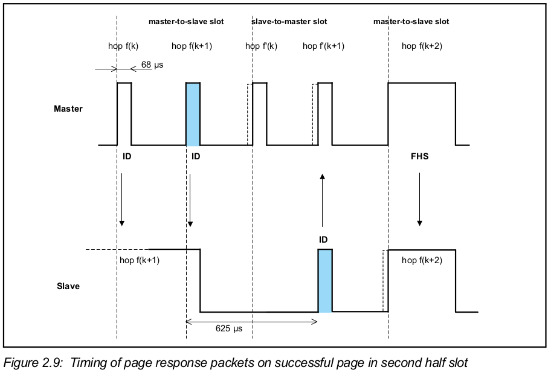

* slave应该根据master page响应数据包来调整自己的rx/tx timing(时序?)

### 2.5 Inquiry scan物理频道

虽然在建立连接前master和slave的角色是尚未定义的, 此时

* master表示inquiring设备
* slave表示inquiry scanning设备

#### 2.5.1 Clock for inquiry

用于inquiry和inquiry scan的时钟应该都是设备本身的本地时钟CLKN

#### 2.5.2 Hopping characteristics

inquiry scan物理频道使用的hopping pattern

* 是一个短的伪随机hopping序列, 由通用inquiry access code(接入码?)决定

inquiry scan物理频道的timing由scanning设备的本地时钟CLKN决定

更多见2.6节

#### 2.5.3 Inquiry procedure timing

在inquiry过程中, master应该传送inquiry message, 其中包含通用或专用inquiry access code.

inquiry的timing与paging的一样(见2.4.3节)

#### 2.5.4 Inquiry response timing

# Part C: Link Manager Protocol Specification

# Part F: Message Sequence Charts

# Part G: Sample Data

# Part H: Security Specification