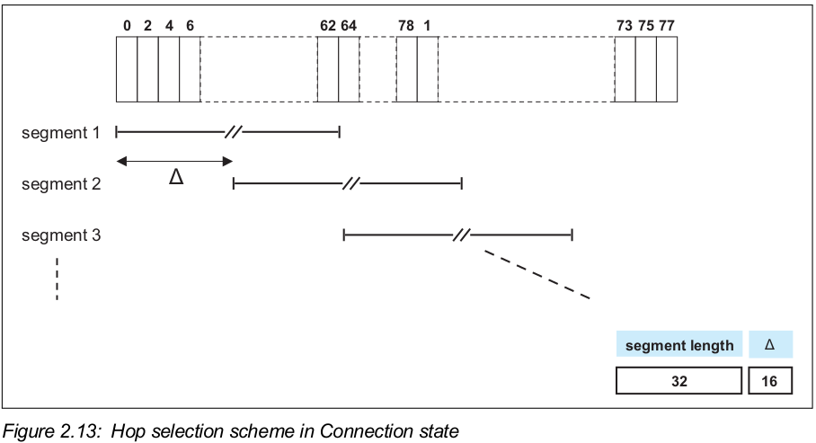
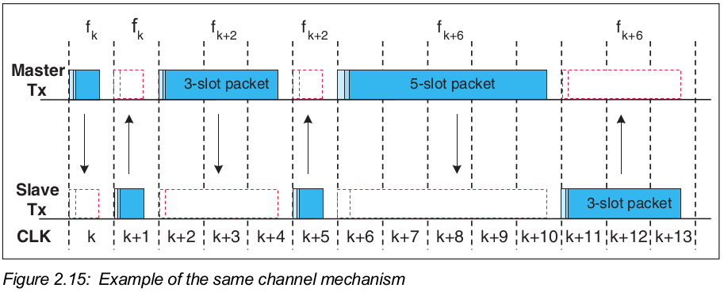

>  Vol 2: BR/EDR Controller

# Part A: Radio Specification

## 1 SCOPE

* unlicensed 2.4 GHz ISM band
* frequency hop transceiver
* two modulation modes
  * Basic Rate(mandatory)
    * use a shaped, binary FM modulation
    * symbol rate: 1Msym/s
    * gross air data rate: 1Mb/s
  * Enhanced Data Rate(optional)
    * use PSK modulation and has two variants: $\Pi$/4-DQPSK and 8DPSK
    * symbol rate: 1Msym/s
    * gross air data rate: 2Mb/s using $\Pi$/4-DQPSK , 3Mb/s using 8DPSK
* Time Division Duplex(TDD) scheme

Bluetooth radio requirement

* the operating conditions specified in Appendix A
* RF Test Specification

## 2 Frequency bands and channel arrangement

## 3 Transmitter characteristics

* Power class 1的设备必须要支持接收功率控制请求(received power control request); 而且, 最低功率必须小于等于+ 4 dBm
  * 对于Power class 2 和 3的设备, 这是可选的
  * 接收功率控制请求, 是接收设备通过LMP命令发出的
  * 功率步长(power step)最大为8 dB, 最小为2 dB
* 如果接收设备不支持发送功率控请求, 所传输的数据包的输出功率必须不能超过power class 2的最大输出功率
  * 也就是说, 此时的传输设备的功率应该是符合power class 2 或 3

* 在任何功率步长上, 所有支持的数据包类型的报头之间的传输功率电平差不能超过10 dB

# Part B: Baseband Specification

## 1 General description

> 说明蓝牙基带的正常运行流程

蓝牙系统的两种连接

* 点对点连接: 两台蓝牙设备共享一个物理频道
* 点对多点连接: 两台或多台蓝牙设备共享一个物理频道, 形成微微网
  * 在微微网中, 最多有7台slave处于活动状态, 只有一个master
  * master控制物理频道的访问权
* 携带connectionless slave broadcast物理链路的物理频道可以有无限多的slave

微微网(piconet)

* 不同的微微网的频率不能是同步的, 而每个微微网都有它自己的跳频序列

分散网(scatternet)

* 由有共同设备的微微网组成

数据包

* 数据以包的形式在空中传送
* Basic Rate数据包的通用格式
  * 
  * access code, header, playload
* Enhanced Data Rate数据包的通用格式
  * 
  * access code, header, guard period, synchronization sequence, enhanced data rate playload, trailer
  * guard period是用来进行转换调制模式的时间

### 1.1 Bluetooth clock

时钟的要求

* 循环周期大概是一天
* 每312.5${\mu}s$进行一次自增一, 以提供3.2kHz的时钟频率
* 如果使用计数器实现时钟, 需要一个28位的计数器

名词说明

* CLKR表示参考时钟(reference clock), 由自由运行的系统时钟得到
* CLKN表示本地时钟(native clock), 将参考时钟进行偏移得到
* CLKE表示预估时钟(estimated clock)
* CLK表示主时钟(mater clock), 将参考时钟加上time_base_offset和slave_offset得到

* $CLK_0$, $ CLK_1$, $ CLK_2$和$CLK_{12}$所对应的时间周期在蓝牙中是很重要的

时钟精度

* 在准备状态, hold模式, sniff模式, 和connectionless slave broadcast模式下, 参考时钟最坏情况下的精度是正负250ppm;
* 在其他情况下, 参考时钟最坏情况下的精度是正负20ppm;

### 1.2 蓝牙设备寻址bluetooth device addressing

蓝牙设备地址

* 每个蓝牙设备都应该有唯一的48位蓝牙设备地址(bluetooth device address, BD_ADDR)
* 蓝牙设备地址是满足IEEE 802-2014标准的48位扩展唯一标识符(EUI-48)
* 有效的EUI-48包含MAC地址块; MAC地址块由IEEE管理, 三种类型: MA-L, MA-M, MA-S

* LAP: Lower Address part
* UAP: Upper Address part
* NAP: Non-significant Address part

#### 1.2.1 保留地址

LAP保留地址: `0x9E8B00~0x9E8B3F`, 共64个

* `0x9E8B33`用于一般的inquiry(查询)
* 其余63个LAP用于特定类型设备的inquiry

* 这些地址不能用作BD_ADDR
* 最右一位是LSB(Least significant bit)

当使用LAP保留地址时, 在UAP上使用DCI(Default check initialization).

* DCI被定义为`0x00`

### 1.3 Access codes访问码

访问码, 是由LAP得到的

三种访问码

* 设备访问码(DAC, device access code): 从paged设备的BD_ADDR中得到
  * 在page, page scan和page response子状态中使用
* 频道访问码(CAC, channel access code): 从master的BD_ADDR的LAP中得到
  * 在连接状态, synchronization train子状态和synchronization scan子状态中使用, 作为在微微网物理频道交换的数据包的开头
* 查询访问码(IAC, inquiry access code): 
  * 在inquiry子状态中使用
  * 有一个通用IAC(GIACJ)用于通用inquiry, 63个专用IAC(DIAC)用于专用inquiry

## 2 物理频道

物理频道

* 位于蓝牙系统架构的最低层
* 每个蓝牙物理频道都有以下的特征:
  * 基础的伪随机跳频序列
  * slot timing
  * 访问码和数据包header的编码

* 当两个设备想要进行通讯时, 它们的收发器必须同时调整到相同的RF频率, 且它们都在对方的标称范围中

* 几个被定义的物理频道
  * the basic piconet channel和 adapted piconet channel: 用于在已连接设备之间的通讯
  * the inquiry scan channel: 用于发现蓝牙设备
  * the page scan channel: 用于连接蓝牙设备
  * the synchronization scan physical channel: 用于获得connectionless slave broadcast physical channel的时间和频率信息, 还可以用于恢复当前微微网的时钟
  * 蓝牙设备在某一时刻只能使用其中的一个频道; 为了支持并发, 设备使用时分多工

连接频道

* 蓝牙设备连接上物理频道, 是指蓝牙设备与该频道同步了时间, 频率和访问码

### 2.1 物理频道定义

除了synchronization scan物理频道, 其他物理频道根据以下信息所定义

* 基础的伪随机RF跳频序列: 由以下信息所决定
  * 蓝牙设备地址的UAP和LAP
  * 被选用的基本跳频序列
  * (对于adapted piconet物理频道) 用于物理链路的AFH_channel_map
* 数据包(slot)timing: 
  * 所有物理频道在时间尺度上划分为time slot
  * 物理频道的传送或接收事件发生在一个或多个time slot中
* 访问码

最大跳频速率: 

* (在连接状态, synchronization train子状态和synchronization scan子状态中)1600跳每秒
* (在inquiry和page子状态中)3200跳每秒

定义以下物理频道

* basic piconet physical channel
* adapted piconet physical channel
* page scan physical channel
* inquiry scan physical channel
* synchronization scan physical channel

### 2.2 Basic piconet physical channel

在连接状态中

* 默认使用basic piconet physical channel

* 可以使用adapted piconet physical channel

#### 2.2.1 Master-Slave definition

微微网中的master

* 根据定义, 通过paging发起连接的设备是master
* 在成功建立微微网后, 可以进行主从切换

basic piconet physical channel由master进行定义的

* master采用polling scheme控制basic piconet physical channel的traffic

#### 2.2.2 Hopping characteristics

Basic piconet physical channel使用基础跳频序列, 在所有rf频道中跳转; 跳频由以下所决定

* 蓝牙时钟
* master的BD_ADDR

关于basic channel hopping sequence的内容见2.6节

#### 2.2.3 Time slots

Basic piconet physical channel在时间上划分为time slot

* 每个time slot的长度为625${\mu}s$
* time slot的编号是master的时钟的高27位
  * 所以, time slot的编号范围是从$0$到$2^{27}-1$, 且编号是循环的

* 数据包的开头要与slot的开头对齐
* 数据包最多可以占有5个连续的time slot

slot pair

* 表示以一个从master向slave传送的slot开始的两个相邻time slot

#### 2.2.4 Piconet clocks

CLK

* CLK是微微网的主时钟
* CLK应该在微微网的timing和调度活动中使用

CLK是将CLKR加上time_base_offset和slave_offset得到的
* time_base_offset是用于与外部time base对齐, 与CLKR相加得到CLKN
  * 只有master才能改变time_base_offset
* slave_offset是用于与master CLK对齐, 与CLKN相加得到CLK;
  * 对于master, CLK就是CLKN, 所以slave_offset为0
  * 不同的slave都有不同的slave_offset, 而且会经常更新slave_offset以使得slave的CLK与master的CLKN近似

* 

#### 2.2.5 Transmit/receive timing

* master应该在偶数编号的slot中开始传送, 即$CLK_1=0$
* slave应该在奇数编号的slot中开始传送, 即$CLK_1=1$

##### 2.2.5.1 Piconet physical channel timing

图中以单slot的数据包为例

* `f(k)`表示第k个time slot的channel hopping frequency
* 在传送数据包后, 被返回的数据包在$N\times625{\mu}s$后得到; N为大于0的奇数, 具体数值取决于被传送的数据包.
* 不确定性窗口(uncertainty window)是在准确时间附近的, 长度为$20{\mu}s$

* master transmission使用master的$CLKN_2$, 即当前传送会被调度到在上一个master TX burst开始后的$M\times1250{\mu}s$, 其中M为大于0的偶数
  * 疑问: 为什么不是$M\times 620{\mu}s$,  其中M为大于0的偶数

* slave会维护一个关于master的CLKN的估计; 通过slave的CLKN偏移得到
  * 该偏移量在每次接收master的数据包时更新
* slave transmission会被调度到slave RX数据包的开始后的$N\times625{\mu}s$, 其中N为大于0的正奇数

##### 2.2.5.2 Piconet physical channel re-synchronization

在微微网的物理频道中, 每200ms内slave没有收到master的数据包, slave会失去与master的同步性

* 如果使用低功率的时钟, 失去同步的时间会比200ms更短

* 在失去同步后, slave只有重新同步后才能发送信息

重新同步

* slave在rx slot中监听master

* slave的synchronization search window的长度从$20{\mu}s$开始增加
* 如果search window的长度超过$1250{\mu}s$, 连续的windows之间应该避免相互覆盖,  所以下一个window会移至不被覆盖的合适位置
  * 例如: $1250{\mu}s<长度{\le}2500{\mu}s$时, 连续window的位置应该是$f(k), f(k+4), ..f(k+4i)$

* 由于长度增加导致uncertainty window向前面的tx slot扩展, 此时依然使用rx hop frequency.
* 在slave重新同步时, master建议传送single slot数据包

### 2.3 Adapted piconet physical channel

* 在adapted piconet physical channel上的物理链路应该至少使用$N_{min}$个RF频道
  * $N_{min}$为20

* adapted piconet physical channel使用adapted channel hooping sequence

### 2.4 page scan物理频道

虽然在建立连接前master和slave的角色是尚未定义的, 此时

* master表示paging设备, 该设备进入连接状态后成为master
* slave表示page scanning设备, 该设备进入连接状态后成为slave

#### 2.4.1 用于paging的CLKE

paging设备的CLKE是page scanning设备的CLKN的估计时钟\

* paging设备, 也就是pager; page scanning设备, 也就是recipient
* 使用recipient的CLKN, pager可以加快连接建立的速度

#### 2.4.2 Hopping characteristics

page scan物理频道使用的hopping pattern

* 是一个短的伪随机hopping序列, 由scanning设备的蓝牙地址决定

page scan物理频道的timing由scanning设备的CLKN决定

更多见2.6节

#### 2.4.3 paging procedure timing

在paging过程中, master应该传送paging message, 与要连接的slave相关.

* 由于paging信息是一个很短的数据包, hop速率是3200跳每秒;
  * 在单个tx slot区间中, paging设备应该在两个不同的hop频率上传送.
    * 第一次传送在$CLK_0=0$时间, 在$f(k)$ tx hopping 频率开始
    * 第二次传送在$CLK_0=1$开始, 在$f(k+1)$ tx hopping 频率开始
  * 在单个rx lsot区间中, paging设备应该在两个不同的hop频率上监听slave page响应信息
    * 第一次接收在$CLK_0=0$时间, 在$f'(k)$ rx hopping 频率开始
    * 第二次接收在$CLK_0=1$开始,  在$f'(k+1)$ rx hopping 频率开始
* 不确定性窗口是接收开头的${\pm}10{\mu}s$

* $f(k)$  is used for the frequencies of the page hopping sequence and $f'(k)$ denotes the corresponding page response sequence frequencies.

#### 2.4.4 Page response timing

* 在收到master page message的$625{\mu}s$后, slave发送slave page response message; 然后, 假设master page message的hop frequency为f(k), 则slave在f(k+1)频率上监听master page response message.
* mater在发送page message后, 如果收到slave page response message, 则在离第一条page message$1250{\mu}s$后发送master page response message

* slave应该根据master page响应数据包来调整自己的rx/tx timing(时序?)

### 2.5 Inquiry scan物理频道

虽然在建立连接前master和slave的角色是尚未定义的, 此时

* master表示inquiring设备
* slave表示inquiry scanning设备

#### 2.5.1 Clock for inquiry

用于inquiry和inquiry scan的时钟应该都是设备本身的本地时钟CLKN

#### 2.5.2 Hopping characteristics

inquiry scan物理频道使用的hopping pattern

* 是一个短的伪随机hopping序列, 由通用inquiry access code(接入码?)决定

inquiry scan物理频道的timing由scanning设备的本地时钟CLKN决定

更多见2.6节

#### 2.5.3 Inquiry procedure timing

在inquiry过程中, master应该传送inquiry message, 其中包含通用或专用inquiry access code.

inquiry的timing与paging的一样(见2.4.3节)

#### 2.5.4 Inquiry response timing

* 在收到master的inquiry message的$625{\mu}s$后, slave发送inquiry response packet
  * 与inquiry response packet的开头相隔$1250{\mu}s$后, slave可以传送extended inquiry response packet

### 2.6 Hop selection

已定义的跳跃序列共有6种: 5种用于基本跳跃系统, 1种用于适应性跳频(adaptive frequency hopping, AFH)

* page跳跃序列: 平均分布在79MHz中的32个唤醒频率(wake-up frequency); 周期长度为32
* page response跳频序列: 有32个频率, 每个频率都与当前page跳频序列的频率一一对应
* inquiry跳跃序列: 平均分布在79MHz中的32个唤醒频率(wake-up frequency); 周期长度为32
* inquiry response跳跃序列: 有32个频率, 每个频率都与当前inquiry跳频序列的频率一一对应
* 基本频道跳跃序列: 在短时间内将79个频率平均分布在79MHz中; 周期长度很长, 因此在短时间不会有重复的模式.
* 适应频道(adapted channel)跳跃序列: 从基本频道跳频序列衍生得到的; 频率数量可以小于79个.

此外, 定义了一组同步train RF频道, 带有3个固定频率

#### 2.6.1 General selection scheme

* 时钟输入的来源取决于被选择的跳跃序列; 此外, 每个跳跃序列使用时钟的不同位, 见表2.2(在2.6.4节)
* 地址输入(UAP/LAP)有28位, 见表2.3(在2.6.4节)
* N, interlace_offset和$k_{offset}$的定义见2.6.4节
* sequence selection可以是以下的值
  * page, page scan, slave page response, master page response
  * inquiry, inquiry scan, inquiry response
  * basic channel, adapted channel
* AFH_channel_map: 在对适应频道跳跃序列进行选择时使用. 见2.6.3节

* RF channel index, 是映射到RF频道频率, 使用表2.1的等式; 输出的index是伪随机的

该选择方案会从频带中选择长度为64MHz的频段, 有32个hop频率; 以伪随机顺序访问这些频率. 然后, 会选择不同的32-hop频段

* 在page, master page response, slave page response, page scan, inquiry, inquiry response和inquiry scan跳频序列中, 32-hop频段根据地址来选择的, 而且只是使用该32-hop频段
  * 不同设备由不同的paging频段
* 对于基本频道跳跃序列, 输出是一个有79-hop的伪随机序列

* 图示

在传送数据包的过程中, RF频率是不变的; 时钟输入是数据包的第一个slot中的时钟值

* 

使用适应频道跳跃序列时, 该序列只包含AFH_channel_map所定义的RF频道集合的频率

* AFH的相同频道机制(same channel mechanism): master在某一频道上传送数据包后, slave可以紧接着在相同频道传送响应数据包

* 示例

#### 2.6.2 Selection kernel

basic hop selection kernel, 如图所示

* 用于page, page response, inquiry, inquiry response 和基本频道跳跃选择内核
* **适应频道跳跃选择内核**见2.6.3节

* `X`用于确定32-hop频段的phase
* `Y1`和`Y2`用于选择master-to-slave或slave-to-master
* `A`到`D`用于确定顺序
* `E`和`F`用于确定如何映射到跳跃序列上
* 在进行计算后, 内核根据结果对一个RF频道索引列表进行寻址
  * 该列表的RF频道索引顺序是: 先将偶数索引按升序排列, 然后将奇数索引按升序排列

* 具体说明: 见2.6.2.*节

#### 2.6.3 Adapted hop selection kernel

适应跳跃选择内核是基于基本跳跃选择内核的; 为了达到跳跃序列的适应性, 与基本跳跃选择内核相比有以下两种额外的功能

* 不得使用的RF频道会被重新映射到可以使用的RF频道上; 详情见2.6.3.1节
* AFH的相同频道机制

#### 2.6.4 Control word

### 2.7 Synchronization scan physical channel

#### 2.7.1 跳频特性

* 只使用索引为0, 24, 78的这三个固定RF频道

* 每个独立的scan window使用的RF频道与前两个window的不同

#### 2.7.2 synchronization train过程

只在connectionless slave broadcast和coarse clock adjustment recovery模式下使用

master应该向三个固定RF频道传送synchronization train包

* 该类数据包的传送与其他数据包的传送是相互独立的

对于每个RF频道, master应该

* 建立synchronization train事件; 该事件被$T_{Sync\_Train\_Interval}$个slot分隔
  * 在coarse clock adjustment recovery模式下, $T_{Sync\_Train\_Interval}=32$
  * 其他情况下, $T_{Sync\_Train\_Interval}$的值由controller来决定
* 在每一对synchronization train事件之间, 尝试发送一个synchronization train包; 不能发送超过一个包
  * synchronization train包的传送应该在$CLK[1:0]=0b00$的slot开始
* 没有调度冲突时, 延迟传送synchronization train包:  共延迟synchronization train事件的$T_{Sync\_Train\_Delay}$个slot
  * $T_{Sync\_Train\_Delay}$应该是偶整数
  * $T_{Sync\_Train\_Delay}$是伪随机数, 范围是0至$T_{Sync\_Train\_Delay\_Max}$
  * $T_{Sync\_Train\_Delay}$不应该大于等于$T_{Sync\_Train\_Interval}$
  * 在coarse clock adjustment recovery模式下, $T_{Sync\_Train\_Delay\_Max}$应该是4; 其他情况下, 为16
* 如果synchronization train包的传送与高优先级的数据包的timing发生冲突, 可以调整延迟来避免冲突; 如果无法避免, 则不进行传送
* 对于相连的三个synchronization train包, 实际使用的延迟不应该都相同
  * 可以有两个延迟相同
* Note: 在符合上述要求的同时, 不同RF频道上的synchronization train事件可以分别进行管理, 也可以统一使用相同的$T_{Sync\_Train\_Delay}$
* 下图展示在单个RF频道上两个相邻的synchronization train包的timing关系

#### 2.7.3 synchronization scan过程

* 对于每个scan window, 设备进行监听$T_{Sync\_Scan\_Window}$个slot
* scan window只在固定的三个RF频道上
* 每个scan window应该是连续的, 不被其他活动打断
* 相邻的scan window之间的间隔是$T_{Sync\_Scan\_Interval}$

## 3 物理链路

物理链路, 表示设备之间的一个基带连接(baseband connection)

* 一条物理链路总是与一条物理频道关联
* 某条物理链路的共同属性, 应用于在某条物理链路上的所有逻辑传输

除了connectionless slave broadcast物理链路, 物理链路的共同属性有

* power control, 功率控制
* link supervision, 链路监控
* encryption, 加密
* channel quality-driven data rate change, 频道的质量驱动的数据率改变
* multi-slot packet control, 多slot数据包控制
* (在adapted piconet物理频道的物理链路) AFH channel map

connectionless slave broadcast物理链路

* 与BR/EDR adapted piconet物理频道关联
* 与CSB逻辑传输关联
* 不支持LMP(Link Manager protocol)
* link supervision(见3.2节)
* 由host控制多slot数据包

### 3.1 Link supervision for active physical links

> 连接中断的原因有多种, 如设备离开有效范围, 遇到严重干扰等.

为了能够检测到link loss(链路丢失), master和slave都应该使用一个链路监控定时器($T_{suppervision}
$)

* 每当在物理链路上接收到一个带有slave地址的有效数据包头时, 重置该物理链路的链路监控定时器
* 在连接状态的任意时刻, 如果链路监控定时器达到supervisionTO值,  该连接应该被认为是断开的
* 链路监控定时器同样用于SCO, eSCO和ACL逻辑传输

supervisionTO超时时间

* 由link manager(链路管理器)协商得到的
* 其值的设置应该使得监控超时时间比hold and sniff周期长

### 3.2 Link supervision for connectionless slave broadcast physical links

对于CSB物理链路, 只有slave监控该链路, 使用CSB链路监控定时器($T_{CSB\_Supervision}$)

* 每当slave接收到带有有效包头的CSB数据包时, slave应该重置定时器
* 在连接状态的CSB模式的任意时刻, 如果链路监控定时器达到CSB\_supervisionTO值,  该连接应该被认为是断开的
  * CSB\_supervisionTO的值由host提供

### 3.3 Authenticated payload timeout for active links

## 4 Logical transports

### 4.1 General

在master和slave之间会建立不同类型的逻辑传输; 已定义的五种逻辑传输

* SCO: Synchronous Connection-Oriented logical transport, 面对连接的同步逻辑传输
* eSCO: Extended Synchronous Connection-Oriented logical transport, 面对连接的扩展同步逻辑传输
* ACL: Asynchronous Connection-Oriented logical transport, 面对连接的异步逻辑传输
* ASB: Active Slave Broadcast logical transport, 活动slave广播逻辑传输
* CSB: Connectionless Slave Broadcast logical transport, 无连接slave广播逻辑传输

同步逻辑传输(SCO, eSCO)

* 是在微微网中一个master和一个slave之间的点对点的逻辑传输
* 支持有时间限制的信息, 如语言, 一般同步数据
* master维护同步逻辑传输, 使用保留的slot作为定期间隔
  * 此外, eSCO在保留slot后可以有一个重新传送窗口

ACL逻辑传输

* 是在微微网中一个master和一个slave之间的点对点的逻辑传输
* 在没有保留给同步逻辑传输的slot中, master可以在每个slot的基础上与任一slave建立ACL逻辑传输

ASB逻辑传输

* 作用: master与active slave进行通讯

CSD逻辑传输

* 作用: master向零个或多个slave发送profile广播数据

### 4.2 Logical transport address(LT_ADDR)

* 每个在微微网中活跃的slave被赋予一个首要的3位逻辑传输地址(LT_ADDR)
  * 当slave被激活时, master应该给该slave赋予一个首要LT_ADDR; 也就是说, 在连接建立时或角色切换时首要LT_ADDR放在FHS载荷上

* 全为0的LT_ADDR被保留用于ASB广播信息
* CSB逻辑传输使用一个非零LT_ADDR
* master没有LT_ADDR;master相对于slave的timing能够区分出master和slave

* 在微微网中eSCO逻辑传输的slave被赋予一个次要的LT_ADDR, 不为零
  * 只有eSCO traffic(通信量)可以在这些LT_ADDR上发送

* ACL通信量(包含LMP)应该总是在首要LT_ADDR上发送
* 一个slave应该只接收广播包和这样的数据包: 数据包中的首要或次有LT_ADDR与该slave匹配
* 只有slave处于active模式, 其LT_ADDR才会是有效的
* 断开连接后, slave应该失去它的所有LT_ADDR

除了全为零的LT_ADDR, 其他LT_ADDR要么是未使用, 要么是被用于以下三种情况

* 作为首要LT_ADDR
* 作为次要LT_ADDR
* 用于CSB逻辑传输

### 4.3 Synchronous logical transports

SCO逻辑传输

* 是一种对称的, 点对点的, 在master和某一slave之间的传输
* SCO逻辑传输保留了slot, 可以被认为是master与slave之间的电路交换连接

* master可以支持最多3条SCO链路, (与同一slave或与不同slave)
* slave可以支持来自同一master的最多3条SCO链路, 或者来自不同master的2条SCO链路
* SCO包不会重新传送

eSCO逻辑传输

* 是一种点对点的, 在master和某一slave之间的传输
* eSCO逻辑传输可以是对称的, 也可以是非对称的
* eSCO逻辑传输保留了slot, 可以被认为是master与slave之间的电路交换连接
* eSCO支持重新传送; 在保留slot后面可以紧跟一个重传窗口
  * 也就是说, 保留slot和重传窗口一起构成了eSCO窗口

### 4.4 Asynchronous logical transport

* 在每个非保留slot中, master可以与任一slave交换数据包
* ACL逻辑传输支持异步服务和等时服务
* 在任意两个设备之间应该只存在一个ACL逻辑传输
* 对于绝大多数ACL包, 数据包重传用于保证数据完整
* 不是发送给特定slave的ACL数据包, 即LT_ADDR=0, 被认为是广播包, 因此应该被每个slave接收
  * 除了只有CSD逻辑传输的slave
* 如果没有数据在ACL传输上发送, 且没有要求进行轮询, 则不要求传送

### 4.5 Transmit/receive routines

该节描述如何使用数据包来支持ACL, SCO和eSCO逻辑传输的通信量; 同时考虑到单一slave和多slave的配置

此外, 描述如何使用TX/RX routine的buffer

* 4.5.1节和4.5.2节中TX/RX routine仅用作辅助信息

#### 4.5.1 TX routine

* 在master中, 每个slave都有一个单独的异步buffer; 此外, 每个同步

##### 4.5.1.1

#### 4.5.2 RX routine

#### 4.5.3 Flow control

# Part C: Link Manager Protocol Specification

# Part F: Message Sequence Charts

# Part G: Sample Data

# Part H: Security Specification

