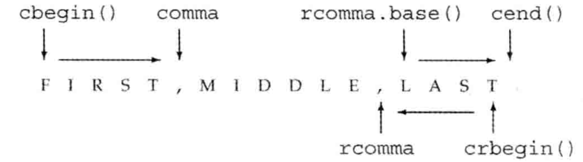

# 总结

* 泛型算法的分类, 形参规范, 命名规范

* 算法对迭代器的要求: 5种类别
* 插入迭代器, Lambda表达式, 参数绑定与`bind`函数
* 链表的特有算法

[toc]

# 1.概述*

一般来说, 泛型算法不是直接操作容器, 而是在两个迭代器指定的元素范围内进行操作;

* 泛型算法通常是遍历范围内的元素, 对每个元素进行一些处理
* 泛型, 是指可以在不同类型的容器中不同类型的元素上使用

以`find`算法为例

* `find`算法接受三个参数; 前两个参数是迭代器, 表示元素范围;  第三个参数是要寻找的值

  ```c++
  string val = "a value";
  auto result = find(lst.cbegin(), lst.cend(), val);	//lst的类型是list<string>
  ```

* `find`算法的执行步骤(概念上的)
  1. 访问序列中的首元素
  2. 比较此元素与要查找的值
  3. 如果匹配, `find`返回标识此元素的值
  4. 否则, `find`前进到下一个元素, 重复执行步骤2和3
  5. 如果到达序列的末尾, `find`应停止
  6. 如果`find`到达序列的末尾, 它应该返回一个表示元素未找到的值. 此值和步骤3返回的值必须具有相容的类型
* 从`find`的执行步骤可得
  * 算法可以不依赖于容器, 但依赖于元素的操作;  
    * 在具体实现中, 迭代器使得算法可以这么做

关键概念: 算法永远不会执行容器的操作

* 泛型算法本身不会执行容器的操作, 它们只会运行于迭代器之上, 执行迭代器的操作.
* 因此, 算法永远不会改变底层容器; 算法可能改变元素的值, 可能在容器内移动元素, 但永远不会添加或删除元素
* 标准库定义了一类特殊的迭代器, 称为插入器(**inserter**); 可以通过该类迭代器在底层容器中执行插入操作

# 2.泛型算法概述*

> 这里展示如何使用算法, 并介绍算法的通用原则

标准库提供了超过100个算法; 不过, 这些算法有一致的结构. 大多数算法定义在`algorithm`头文件中, 还有一些数值算法定义在`numeric`头文件中.

* 除了少数例外, 标准库算法一般都对一个给定范围内的元素进行操作; 此元素范围称为"输入范围". 
  * 接受输入范围的算法总是使用前两个形参表示此范围, 这两个形参分别是指向要处理的第一个元素和尾元素之后位置的迭代器

## 2.1只读算法* 

> 一些算法只会读取其输入范围内的元素, 而从不改变元素的值;

`find`算法: 

* 在输入范围内根据给定的值查找相等的元素, 返回一个指向该元素的迭代器; 若没有找到, 返回第二个参数(也是迭代器), 表示范围的尾后位置
* 形式: `find(beg, end, val)`
  * 前两个参数是迭代器, 表示输入范围;  
  * 第三个参数是要寻找的值
* 默认情况下使用`==`运算符

`accumulate`算法: 

* 把一个给定的值与输入范围内的每个元素相加, 返回一个和; 类似于`init + elem1 + elem2 + ...`

* 形式: `accumulate(beg, end, val)`
  * 前两个参数是迭代器, 表示输入范围;  
  * 第三个参数是和的初值; 该值的类型决定了函数中所使用的`+`运算符以及返回类型
* 默认情况下使用两元`+`运算符

> 接受两个序列的算法

`equal`算法

* 确定两个序列的元素是否相等; 若相等, 返回`true`, 否则返回`false`; 具体是将第一序列的每一元素和第二序列中相对应位置的元素进行比较
* 形式: `equal(beg1, end1, beg2)`
  * 前两个参数是指向同一容器的迭代器, 表示第一序列;  
  * 第三个迭代器表示第二序列的首元素
* 注意
  * 默认情况下使用`==`操作
  * 第二序列至少要与第一序列一样长

## 2.2写算法*

一些算法将新值赋予序列中的元素

> 一些算法接受两个迭代器, 表示输入范围

`fill`算法

* 将给定的值赋予输入范围内的每个元素
* 形式: `fill(beg, end, val)`
  * 前两个参数是迭代器, 表示输入范围;  
  * 第三个参数是用于赋值的值
* 默认情况下使用`beg`所指的元素类型的`=`赋值运算符

> 一些算法接受一个迭代器, 表示目的位置
>
> * 表示目的位置的迭代器, 称为目标迭代器(**destination iterator**)

`fill_n`算法

* 将给定的值赋予迭代器指向的元素开始指定个元素

* 形式: `fill_n(dest, n, val)`
  * 第一个参数是一个目标迭代器, 表示一个目的位置(**destination**), 指向一个序列的首元素
  * 第二个参数是计数值, 表示需要写入多少个元素
  * 第三个参数是写入值, 表示要写入的值
* 默认情况下使用`dest`所指的元素类型的`=`赋值运算符
* 注意
  * `fill_n`假定迭代器`dest`指向一个元素, 而且从`dest`开始的序列至少包含`n`个元素

### `back_inserter`

插入迭代器(**insert iterator**), 是一种能向容器添加元素的迭代器.

* 当我们通过一个插入迭代器向容器元素赋值时, 一个与赋值号右操作数相等的元素被添加到容器中
* 插入迭代器经常作为算法的目标迭代器
* 更多内容(s10.4.1 p401)

`back_inserter`, 是一个返回插入迭代器的函数, 定义在`iterator`头文件

* 接受一个指向容器的引用, 返回一个与该容器绑定的插入迭代器

```c++
vector<int> vec;
fill_n(back_inserter(vec), 10, 0);
```

### 拷贝算法

`copy`算法

* 把输入范围中的元素拷贝到目标序列中; 返回目标序列中最后一个新元素的后面位置的迭代器

* 形式: `copy(beg, end, dest)`
  * 前两个迭代器表示输入范围;  
  * 第三个迭代器表示目标序列的起始位置
* 默认情况下使用`dest`所指的元素类型的赋值运算符

> 多个算法提供了所谓的"拷贝版本; 它们计算新元素的值, 但不会将它们放置在输入序列的末尾, 而是创建一个新序列保存这些结果

`replace`算法

* 读入一个序列, 并将其中所有等于给定值的元素都改为另一个值
* 形式: `replace(beg, end, val, new_val)`
  * 前两个迭代器表示输入范围;  
  * 后两个值分别是要搜索的值和新值;
* 默认情况下使用`beg`所指的元素类型的赋值运算符

`repalce_copy`算法

* 该版本保留输入序列, 接受第三个迭代器参数, 指出调整后序列的保存位置
* 形式: `replace_copy(beg, end, dest, val, new_val)`
  * 前两个迭代器表示输入范围;  
  * 第三个参数是目标迭代器, 表示输出序列的位置
  * 后两个值分别是要搜索的值和新值;
* 默认情况下使用`beg`所指的元素类型的赋值运算符

## 2.3重排元素顺序的算法*

一些算法会重排容器中元素的顺序

`sort`算法

* 对输入范围内的元素进行排序
* 形式: `sort(beg, end)`
  * 这两个迭代器表示输入范围;  
* 默认情况下使用元素类型的`<`运算符

`stable_sort`算法

* 与`sort`算法类似; 不同的是, `stable_sort`维持相等元素的原有顺序

`unique`算法

* 重排序列, 把相邻的重复项移动到容器中的靠后部分, 返回一个指向最后一个唯一值的后面位置的迭代器
* 形式: `unique(beg, end)`
* 默认情况下使用元素类型的`==`运算符

# 3.操作定制

> 很多算法都会比较输入序列中的元素; 默认情况下, 这些算法使用元素类型的`<`或`==`运算符来完成比较.

标准库为这些算法定义了额外的版本, 允许我们提供自己定义的操作来替代默认运算符

## 3.1向算法传递一个函数*

>  一些算法可以接受谓词

谓词(**prdicate**), 是指一个可以被调用的表达式, 其返回结果是一个作为条件的值

* 标准库所使用的谓词可分为: 一元谓词(**unary prediacate**, 有一个形参), 和二元谓词(**binary predicate**, 有两个形参)
* 接受谓词的算法会在输入范围内的元素上使用给定的谓词; 元素类型必须能够与谓词的形参类型匹配

`sort`算法的接受二元谓词的版本

* 提供的二元谓词必须满足某些条件(见s11.2.2 p425)
* 形式: `sort(beg, end, pred)`

```c++
bool isShorter(const string &s1, const string &s2) {
    return s1.size() < s2.size();
}
sort(words.begin(), words.end(), isShorter);
```

## 3.2Lambda表达式(C++11)

除了函数以外, 可调用对象还有重载了函数调用运算符的类, 和Lambda表达式

Lambda表达式

* Lambda表达式, 表示一个可调用的对象

* 形式: `[capture_list] (parameter_list)->return_type {function_body}`
  * 可以忽略形参列表和圆括号, 表示一个空参数列表
  * 可以忽略返回类型; 如果忽略返回类型, 有
    * Lambda体只是一个`return`语句, 则返回类型从返回语句中的表达式的类型推断而来
    * Lambda体不只是一个`return`语句, 则返回`void`
  * 如果要使用返回类型, 必须使用尾置返回.
  * 必须包含(可以为空的)捕获列表和函数体
* 捕获列表`capture_list`
  * 一个lambda所在函数中定义的局部变量列表, 以逗号分隔变量名
  * 把局部变量放在捕获列表中, 表示需要在`lambda`中使用该变量
* 注意
  * Lambda表达式必须在函数内定义
  * Lambda表达式不能有默认实参
  * 如果想使用lambda所在函数的局部变量, 需要将其放入捕获列表
  * Lambda可以直接使用局部静态变量和全局变量

```c++
auto f = []{return 42;};	//f是一个可调用对象
std::cout << f() << std::endl;	//输出42
```

### 向算法传递一个lambda

`find_if`算法: 接受一个一元谓词

* 在输入范围内的元素上调用给定的谓词
  * 如果存在谓词返回非0值的元素, 返回一个迭代器, 指向第一个这样的元素; 
  * 如果不存在这样的元素, 则返回尾后迭代器

* 形式: `find_if(beg, end, unary_pred)`

```c++
void biggies(vector<string> &words, 
             vector<string>::size_type sz) 
{
	elimDups(words);	//把words的元素按字典排序, 并移出重复项
    stable_sort(words.begin(), words.end(), isShorter);
    auto wc = find_if(words.begin, words.end(),
                     [sz](const string&a)
                      {return a.size() >= sz;});
    auto count = words.end() - wc;
    cout << count << " " << make_plural(cout, "word", "s")
        << " of length " << sz << " or longer" << endl;
}
```

## 3.3Lambda捕获和返回

定义一个lambda表达式时, 编译器根据lambda表达式生成一个对应的无名的类类型, 保存一些必要信息; 当给函数传递一个lambda, 或者使用`auto`定义一个变量时初始符为lambda, 编译器会创建一个该类类型的对象.

* 默认情况下, 根据lambda生成的类都含有一个对应lambda捕获的变量的数据成员; 与普通的数据成员一样, 该数据成员在lambda对象创建时初始化

### Lambda的捕获

与参数传递一样, lambda中的捕获变量的方式可以是值捕获或引用捕获

* 下表是lambda捕获列表的形式

  | 形式                   | 描述                                                         |
  | ---------------------- | ------------------------------------------------------------ |
  | `[]`                   | 空捕获列表; 表示lambda中不使用所在函数的变量                 |
  | `[names]`              | `names`是一个逗号分隔的局部名字的列表;变量默认被值捕获, 名字前加`&`表示引用捕获 |
  | `[&]`                  | 隐式引用捕获列表, 表示在lambda中所使用的来自所在函数的局部名字都会被隐式引用捕获 |
  | `[=]`                  | 隐式值捕获列表, 表示在lambda中所使用的来自所在函数的局部名字都会被隐式值捕获 |
  | `[&, identifier_list]` | `identifier_list`中的名字被值捕获; 其他来自所在函数的的局部名字被隐式引用捕获; `identifier_list`中的名字不能以`&`开头 |
  | `[=, reference_list]`  | `reference_list`中的名字被引用捕获; 其他来自所在函数的局部名字被隐式值捕获; `reference_list`中的名字必须以`&`开头, 不能包含`this`指针 |

* 值捕获: 当lambda对象被创建时, 被捕获的变量的值被拷贝到lambda中的同名变量中

* 引用捕获: 当lambda对象被创建时, 被捕获的变量与lambda中的同名变量绑定

  * 当以引用方式捕获一个变量时, 需要保证该变量在lambda执行过程中一直存在
  * 函数可以返回一个lambda; 因为函数不应该返回一个指向局部变量的引用, 所以该lambda不应该有引用捕获

* 隐式捕获: 让编译器根据lambda体中的代码来推断我们要使用哪些变量\

### 可变Lambda

默认情况下, 一个lambda不能改变被值捕获的变量; 

如果想要改变被值捕获的变量, 必须在形参列表后跟`mutable`关键字; 此时不能省略形参列表

```c++
void fcn3()
{
    size_t v1 = 42;
    auto f = [v1] () mutalbe {return ++v1;};
    v1 = 0;
    auto j = f(); 	// j is 43
}
```

### 指定lambda返回类型

默认情况下, 如果Lambda表达式省略返回类型, 且

* Lambda体只是一个`return`语句, 则编译器从`return`中推断返回类型
* Lambda体不只是一个`return`语句, 则编译器假定此Lambda返回`void`

当要明确指定lambda返回类型时, 使用尾置返回类型(C++11)

## 3.4实参绑定

### 标准库`bind`函数

`bind`函数, 一个通用的函数适配器, 定义在`functional`头文件中

* 接受一个可调用对象, 生成一个新的可调用对象, 新的可调用对像重新调整原对象的参数列表

* 当调用`bind`返回的新可调用对象时, 新对象调用`callable`

* 形式: `auto newCallable = bind(callable, arg_list)`

  * `callable`是一个可调用对象
  * `arg_list`是一个逗号分隔的实参列表, 该列表对应于`callable`的形参列表
    * `arg_list`可以包含形如`_n`的名字, 其中`n`是一个整数; 
  * `_n`是占位符, 表示`newCallable`的形参, 在`arg_list`中为`newCallable`的实参占据位置. 数值`n`表示在`newCallable`中第`n`个形参; 如`_1`表示`newCallable`中的第一个形参

  ```c++
  bool check_size(const string &s, string::size_type sz)
  {
      return s.size() >= sz;
  }
  auto check6 = bind(check_size, _1, 6);		// 使用占位符_1
  
  //在某个函数中
  string s = "hello";
  bool b1 = check6(s);	//check6(s)调用check_size(s, 6)
  ```

`arg_list`的实参都是值传递的; 如果想要以引用方式传递某个实参, 必须要使用标准库函数`ref`或`cref`

```c++
ostream &print (ostream &os, const string &s, char c)
{
    return os << s << c;
}
for_each(words.begin(), words.end(), bind(print, os, _1, ' '));	//error
for_each(words.begin(), words.end(), bind(print, ref(os), _1, ' '));	
```

* `ref`和`cref`函数定义在`functional`头文件中
  * `ref`函数返回一个可拷贝的对象, 此对象包含给定的引用;
  * `cref`函数返回一个可拷贝的对象, 此对象包含`const`引用;

* 占位符定义在`placeholders`命名空间
  * 名字`_n`都定义在`placeholders`命名空间中, 而这个命名空间定义在`std`命名空间
  * `placeholders`命名空间定义在`functional`头文件
  * 因此, `_n`的`using`声明的形式是: `using std::placeholders::_n;`
    * 例子: `_1`的`using`声明是: `using std::placeholders::_1;`
  * 可以声明整个命名空间, 形式是: `using namespace namespace_name;`
    * 例子: `using namespace std::placeholders;`

### `bind1st`, `bind2nd`(旧版本)

C++ 的旧版本标准库中定义了两个绑定实参的函数: `bind1st`, `bind2nd`

* `bind1st`, `bind2nd`分别只能绑定第一或第二个形参

# 4.迭代器再探

 除了为容器定义的迭代器外, 标准库在`iterator`头文件中定义了几种其他的迭代器, 有

* 插入迭代器(**insert iterator**): 可以与一个容器绑定, 用于向容器插入元素
* 流迭代器(**stream iterator**): 可以与输入或输出流绑定, 用于遍历关联的IO流
* 反向迭代器(**reverse iterator**): 这类迭代器向后移动, 而不是向前移动; 除了`forward_list`外的标准库容器都定义了反向迭代器
* 移动迭代器(**move iterator**): 这类迭代器用于移动元素, 而不是拷贝元素

## 4.1插入迭代器

插入器是一种迭代器适配器, 它接受一个容器然后生成一个迭代器; 该迭代器就是插入迭代器, 用于向给定容器添加元素.

有三种插入器函数, 生成不同的插入迭代器

* `back_inserter`: 创建一个使用`push_back`操作的迭代器
* `front_inserter`: 创建一个使用`push_front`操作的迭代器
* `inserter`: 创建一个使用`insert`操作的迭代器; 该函数接受第二个参数, 必须是一个指向给定容器的迭代器; 元素将被插入到给定迭代器所表示的元素之前

插入迭代器的操作

| 操作                  | 描述                                                         |
| --------------------- | ------------------------------------------------------------ |
| `*it = t`             | 在`it`指定的位置插入值`t`                                    |
| `*it`, `++it`, `it++` | 这些操作虽然存在, 但是不会对`it`做任何使其; 每个操作返回`it`本身 |

以`inserter`为例

```c++
auto it = inserter(c, iter);
*it = val;					//这里的it是插入迭代器
//上面的语句等价于
it = c.insert(it, val);		//这里的it是普通的迭代器
++it;
```

## 4.2`iostream`迭代器

`iostream`迭代器将它们的流看作特定类型的元素序列

### `istream_iterator`

| 操作                         | 描述                                                         |
| ---------------------------- | ------------------------------------------------------------ |
| `istream_iterator<T> in(is)` | `in`从输入流`is`中读取类型为`T`的值                          |
| `istream_iterator<T> end;`   | 读取类型为`T`的值的输入流`is`的尾后迭代器, 表示输入流遇到eof或者IO错误. |
| `in1 == in2`                 | `in1`和`in2`所读取类型相同, 且它们绑定到相同的输入流或都是尾后迭代器时, 两者相等 |
| `in1 != in2`                 | 同上                                                         |
| `*in`                        | 返回从输入流中读取的值                                       |
| `in->mem`                    | 等于`(*in).mem`                                              |
| `++in`, `in++`               | 使用元素类型的`>>`运算符从输入流中读取下一个值. 与以往一样, 前置版本返回一个指向递增后的迭代器引用, 后置版本返回旧值 |

* `T`类型的要求: 定义了`>>`运算符的类型
  * 因为`istream_iterator`使用元素类型的`>>`运算符读输入流
* `istream_iterator`允许使用懒惰求值; 也就是说, 具体实现可以延迟读取输入流, 但是必须在第一次使用该迭代器之前完成求值

```c++
istream_iterator<int> in_iter(cin), eof;
vector<int> vec(in_iter, eof);
istream_iterator<int> in(cin), eof1;
cout << accumulate(in, eof1, 0) << endl;
```

### `ostream_iterator`

| 操作                              | 描述                                                         |
| --------------------------------- | ------------------------------------------------------------ |
| `ostream_itertator<T> out(os);`   | `out`向输出流`os`中写入类型为`T`的值                         |
| `ostream_iterator<T> out(os, d);` | `out`向输出流`os`中写入类型为`T`的值, 每个值后面都输出一个空终止的字符数组`d` |
| `out = val`                       | 使用元素类型的`<<`运算符向输入流中写入值`val`; `val`的类型要与类型`T`匹配 |
| `*out`, `++out`, `out++`          | 这些操作虽然存在, 但是不会对`out`做任何使其; 每个操作返回`out`本身 |

* `T`类型的要求: 定义了`<<`运算符的类型
* 不允许空的或尾后位置的`ostream_iterator`

```c++
ostteam_iterator<int> out_iter(cout, " ");
//第一种形式(建议使用)
for (auto e : vec)
    *out_iter++ = e;
cout << endl;
//第二种形式(不建议使用)
for (auto e: vec)
    out_iter = e;
cout << endl;
```

## 4.3反向迭代器

反向迭代器是反向遍历容器的迭代器, 即从尾元素到首元素的方向.

* 除了`forward_list`外, 其他容器都有反向迭代器

* 反向迭代器中的递增和递减运算符的含义是与普通的迭代器的含义相反;

  * 反向迭代器中的"递增"实际上是移动到前一个元素, "递减"实际上是移动到后一个元素

* 返回反向迭代器的成员

  * `rbegin`, `crbegin`:  返回指向尾元素的迭代器
  * `rend`, `crend`: 返回指向首前位置的迭代器

* 反向迭代器的`base`成员

  * 返回其对应的普通迭代器

  * 反向迭代器`iter`与`iter.base()`指向不同的元素; 两者指向的元素是相邻的元素

    * 指向元素的不同是为了保证元素范围无论是正向还是反向都是相同的.

  * 例子: 

    

    * 范围`[crbegin(), rcomma)`与`[rcomma.base(), cend())`都指向相同的元素范围

```c++
vector<int> vec = {0, 1, 2, 3, 4};
for (auto r_iter = vec.crbegin();
    	  r_iter != vec.crend();
    	  ++r_iter)
    cout << *r_iter << ", ";		//输出: 4, 3, 2, 1, 0
```

# 5.泛型算法结构*

泛型算法的最基本的特征是它所要求的迭代器操作;

根据算法所要求的迭代器操作可以将迭代器分为5个迭代器类别(**iterator category**)

| 迭代器                                     | 描述                                 |
| ------------------------------------------ | ------------------------------------ |
| 输入迭代器(**input iterator**)             | 只读, 不写; 单遍扫描, 只能递增       |
| 输出迭代器(**output iterator**)            | 只写, 不读; 单遍扫描, 只能递增       |
| 前向迭代器(**forward iterator**)           | 可读写; 多遍扫描, 只能递增           |
| 双向迭代器(**bidirectional iterator**)     | 可读写; 多遍扫描, 可递增和递减       |
| 随机访问迭代器(**random-access iterator**) | 可读写; 多遍扫描, 支持全部迭代器运算 |

## 5.1 五种迭代器类别*

迭代器按所能提供的操作分类, 形成一种层次 . 除了输出迭代器外, 一个高层类别的迭代器支持低层类别的迭代器的所有操作.

* C++标准指明泛型算法和数值算法的每个迭代器形参的最小类别; 
* 对于每个迭代器形参来说, 作为实参的迭代器至少能够提供规定的最小类别的操作.

输入迭代器((**input iterator**): 

* 必须支持以下操作
  * `==` , `!=`: 用于比较两个迭代器的相等性
  * `++`: 前置和后置递增迭代器
  * `*`: 用于读取元素的解引用运算符; 该解引用只会出现在赋值运算符的右侧
  * `->`: 解引用迭代器, 并获得对象的成员

* 其他
  * 递增输入迭代器可能导致所有其他指向流的迭代器失效, 因此只能用于单遍扫描
* 属于该类别的迭代器类型: `istream_iterator`
* 要求该类别迭代器的算法: `find`, `accumulate`

输出迭代器(**output iterator**): 可以看作输入跌倒去功能上的补集

* 必须支持以下操作
  * `++`: 前置和后置递增迭代器
  * `*`: 用于写入元素的解引用运算符; 该解引用只出现在赋值运算符的左侧
* 其他
  * 只能向一个输出迭代器赋值一次, 因此只能用于单遍扫描
* 属于该类别的迭代器类型: `ostream_iterator`, 多数目标迭代器`dest`
* 要求该类别迭代器的算法: `copy`函数的第三个参数

前向迭代器(**forward iterator**)

* 必须支持以下操作
  * 所有输入和输出迭代器的操作
* 其他
  * 可以多次读写同一个元素, 因此可以多次扫描
* 属于该类别的迭代器类型: `forward_list`上的迭代器
* 要求该类别迭代器的算法: `replace`函数

双向迭代器(**bidirectional iterator**)

* 必须支持以下操作
  * 支持所有前向迭代器的操作
  * `--`: 前置和后置递减迭代器
* 其他
  * 可以多次读写同一个元素, 因此可以多次扫描
* 属于该类别的迭代器类型: 除了`forward_list`外的其他标准库容器都提供符合双向迭代器要求的迭代器
* 要求该类别迭代器的算法: `reverse`函数

随机访问迭代器(**random-access iterator**)

* 必须支持以下操作
  * 支持双向迭代器的所有操作
  * `<, <=, >, >=`: 比较两个迭代器的关系运算符
  * `+, +=, -, -=`: 迭代器与一个整数值的加减运算
  * `iter1 - iter2`: 两个迭代器之间的减法运算
  * 下标运算符`iter[n]`, 等价于`*(iter + n)`
* 其他
  * 提供常量时间内访问序列中任意元素的能力
* 属于该类别的迭代器类型: `array`, `deque`, `string`和`vector`的迭代器, 用于访问内置数组的指针
* 要求该类别迭代器的算法: `sort`函数

## 5.2算法形参模式Algorithm Parameter Patterns*

> 泛型算法的形参有规范的

大多数算法具有以下的形参形式之一

* `alg(beg, end, other_args);`
* `alg(beg, end, dest, other_args);`
* `alg(beg, end, beg2, other_args);`
* `alg(beg, end, beg2, end2, other_args);`
* 说明: `alg`是算法的名字; `beg`和`end`是两个迭代器, 表示算法的输入范围; `dest`, `beg2`与`end2`都是迭代器参数, 分别表示指定目的位置和第二个范围

`dest`形参是一个表示算法可以写入的目的位置的迭代器. 

* 算法假定`dest`所指的目的位置有足够空间容纳写入的数据

`beg2`和`end2`是指向同一容器的迭代器, 表示第二个输入范围

* 只接受`beg2`的算法把`beg2`看作第二个输入范围的第一个元素; 并算法假定从`beg2`开始的输入范围至少与第一个输入范围一样大

## 5.3算法命名规范*

> 算法遵循一组命名和重载规范

一些算法使用重载形式传递一个谓词

* 函数的一个版本用元素类型的运算符来比较元素
* 函数的另一个版本接受一个额外的谓词参数来代替`<`或`==`

```c++
unique(beg, end);
unique(beg, end, comp);
```

有`_if`版本的算法

* 接受一个元素值的算法通常有另一个不同名的(不是重载的)版本, 该版本接受一个谓词代替元素值.
* 接受谓词参数的算法都有附加的`_if`后缀

```c++
find(beg, end, val);
find_if(beg, end, pred);
```

拷贝元素的版本和不拷贝的版本

* 默认情况下, 重排元素的算法将重排后的元素写回给定的输入序列中
* 算法的不同名的另一个版本 , 将元素写到一个指定的输出目的位置; 一般在名字后附加一个`_copy`

```c++
reverse(beg, end);
reverse(beg, end, dest);
```

一些算法同时提供`_copy`和`_if`版本, 接受一个目的位置迭代器和一个谓词

```c++
remove_if(v1.begin(), v1.end(), [](int i){return i % 2;});
remove_if(v1.begin(), v1.end(), back_inserter(v2), [](int i){return i % 2;});
```

# 6.特定容器的算法

容器类型`list`和`forward_list`定义几种成员函数形式的算法

* 原因
  * 链表不符合一些泛型算法的要求
  * 一些通用版本的算法对于链表来说代价太高
* 注意: 这些链表特有的操作会改变链表

| 算法                    | 描述                                                         |
| ----------------------- | ------------------------------------------------------------ |
| `lst.merge(lst2)`       | 将来自`lst2`的元素合并入`lst`. `lst`和`lst2`必须是有序的. 元素将从`lst2`... |
| `lst.merge(lst2, comp)` | ...删除. 在合并后, `lst2`变为空. 第一版本使用`<`, 第二个使用给定的比较操作 |
| `lst.remove(val)`       | 调用`erase`删除掉与给定值相等(==)...                         |
| `lst.remove_if(pred)`   | ...或令一元谓词为值的每个元素                                |
| `lst.reverse()`         | 反转`lst`中元素的顺序                                        |
| `lst.sort()`            | 给`lst`中的元素进行排序, 使用`<`...                          |
| `lst.sort(comp)`        | ...或者给定操作`comp`进行排序                                |
| `lst.unique()`          | 调用`erase`删除同一个值的连续拷贝. 第一个版本使用`==`,...    |
| `lst.unique(pred)`      | 第二个版本使用给定的二元谓词                                 |

* 这些操作都返回`void`

## `splice`成员

链表类型还定义了`splice`算法; 此算法是链表数据结构所特有的

`splice`算法

* `lst.splice(p, lst2)`或`flst(splice_after(p, lst2)`
  * 效果: 函数将`lst2`的所有元素移动到`lst`中`p`之前的位置或是`flst`中`p`之后的位置.
  * `p`是一个指向`lst`中元素的迭代器, 或指向`flst`首前位置的迭代器.
  * 元素会从`lst2`中删除. `lst2`的类型必须与`lst`或`flst`相同, 且不能是同一链表

* `lst.splice(p, lst2, p2)`或`flst(splice_after(p, lst2, p2)`
  * 效果: 将`p2`指向的元素移动到`lst`中, 或将`p2`之后的元素移动到`flst`中
  * `p2`是一个指向`lst2`中位置的有效迭代器
  * `lst2`可以是与`lst`或`flst`相同的链表
* `lst.splice(p, lst2, b, e)`或`flst(splice_after(p, lst2, b, e)`
  * 效果: 将给定范围的元素从`lst2`移动到`lst`或`flst`
  * `b`和`e`必须表示`lst2`中的合法范围.
  * `lst2`可以是与`lst`或`flst`相同的链表, 但`p`不能指向给定范围中的元素