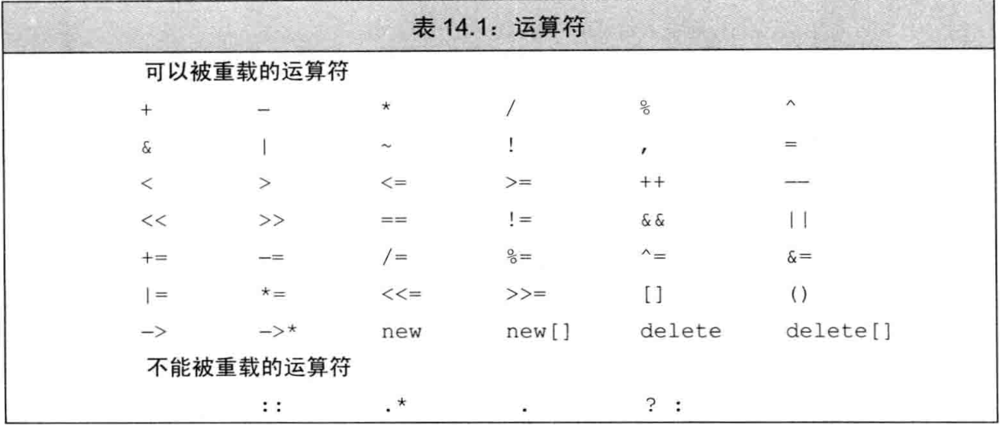

# 总结

* 重载运算符

* 类型转换

[toc]

# 1.基本概念*

> 通过运算符重载, 可以自定义类类型的运算符的含义; 恰当地使用运算符重载能令程序更易于编写和阅读

类的重载运算符是具有特殊名字的函数

* 形式
  * 其名字由关键字`operator`和要定义的运算符符号组成
  * 与其他函数一样, 重载运算符包含返回类型, 形参列表和函数体
  * 重载运算符函数的形参数量, 就是该运算符作用的运算对象的数量
    * 一元运算符有一个形参; 二元运算符有两个形参, 且左操作数传递给第一个形参, 右操作数传递给第二个形参
    * 如果重载运算符函数是某个类的成员函数, 运算符的第一个操作数是隐式地与`this`指针绑定的; 此时, 如果有其他操作数, 这些操作数作为形参列表中的形参

* 限制

  * 除了函数调用运算符`operator()`, 其他重载运算符不能含义默认实参

  * 运算符函数必须要么是类的成员, 要么至少含义一个类类型的形参; 

    * 也就是说, 不能改变运算符作用于内置类型对象时的含义

  * 只能重载已有的运算符, 不能创建新的运算符符号

  * 可以重载大多数运算符, 有些不能重载;

    

    * `+, -, *, &`这四个符号既是一元运算符也是二元运算符; 能够根据形参的数量来推断要定义的运算符

* 调用重载运算符
  * 像内置运算符一样调用重载运算符, 如`obj1 + obj2`
  * 像成员函数一样调用重载运算符函数, 如`obj1.operator+=(obj2)`
  * 像普通函数一样调用重载运算符函数, 如`operator+(obj1, obj2)`

* 重载运算符的性质

  * 重载运算符的优先度和结合律与对应的内置运算符一样
  * 使用重载运算符本质是一次函数调用, 因此关于运算对象求值顺序的规则对重载运算符没有保留下来
    * 因此, 不建议重载保证求值顺序的运算符, 如`&&`, `||`, `,`等

* 建议

  * 对于`&&`和`,`运算符, C++为其定义了用于类类型对象时的特殊含义, 所以一般来说不应该重载它们

  * 重载运算符的含义最好与内置类型一致
    * 如果类执行IO操作, 则定义位移操作运算符`<<`和/或`>>`使其与内置类型的IO保持一致
    * 如果类的某个操作是检查相等性, 则定义相等性运算符`==`和/或`!=`
    * 如果类包含一个简单的自然的排序操作, 则定义`operator<`, 甚至定义所有关系运算符
    * 重载运算符的返回类型通常情况下应该与其内置版本的返回类型兼容: 逻辑和关系运算符应该返回`bool`, 算术运算符应该返回一个类类型的值, 赋值运算符和复合赋值运算符应该返回左操作数的引用

## 赋值和复合赋值运算符

建议

* 赋值之后, 左操作数和右操作数应该有相同的值; 运算符返回左操作数的引用
* 如果类含义算术运算符或位运算符, 则最好也提供对应的复合赋值运算符; 复合赋值运算符的行为也应该与其内置版本一致, 如`+=`的行为应该是先执行`+`再执行`=`

## 选择作为成员或非成员

当定义重载运算符时, 我们必须决定是将其声明位为类的成员函数还是声明为一个非成员函数. 不过, 有些运算符必须是成员函数;

下面是几条原则

* `=`赋值, `[]`下标, `()`调用, `->`成员访问箭头等运算符必须是成员函数
* 复合赋值运算符通常应该是成员
* 改变对象状态或者与给定类型密切相关的运算符通常应该是成员, 如递增, 递减, 解引用等等
* 具有对称性的运算符通常应该是非成员函数, 如算术, 相等性, 关系, 位运算等等

作为成员和非成员的区别

* 作为成员函数的运算符, 它的第一个操作数必须是其所属类的一个对象
* 作为非成员函数的运算符, 至少有一个操作数是类类型即可

# 2.输入和输出运算符*

IO标准库分别使用`>>`和`<<`运算符执行输入操作和输出操作; 支持IO的类通常定义这些运算符的版本

## 2.1重载输出运算符`<<`*

输出运算符的重载版本通常是: `ostream &operator<<(ostream &, const T&);`

* 为了与`iostream`标准库兼容, 类的输出运算符应该是非成员函数; 此时若想要输出类的非公有成员, 需要将输出运算符声明为友元
* 第一个形参通常是非`const`的`ostream`对象引用
  * 因为写入输出流会改变它的状态, 所以`ostream`对象是非`const`的
  * 因为不能拷贝`ostream`对象, 所以该形参是引用类型

* 第二形参通常是想要输出的类类型对象的`const`引用
  * 该形参为引用类型的原因是希望避免拷贝实参
  * 该形参为`const`的原因是一般情况下输出操作不会改变对象的内容

* `operator<<`通常要返回它的`ostream`形参
  * 原因是为了与其他输出运算符保持一致

建议: 

* 输出运算符尽量减少格式化操作; 让用户去控制输出的细节

## 2.2重载输入运算符`>>`*

输入运算符的重载版本通常是: `istream &operator>>(istream &, T&);`

* 为了与`iostream`标准库兼容, 类的输入运算符应该是非成员函数; 
* 第一个形参通常是非`const`的`istream`对象引用
  * 因为读取输入流会改变它的状态, 所以`istream`对象是非`const`的
  * 因为不能拷贝`istream`对象, 所以该形参是引用类型

* 第二形参通常是接受数据的类类型对象的非`const`引用
  * 该形参为引用类型的原因是希望避免拷贝实参
  * 该形参为非`const`的原因是一般情况下输入操作会改变对象的内容

* `operator>>`通常要返回它的`istream`形参
  * 原因是为了与其他输入运算符保持一致

建议

* 输入运算符必须处理输入可能失败的情况; 
  * 如果出现错误, 应该确保接受数据的对象处于有效的状态
  * 可能发生的错误: 输入流包含了错误类型的数据, 或读取操作遇到了文件末尾, 或遇到输入流的其他错误
* 一些输入运算符需要做额外的工作, 如检验数据是否符合设计者的要求等等; 如果输入不符合要求, 应该设置输入流的条件状态来表示失败的输入, 通常只设置`failbit`.

# 3.算术和关系运算符

通常, 算术和关系运算符被定义为非成员函数, 以允许对左右操作数进行类型转换; 因为这些运算符一般不需要改变运算对象的状态, 所以形参通常是`const`引用.

算术运算符的形式: 以`+`加法运算符为例,  `T operator+(const T&, const T&)`

* 算术运算符通常返回一个局部变量的拷贝; 该局部变量的值是计算两个操作数的结果

建议

* 定义了算术运算符的类通常也会定义对应的复合赋值运算符; 此时, 可以使用复合赋值来定义对应的算术运算符, 这是最有效的

## 3.1相等性运算符*

通常, 类定义相等性运算符是为了检验两个对象是否相等; 也就是说, 它们会比较对象的每一个数据成员, 只要当所有对应的成员都相等时才认为两个对象相等

相等性运算符的形式: 以`==`为例, `bool operator==(const T&, const T&)`

* 通常返回一个`bool`值

建议

* 如果类定义了`operator==`, 则该运算符应该能判断一组给定的对象中是否含有相同数据
* 通常情况下, 相等性运算符应该具有传递性; 即, 如果`a==b`和`b==c`都为真, 则`a==c`也应该为真
* 通常定义了`operator==`运算符, 也应该定义`operator!=`, 反之亦然; 此时, 最有效的方式是利用其中一个运算符来定义另一个运算符

## 3.2关系运算符*

定义相等性运算符的类也常常(但不总是)包含关系运算符; 特别是, 因为关联容器和一些算法要用到`<`小于运算符, 所以定义`operator<`会比较有用

关系运算符的形式: 以`<`为例, `bool operator<(const T&, const T&)`

建议: 

* 关系运算符应该定义该类的顺序关系; 顺序关系应该是严格弱序, 即关联容器对其键的要求
* 如果该类同时有相等性运算符和关系运算符, 则两者的含义要保持一致; 特别的是, 如果两个对象是`!=`的, 则一个对象应该`<`另外一个对象

# 4.赋值运算符

除了拷贝/移动赋值运算符外, 类还可以定义其他的赋值运算符以使用其他类型的对象作为右操作数;

赋值运算符的形式: `T& T::operator=(const X&)`,  `T& T::operator=(X)`

* `T`类型是该运算符所属的类, `X`类型是除`T`外的其他类型
* 赋值运算符必须定义为成员函数

* 通常返回一个左操作数的非`const`引用
* 与拷贝/移动赋值运算符一样, 其他运算符必须释放当前内存空间和创建新的空间; 

## 复合赋值运算符

复合赋值运算符可以是成员函数, 也可以是非成员函数; 一般建议定义为成员函数

复合赋值运算符的形式: 以`+=`为例, `T T::operator+=(const T&)` 

# 5.下标运算符

表示容器的类通常定义下标运算符

下标运算符的形式: `X& T::operator[](size_type)`, `const X& T::operator[](size_type) const`

* `T`类型是该运算符所属的类, `X`类型是元素类型
* `size_type`通常是无符号整数类型, 可以是其他类型
* 下标运算符必须是成员函数
* 通常返回所访问元素的引用

建议

* 最好同时定义下标运算符的常量版本和非常量版本

# 6.递增和递减运算符

表示迭代器的类通常会实现递增和递减运算符; C++不要求递增和递减运算符必须是成员, 不过建议将其设为成员函数

## 定义前置版本

形式: `T& T::operator++()`, `T& T::operator--()`

* 通常返回一个递增后或递减后的对象引用

## 定义后置版本

普通的重载形式无法区别前置和后置版本; 为了解决这个问题, 后置版本从形式上接受一个额外的(不被使用的)`int`类型的形参. 

* 这个形参的唯一作用就是区分前置版本和后置版本的函数

* 当我们使用后置运算符时, 编译器为这个形参提供一个值为0的实参. 
* 管从语法上来说后置运算符可以使用这个额外的形参, 但是在实际过程中通常不会这么做. 

形式: `T T::operator++(int)`, `T T::operator--(int)`

* 通常返回对象的原本值, 所以返回的形式是一个值而不是引用

如果想要显式调用后置版本, 在调用时传递一个整型实参

* 如: `p.operator++(0)`

# 7.成员访问运算符

表示迭代器的类通常定义`*`解引用运算符和`->`箭头运算符

## 解引用运算符

解引用运算符的形式: `X& T::operator*() const`

* `T`类型是该运算符所属的类, `X`类型表示所指对象的类型

* 建议定义为成员函数, 通常定义为`const`成员函数
* 通常返回一个引用, 指向类对象所指的对象

## 箭头运算符

箭头运算符的形式: `X* T::operator->() const`, `X T::operator->() const`

* `T`类型是该运算符所属的类, `X*`表示一个指针, `X`表示一个类的对象

* 必须定义为成员函数, 通常定义为`const`成员函数
* 必须返回一个指针类型或一个重载operator->的类对象

限制

* 重载箭头运算符必须返回一个指针类型或一个重载operator->的类对象

  ```c++
  //当我们使用point->mem时, point必须是指向对象的指针或一个重载operator->的类对象
  point->mem;
  //等价于
  (*point).mem;				//这里的point是内置指针
  point.operator->()->mem;	//这里的point是类的一个对象
  ```

* `point->mem`的执行过程

  * 如果`point`是指针, 则使用内置的箭头运算符, 此时表达式等价于`(*point).mem`; 如果`point`所指的类型没有成员`mem`, 程序会发生错误
  * 如果`point`是定义了`operator->`的类的一个对象, 此时表达式等价于`point.operator->() ->mem`; 也就是说, 调用`point`的`operator->`成员函数, 然后返回的结果继续使用箭头运算符`->`来获取`mem`.
    * 如果`point`的`operator->`返回一个指针, 则执行上面的情况;
    * 如果`point`的`operator->`返回一个重载`->`的对象, 则重复当前的情况

# 8.函数调用运算符*

如果类重载函数调用运算符, 该类的对象可以像函数一样使用, 因此该类的对象被称为函数对象(**function object**), 该类被称为函数对象类(**function-object class**)

* 函数调用运算符必须是成员函数, 形式: `return_type class_name::operator()(parameter_list)`
* 一个类可以定义多个版本的函数调用运算符, 相互之间应该在参数数量或类型上有所区别
* 调用函数对象时的实参必须与重载函数通用运算符的形参匹配

与其他类一样, 函数对象类除了`operator()`外也可以包含其他成员, 所以函数对象比普通函数更加灵活

* 函数对象经常被用于泛型算法

## 8.1Lambda是函数对象

当我们编写一个Lambda表达式, 编译器根据Lambda表达式生成一个未命名类的未命名对象, 该未命名类包含一个重载函数调用运算符, 因此lambda是函数对象

* 该未命名类的函数调用运算符的形参列表和函数体与Lambda表达式中的一样
  * 默认情况下lambda不能改变它捕获的变量, 所以该重载函数调用运算符默认是一个`const`成员函数
  * 如果lambda表达式被声明为`mutable`, 则该重载函数调用运算符不是`const`的
* lambda捕获的变量被存储为该未命名对象中对应的数据成员
  * 对于通过引用捕获的变量, 编译器可以直接使用该引用而无须在lambda产生的类中将其存储为数据成员
  * 对于通过值捕获的变量, 必须为每个值捕获的变量建立对应的数据成员
* lambda产生的类中有构造函数; 在该构造函数中, 使用捕获的变量的值来初始化对应的数据成员

* 由lambda表达式产生的类有一个删除的默认构造函数, 一个删除的赋值运算符和一个默认析构函数; 至于它是否含义默认的或删除的拷贝/移动构造函数, 这取决于捕获的数据成员类型

## 8.2标准库定义的函数对象

标准库定义了一组表达算术运算符, 关系运算符和逻辑运算符的类, 具体如下表

| 算术            | 关系               | 逻辑             |
| --------------- | ------------------ | ---------------- |
| `plus<T>`       | `equal_to<T>`      | `logical_and<T>` |
| `minus<T>`      | `not_equal_to<T>`  | `logical_or<T>`  |
| `multiplies<T>` | `greater<T>`       | `logical_not<T>` |
| `divides<T>`    | `greater_equal<T>` |                  |
| `modulus<T>`    | `less<T>`          |                  |
| `negate<T>`     | `less_equal<T>`    |                  |

* 这些类都定义了一个调用运算符以执行对应的操作, 定义在`functional`头文件中, 
* 这些类被定义成模板, 需要提供一个类型以表示调用运算符的形参类型

* 标准库规定其函数对象适用于指针, 即不会产生未定义的行为;
  * 注意: 使用内置的关系运算符比较无关的指针, 会产生未定义的行为
  * 关联容器使用`less<key_type>`来比较元素

## 8.3可调用对象和`function`

> C++中有几种可调用对象: 函数, 函数指针, lambda表达式, `bind`创建的对象以及重载函数运算符的类;

和其他对象一样, 可调用对象也有类型.

* lambda有它自己唯一的匿名类类型
* 函数以及函数指针的类型由其返回值类型和实参类型决定

调用签名(**call signature**), 是指对象调用返回的类型以及传递给调用的实参类型

* 一种调用签名对应一个函数类型

* 两个不同类型的可调用对象可能拥有同一种调用签名

  ```c++
  //普通函数
  int add(int i, int j) { return i + j; }
  //lambda
  auto mod = [](int i, int j) { return i % j; };
  //函数对象
  struct divide {
      int operator()(int denominator, int divisor) {
          return denominator / divisor;
      }
  };
  ```

  * 例子中的三个可调用对象的类型都不相同, 但是它们的调用签名都相同, 都为`int(int, int)`

### 标准库`function`类型(C++11)

`function`模板类型, 定义在`functional`头文件中

* 需要提供该`function`类型所要表示的对象的调用签名

  ```c++
  function<int(int, int)> f1 = add;
  function<int(int, int)> f2 = [](int i, int j) { return i % j; };
  function<int(int, int)> f3 = divide();
  ```

* 不能直接将重载函数的名字存入`function`对象中; 解决方法

  * 将所需的函数存入一个函数指针
  * 使用一个lambda包装所需的函数; 在lambda中, 调用所需的函数并返回调用的结果;

  ```c++
  //两个同名的重载函数
  int add(int i, int j) {return i + j;}
  Sales_data add(const Sales_data&, const Sales_data&);
  //不能使用重载函数名存入function对象中
  function<int(int, int)> f;
  f = add;		//error: 哪个add?
  //将所需的函数存入一个函数指针
  int (*fp)(int, int) = add;
  f = fp;			//ok
  //使用lambda
  f = [](int a, int b) { return add(a,b);};//ok: f存储lambda, 但add是真正执行工作的函数
  ```

| 操作                      | 描述                                                         |
| ------------------------- | ------------------------------------------------------------ |
| `function<T> f;`          | `f`是一个空的`function`对象, 可以存储调用签名为`T`的可调用对象 |
| `function<T> f(nullptr);` | 显式构造一个空的`function`对象                               |
| `function<T> f(obj);`     | `f`存储一个可调用对象`obj`的拷贝                             |
| `f`                       | 将`f`作为条件时: 当`f`含有一个可调用对象时为`true`, 否则为`false` |
| `f(args)`                 | 调用`f`中的对象, 实参是`args`                                |
| 类型成员                  |                                                              |
| `result_type`             | 该`function`类型的可调用对象的返回类型                       |
| `argument_type`           | 当`function`对象只有一个实参时定义的类型, 表示该实参的类型   |
| `first_argument_type`     | 当`function`对象只有两个实参时定义的类型, 表示第一个实参的类型 |
| `second_argument_type`    | 当`function`对象只有两个实参时定义的类型, 表示第二个实参的类型 |

# 9.重载, 类型转换和运算符

* 由一个实参调用的非`explicit`的构造函数, 定义了一种隐式的类型转换: 从实参类型转换成该类类型.
* 通过定义类型转换运算符将定义一种隐式的类型转换: 从该类类型转换成其他类型

转换构造函数和类型转换运算符都定义了类类型转换(**class-type conversion**), 也称为用户定义类型转换(**user-defined conversion**)

## 9.1类型转换运算符

类型转换运算符的形式: `operator type() const;`

* 定义一个从所属类的类型到`type`类型的类型转换

* 要求
  * `type`表示某种类型, 是任意能作为函数返回类型的类型(除了`void`外)
    * 因此, 不允许是数组类型和函数类型
  * 类型转换运算符必须是成员类型
  * 类型转换运算符没有显式的返回类型, 也没有形参
  * 类型转换运算符通常不应该改变调用该运算符的对象, 所以被定义成`const`
* 除非类类型和转换类型之间存在明显的映射关系, 最好不要定义类型转换函数

* 例子

  ```c++
  class SmallInt {
  public:
      SmallInt(int i = 0) : val(i)
      {
          if (i < 0|| i > 255)
              throw std::out_of_range("Bad SmallInt value");
      }
      operator int() const { return val; }
  private:
      std::size_t val;
  };
  ```

  * `SmalleInt`类的`SmalleInt(int)`构造函数定义一个从`int`到`SmallInt`的类型转换
  * `SmalleInt`类的`operator int() const`定义一个从`SmallInt`到`int`的类型转换

  ```c++
  SmallInt si = 3.14;	//double->int->SmallInt
  si + 3.14;			//SmallInt->int->double
  ```

### 向`bool`的类型转换问题

对于类来说, 定义向`bool`的类型转换是比较普遍的; 在C++标准的早期版本中, 如果类想定义一个向`bool`的类型转换, 则常常遇到一个问题: 

* 因为`bool`是一种算术类型, 所以类类型的对象转换成`bool`后就能被用在任何需要算术类型的上下文中. 这样的类型转换可能引发意想不到的结果, 特别是当`istream`含有向`bool`的类型转换时,下面的代码仍将编译通过:

  ```c++
  int i = 42;
  cin << i;
  ```

  * 这段程序试图将输出运算符作用于输入流. 因为`istream`本身并没有定义`<<`, 所以本来代码应该产生错误.
  * 然而, 该代码能使用`istream`的`bool`类型转换运算符将`cin`转换成`bool`, 而这个`bool`值接着被提升成`int`并用作内置的左移运算符的左操作数. 这一结果显然与我们的预期大相径庭

### `explicit`类型转换运算符(C++11)

为了避免这样的问题, C++11引入了`explicit`类型转换运算符

* 除了一个例外, 类型转换运算符是`explicit`时, 必须通过显式强制类型转换才可以执行类型转换
* 例外是, 如果表达式被用作条件, 则编译器会将显式的类型转换自动应用于它; 也就是说, 当表达式出现在下列位置时, 显式的类型转换将被隐式地执行
  * `if`, `while`及`do`语句的条件部分
  * `for`语句头的条件表达式
  * 逻辑非, 逻辑或, 逻辑与运算符的操作数
  * 条件运算符的条件表达式

### 转换为`bool`

在标准库的早期版本中, IO类型定义了向`void*`的转换规则, 以求避免上面提到的问题

## 9.2避免二义性类型转换

当一个类包含一种或多种类型转换时, 则必须确保在类类型和目标类型之间只存在唯一一种转换方式; 否则, 编写的代码将很可能具有二义性, 当程序遇到二义性的类型转换时会出错.

有两种情况下可能产生多重转换路径

1. 两个类提供了相同的类型转换;  
   * 如A类定义一个提供`B->A`类型转换的转换构造函数, B类也定义一个提供`B->A`类型转换的运算符
2. 某个类定义了多个类型转换, 而这些转换涉及的目标类型可以相互转换
   * 如, A类定义一个提供`A->int`类型转换的运算符和一个提供`A->short`类型转换的运算符

关于正确地设计类的重载运算符, 转换构造函数和类型转换函数(类型转换运算符)的建议

* 两个类不要提供了相同的类型转换
* 避免转换目标是内置算术类型的类型转换. 特别的是, 如果你已经定义了一个转换成算术类型的类型转换,则
  * 不要再定义接受算术类型的重载运算符. 如果用户需要这样的运算符, 则使用类型转换, 然后使用内置的运算符
  * 不要定义转换到其他算术类型的类型转换. 让标准类型转换完成向其他算术类型转换的工作

### 重载函数与类类型转换

* 当调用重载函数时, 如果可行函数分别需要不同的类类型转换, 则这些可行函数都被认为是一样好, 也就是说该函数调用具有二义性.

* 在调用重载函数时, 如果可行函数都需要同一个类类型转换, 编译器才考虑额外的标准类型转换的级别(如果有的话)

## 9.3函数匹配与重载运算符

重载运算符其实就是重载函数; 因此, 通用的函数匹配规则也适用于判断表达式中的运算符是哪个版本. 

与普通函数调用不同的是, 

* 不能通过调用的形式来区分当前的运算符是成员函数还是非成员函数

* 候选函数的规模更大; 候选函数包含
  * 运算符的非成员版本和内置版本
  * 如果左操作数是类类型对象时还要运算符的考虑成员函数版本