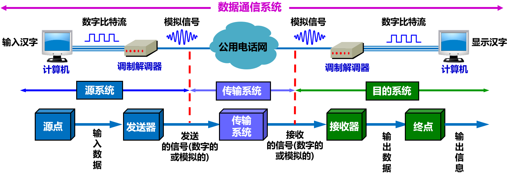

# 总结

* 物理层的任务
* 几种常用的信道复用技术
* 几种常用的宽带接入技术, 主要是ADSL和FTTx

[toc]

# 物理层的基本概念*

物理层考虑的是: 怎样才能够在连接各种计算机的传输媒体上传输数据比特流

* 尽可能地屏蔽掉各种各样传输媒体和通信手段的差异, 使得物理层上面的数据链路层感觉不到这些差异

用于物理层的协议, 也常称为物理层规程(procedure)

* 在"协议"这个名词出现之前, 人们先使用了"规程"这一名词

物理层的任务: 

* 主要任务: 确定与传输媒体的接口有关的一些特性, 即:
  * 机械特性: 指明接口所用接线器的形状和尺寸, 引线数目和排列, 固定和锁定装置等
  * 电气特性: 指明在接口电缆的各条线上出现的电压的范围
  * 功能特性:  指明某条线上出现的某一电平的电压的意义
  * 过程特性: 指明对于不同功能的各种可能事件的出现顺序
* 其他任务
  * 完成传输方式的转换: 数据在计算机内部多采用并行传输方式, 而数据在通信线路一般是串行传输

# 数据通信的基础知识

## 数据通信系统的模型

通过一个最简单的例子来说明数据通信系统的模型; 

* 例子: 两个计算机经过普通电话机的连线, 再经过公用电话网进行通信

数据通信系统的组成

* 源系统(或发送端, 发送方)
  * 源点(source): 源点设备能够产生要传输的数据; 例如从计算机的键盘输入汉字, 计算机产生输出的数字比特流
  * 发送器: 源点生成的数字比特流通常要通过发送器编码后才能够再传输系统中进行传输; 典型的发送器是调制器, 现在很多计算机使用内置的调制解调器(包含调制器和解调器)
* 传输系统(或传输网络): 可以是简单的传输线, 可以是连接在源系统和目的系统之间的复杂网络系统
* 目的系统(或接收端, 接受方)
  * 接收器: 可以接受传输系统传送过来的信号, 并把它转换成能过被目的设备处理的信息; 典型的接收器是解调器
  * 终点(destination): 终点设备从接收器获取传送来的数字比特流, 然后把信息输出; 例如, 把汉字在计算机屏幕上显示出来

通信的常用术语

* 消息(message): 通信的目的是传送消息; 如话音, 文字, 图像, 视频等等都是消息
* 数据(data): 运送消息的实体; (RFC 4949中)数据是使用特定方式表示的信息, 通常是有意义的符号序列
* 信号(signal): 数据的电气或电磁的表现; 根据信号中代表消息的参数的取值方式不同, 可分为
  * 模拟信号, 或连续信号: 代表消息的参数的取值是连续的
  * 数字信号, 或离散信号: 代表消息的参数的取值是离散的; 
    * 码元(code): 在使用时间域(或称为时域)的波形表示数字信号时, 代表不同离散数值的基本波形;
      * 在使用二进制编码时, 只有两种不同的码元, 一种代表0状态而另一种代表1状态

## 有关信道(channel)的几个基本概念

信道(channel): 表示向某一个方向传送信息的媒体

* 一条通信电路往往包含一条发送信道和一条接收信道

从通信的双方信息交互的方式来看, 有以下三种基本方式

* 单向通信/单工通信: 只能有一个方向的通信而没有反方向的交互, 如无线电广播或有线电广播以及电视广播
  * 只需要一条信道
* 双向交替通信/半双工通信: 通信的双方都可以发送信息, 但不能双方同时发送(因此也不能同时接收)
  * 需要两条信道
* 双向同时通信/全双工通信: 通信的双方可以同时发送和接收信息
  * 需要两条信道

基带信号(基本频带信号): 来自信源的信号

* 基带信号往往包含有较多低频成分, 甚至有直流成分, 而许多信道并不能传输这种低频分量或直流分量
* 为了解决这一问题, 必须对基带信号进行调制(modulation)

调制

* 基带调制: 仅仅对基带信号的波形进行变换, 使它能够与信道特性相适应; 变换后的信号仍然是基带信号
  * 由于这种基带调制是把数字信号转换为另一种形式的数字信号, 因此这一过程也称为编码(coding)
  * 常用的编码方式
    * 不归零制: 正电平代表1, 负电平代表0
    * 归零制: 正脉冲代表1, 负脉冲代表0
    * 曼切斯特编码: 位周期中心的向上跳变代表0, 位周期中心的向下跳变代表1. 但也可反过来定义
    * 差分曼切斯特编码: 在每一位的中心处始终都有跳变. 位开始边界有跳变代表0, 而位开始边界没有跳变代表1
    * 
    * 从信号波形中可以看出, 曼彻斯特(Manchester)编码和差分曼彻斯特编码产生的信号频率比不归零制高
    * 从自同步能力来看, 不归零制不能从信号波形本身中提取信号时钟频率(这叫做没有自同步能力), 而曼彻斯特编码和差分曼彻斯特编码具有自同步能力
* 带通调制: 使用载波(carrier)进行调制, 把基带信号的频率范围搬移到较高的频段, 并转换为模拟信号
  * 经过载波调制后的信号称为带通信号(即仅在一段频率范围内能够通过信道
  * 基本的带通调制方法
    * 调幅(AM): 载波的振幅随基带数字信号而变化
    * 调频(FM): 载波的频率随基带数字信号而变化
    * 调相(PM): 载波的初始相位随基带数字信号而变化
    * 
  * 为了达到更高的信息传输速率, 必须采用技术上更为复杂的多元制的振幅相位混合调制方法
    * 正交振幅调制 (Quadrature Amplitude Modulation, QAM ) 

## 信道的极限容量

问题: 

* 任何实际的信道都不是理想的, 在传输信号时会产生各种失真以及带来多种干扰
* 码元传输的速率越高, 或信号传输的距离越远, 或传输媒体质量越差, 在信道的输出端的波形的失真就越严重
* 

从概念上讲, 限制码元在信道上的传输速率的因素有以下两个:

* 信道能够通过的频率范围: 如果信道的频带越宽, 也就是能够通过的信号高频分量越多, 那么就可以用更高的速率传送码元而不出现码间串扰
  * 具体的信道所能通过的频率范围总是有限的; 信号中的许多高频分量往往不能通过信道
  * 码间串扰: 接收端收到的信号波形失去码元之间的清晰界限
  * 奈氏准则: 在假定的理想条件下, 为了避免码间串扰, 码元有传输速率的上限值
    * 在任何信道中, 码元传输的速率是有上限的, 传输速率超过此上限, 就会出现严重的码间串扰, 使接收端对码元的识别/判决成为不可能
* 信噪比: 信号的平均功率和噪声的平均功率之比, 记为S/N
  * 度量单位: 分贝(dB); 即, $信噪比(dB) = 10 \times \log_{10}(S/N)(dB)$

香农公式指出: 信道的极限信息传输速率C是
$$
C = W\log_2(1+S/N) (bit/s)
$$

* 式中: 
  * W为信道的带宽(以Hz为单位)
  * S为信道内所传信号的平均功率
  * N为信道内部的高斯噪声功率
* 说明: 
  * 信道的带宽或信道中的信噪比越大, 则信息的极限传输速率就越高
  * 只要信息传输速率低于信道的极限信息传输速率, 就一定可以找到某种办法来实现无差错的传输
  * 实际中, 信道上能够达到的信息传输速率要比香农的极限传输速率低不少

# 物理层下面的传输媒体

传输媒体, 也称为传输介质或传输媒介

* 数据传输系统中在发送器和接收器之间的物理通路
* 可分为两大类:
  * 导引型(guided)传输媒体: 其中的电磁波被导引沿着固体媒体传播
  * 导引型传输媒体: 是指自由空间; 非导引型传输媒体中, 电磁波的传输常称为无线传输

电信领域使用的电磁波的频谱

## 导引型传输媒体

双绞线/双扭线, 最古老但最常用的传输媒体

* 把两根互相绝缘的导线并排放在一起, 然后用规则的方法绞合(twist)起来就构成双绞线
  * 绞合可以减少对相邻导线的电磁干扰
* 模拟传输和数字传输都可以使用双绞线, 其通信距离一般为几到十几公里
* 为了提高双绞线的抗电磁干扰能力, 可以在双绞线的外面加上一层金属屏蔽层
  * 屏蔽双绞线(Shielded Twisted Pair, STP): 带有金属屏蔽层
  * 无屏蔽双绞线(Unshielded Twisted Pair, UTP)
* EIA/TIA-568-A标准规定了5个种类的UTP标准: 对传送数据来说, 现在最常用的UTP是5类线(Category 5 或 CAT5)
  * 

同轴电缆

* 由内导体铜质芯线(单股实心线或多股绞合线), 网状编织的外道提屏蔽层(也可以是单股的), 绝缘层以及保护塑料外层所组成
* 同轴电缆具有很好的抗干扰特性, 被广泛用于传输较高速率的数据
* 同轴电缆的带宽取决于电缆的质量

光缆

* 光纤通信是利用光纤纤维传递光脉冲来进行通信; 由于可见光的频率非常高, 约为$10^8$MHz的量级, 因此光纤通信系统的传输带宽远远大于目前其他各种传输媒体的带宽
  * 光纤是光纤通信的传输媒体
* 当光线从高折射率的媒体射向低折射率的媒体时, 其折射角将大于入射角.  只要从纤芯中射到纤芯表面的光线的入射角大于某个临界角度, 就可产生全反射, 光也就沿着光纤传输下去
* 
* 类别
  * 多模光纤: 可以存在多条不同角度入射的光线在一条光纤中传输. 
    * 光脉冲在多模光纤中传输时会逐渐展宽, 造成失真; 因此多模光纤只适合于近距离传输
  * 单模光纤: 若光纤的直径减小到只有一个光的波长, 则光纤就像一根波导那样, 它可使光线一直向前传播, 而不会产生多次反射

* 

* 光波的波段
  * 常用的三个波段的中心分别位于850nm, 1300nm和1550nm
    * 850nm波段的衰减较大, 但在此波段的其他特性均较好
    * 这三种波段都具有25000~30000GHz的带宽
* 优点
  * 通信容量非常大
  * 传输损耗小, 中继距离长
  * 抗雷电和电磁干扰性能好
  * 无串音干扰, 保密性好
  * 体积小, 重量轻

架空明线(铜线或铁线)

* 在20世纪初就已大量使用的方法: 在电线杆上架设的互相绝缘的明线.
* 在许多国家现在都已停止铺设架空明显; 目前在我国的一些农村和边远地区的通信仍然使用架空明线

## 非导引型传输媒体

将自由空间成为"非导引型传输媒体"

* 无线传输可使用的频段很广
* 短波通信(即高频通信)主要是靠电离层的反射; 
  * 电离层的不稳定所产生的衰落现象和电离层反射所缠上的多径效应, 使得短波信道的通信质量较差, 传输速率低
* 无线电微波通信: 
  * 微波的频率范围为300MHz\~300GHz(波长1m\~1mm), 主要使用2~40GHz的频率范围
  * 微波在空间主要是直线传播, 可以穿透电离层而进入宇宙空间.
  * 两种方式:
    * 地面微波接力通信
    * 卫星通信

要使用某一段无线电频谱进行通信, 通常必须得到本国政府有关无线电频谱管理机构的许可证. 但是, 也有一些无线电频段是可以自由使用的. 例如: 美国的ISM频段. 各国的 ISM 标准有可能略有差别.

* ISM是Industrial, Scientific, and Medical的缩写

# 信道复用技术*

复用(multiplexing)是通信技术中的基本概念. 在计算机网络中的信道广泛地使用各种复用技术

* 复用是一种将若干个彼此独立的信号, 合并为一个可在同一信道上同时传输的复合信号的方法

* 在发送端使用一个复用器(multiplexer), 使得多个信号一起使用一个共享信道进行通信
* 在接收端使用分用器(demultiplexer), 把合起来传输的信息分别送到相应的终点

## 频分复用, 时分复用, 统计时分复用

频分复用(Frequency Division Multiplexing, FDM)

* 用户在分配到一定的频带后, 在通信过程中将一直占用这个频带
* 频分复用的所有用户在同样的时间占用不同的带宽资源; (这里的"带宽"是频率带宽, 而不是数据的发送速率)
* 

时分复用(Time Division Multiplexing, TDM)

* 将时间划分为一段段等长的时分复用帧(TDM); 每个时分复用帧的用户在每一个TDM帧中占用固定序号的时隙
  * TDM信号, 也称为等时(isochronous)信号
* 时分复用的所有用户是在不同的时间占用同样的频带宽度
* 与频分复用相比较, 时分复用更有利于数字信号的传输
* 时分复用可能会造成线路资源的浪费: 由于计算机数据的突发性质, 用户对分配到的子信道的利用率一般是不高的
* 

统计时分复用(Statistic TDM, STDM), 一种改进的时分复用, 明显地提高信道的利用率

* STDM帧不是固定分配时隙, 而是按需动态地分配时隙; 在每个时隙中有用户的地址信息
* 集中器(concentrator)常使用这种统计时分复用; 此时该类集中器也叫作智能复用器

* 
  * 各用户有要传输的数据, 就随时发往集中器的输入缓存
  * 然后, 集中器按顺序依次扫描输入缓存, 把缓存中的输入数据放入STDM帧; 会跳过没有数据的缓存
  * 当一个帧的数据放满了, 就发送出去

## 波分复用

波分复用(Wavelength Division Multiplexing, WDM), 就是光的频分复用

* 光载波先经过光调制器后, 调制成不同波长的光载波
* 然后经过光复用器(又称为合波器)后, 将多路光载波合并, 发送到在一根光纤中传输
* 光信息在光纤中传输一段距离后就会衰减; 需要对衰减了的光信息进行放大
  * 光放大器, 电放大器
* 然后经过光分用器(又称为分波器), 将合并的光载波分开成多路光载波
* 最后经过光解调器进行解调

## 码分复用

码分复用(Code Division Multiplexing, CDM), 常称为码分多址(Code Division Multiple Access, CDMA)

* 每个用户可以在同样的时间使用同样的频率进行通信; 各用户使用经过特殊挑选的不同码型, 因此彼此不会造成干扰
* 码分复用发送的信号有很强的抗干扰能力, 其频率类似于白噪声, 不易被敌人发现, 因此最初用于军事通信

码片(chip)

* 每一个比特时间划分为m个短的间隔, 称之为码片

* 通常m的值是64或128

码片序列(chip sequence)

* 使用CDMA的每一个站被指派一个唯一的$m$ bit码片序列
* 若要发送比特1, 则发送它自己的码片序列
* 若要发送比特0, 则发送码片序列的二进制反码

扩频(spread spectrum)

* 假定S站要发送信息的数据率为 b bit/s. 由于每一个比特要转换成 m 个比特的码片, 因此 S 站实际上发送的数据率提高到 mb bit/s，同时 S 站所占用的频带宽度也提高到原来数值的 m 倍
* 这种通信方式是扩频通信中的一种, 叫做直接序列扩频(Direct Sequence Spread Spectrum, DSSS)
* 另一种是跳频扩频(Frequency Hopping Spread Spectrum, FSSS)

CDMA的工作原理

* 每个站分配的码片序列不仅必须各不相同, 并且还必须互相正交(orthogonal)
  * 在实用的系统中是使用伪随机码序列
  * 两个不同站的码片序列正交, 就是向量 S 和T 的规格化内积(inner product)等于0, 即$S \cdot T = \frac{1}{m}\sum_{i=1}^mS_iT_i = 0$
  * 如, 向量$S = \{-1 -1 -1 +1 +1 -1 +1 +1\}$, 表示码片序列00011011, 和向量$T = \{-1 -1 +1 -1 +1 +1 +1 -1\}$, 表示码片序列00101110
* 正交关系的重要特性是:
  * 两个不同站的码片序列正交, 则不同站的码片向量的规格化内积为0
  * 任何一个码片向量和其他站的码片反码的向量的内积为0
  * 任何一个码片向量和它自己的规格化内积都是1 
  * 任何一个码片向量和它自己的反码向量的规格化内积值是–1
* 当多个站同时发送数据时, 只要知道某个站所特有的码片序列, 就能够利用上面的特性来获得该站的数据
* 

# 数字传输系统(p59)

# 宽带接入技术

从宽带接入的媒体来看, 可以划分为两大类

* 有线宽带接入
* 无线宽带接入(见第9章)

以下是关于有线宽带接入的讨论

## ADSL技术

非对称数字用户线(Asymmetric Digital Subscriber Line, ADSL)

* 该技术用数字技术对现有的模拟电话用户进行改造, 使它能够承载宽带数字业务
* 标准模拟电话信号的频带被限制在300~3400Hz的范围内, 但用户线本身实际可通过的信号频率仍然超过1MHz
* ADSL技术把0~4kHz低端频谱留给传统电路使用, 而把原来没有被利用的高端频谱留给用户上网使用
* ADSL的下行带宽都远远大于上行带宽

数字用户线(Digital Subscriber Line, DSL)的几种类型

* ADSL(Asymmetric Digital Subscriber Line): 非对称数字用户线
* SDSL(Symmetric DSL): 对称的数字用户线
* HDSL(High speed DSL): 高速数字用户线; 使用一对线或两对线的对称DSL
* VDSL(Very high speed DSL): 甚高速数字用户线; ADSL的快速版本
* RADSL(Rate-Adaptive DSL): 速率自适应 DSL, 是ADSL的一个子集, 可自动调节线路速率

ADSL的传输距离

* ADSL的传输距离取决于数据率和用户线的线径
  * 用户线越细, 信号传输时的衰减就越大
  * 数据率越高, 信号传输时的衰减就越大

ADSL的特点

* 上行和下行带宽做成不对称的
* ADSL所能得到的最高数据传输速率与实际的用户线上的信噪比密切相关

ADSL调制解调器

* ADSL在用户线(铜线)的两端各安装一个ADSL调制解调器
* 我国目前采用的方案是离散多音调(Discrete Multi-Tone, DMT)调制技术
  *  "多音调", 就是"多载波"或"多子信道"的意思
* DMT调制技术采用频分复用的方法, 把40kHz以上一直到1.1 MHz的高端频谱划分为许多子信道, 其中25个子信道用于上行信道, 而249个子信道用于下行信道
* 每个子信道占据4kHz带宽(严格讲是 4.3125 kHz), 并使用不同的载波(即不同的音调)进行数字调制. 这种做法相当于在一对用户线上使用许多小的调制解调器并行地传送数据
* 由于用户线的具体条件往往相差很大(距离, 线径, 受到相邻用户线的干扰程度等都不同), 因此ADSL采用自适应调制技术使用户线能够传送尽可能高的数据率
  * 当ADSL启动时, 用户线两端的ADSL调制解调器就测试可用的频率, 各子信道受到的干扰情况, 以及在每一个频率上测试信号的传输质量
  * 因此, ADSL不能保证固定的数据率

基于ADSL的接入网

第二代ADSL: ITU-T已颁布了更高速率的ADSL标准, 即G系列标准

* 通过提高调制效率得到了更高的数据率
* 采用了无缝速率自适应技术(Seamless Rate Adaptation, SRA), 可在运营中不中断通信和不产生误码的情况下, 自适应地调整数据率
* 改善了线路质量评测和故障定位功能

## 光纤同轴混合网(HFC网)

光纤同轴混合网(Hybrid Fiber Coax, HFC):

* 在目前覆盖面很广的有线电视网CATV的基础上开发的一种居民宽带接入网
* HFC网除可传送电视节目外, 还能提供电话, 数据和其他宽带交互业务
* 最早的CATV网是树形拓扑结构的同轴电缆网络, 它采用模拟技术的频分复用对电视节目进行单向传输; 之后, 对有线电视网进行改造, 变成了现在的HFC网

结构

* HFC网将原CATV网中的同轴电缆主干部分改换为光纤, 并使用模拟光纤技术
  * 在模拟光纤中采用光的振幅调制AM, 这比使用数字光纤更为经济
* 光纤从头端连接到光纤结点 (fiber node), 即光分配结点(Optical Distribution Node, ODN); 光信号在光纤结点转换成电信, 然后通过同轴电缆传送到每个用户家庭
* 

HFC网具有双向传输能力, 并扩展了传输频带

机顶盒(set-top box)

* 机顶盒连接在同轴电缆和用户的电视机之间, 使得现有的模拟电视能够接收数字电视信号

电缆调制解调器(cable modem), 即为HFC网使用的调制解调器

* 连接在同轴电缆和用户的计算机之间, 使得用户能够利用HFC网接入到互联网
* 电缆调制解调器最大的特点就是传输速率高
* 电缆调制解调器比在普通电话线上使用的调制解调器要复杂得多, 并且不是成对使用, 而是只安装在用户端

## FTTx技术

FTTx(Fiber To The x), 

* FTTx 是一种实现宽带居民接入网的方案, 代表多种宽带光纤接入方式
* FTTx表示 光纤到...; 例如
  * FTTH(Fiber To The Home): 光纤一直铺设到用户家庭, 可能是居民接入网最后的解决方法
  * FTTB(Fiber To The Building): 光纤进入大楼后就转换为电信号, 然后用电缆或双绞线分配到各用户
  * FTTC(Fiber To The Curb): 光纤铺到路边, 从路边到各用户可使用星形结构双绞线作为传输媒体

由于一个家庭用户远远用不了一根光纤的通信容量; 为了有效第利用光纤资源, 在光纤干线和广大用户之间, 还需要铺设一段中间的转换装置, 即光配线网(Optical Distribution Network, ODN)

* 作用: 使得数十个家庭用户能够共享一根光纤干线
* 无源光配线网(Passive Optical Network, PON): 光配线网通常是无源的, 即无须配备电源的, 因此基本不用维护, 其长期运营成本和管理成本都很低

* 光线路终端(Optical Line Terminal, OLT)是连接到光纤干线的终端设备
* OLT把收到的下行数据发往无源的1:N光分路器(splitter), 然后用广播方式向所有用户端的光网络单元(Optical Network Unit, ONU)发送
  * 典型的光分路器使用分路比是1:32, 有时也可以使用多级的光分路器
* 每个ONU根据特有的标识只接收发送给自己的数据, 然后转换为电信号发往用户家中
* 当ONU发送上行数据时, 先把电信号转换为光信号, 光分路器把各ONU发来的上行数据汇总后, 以TDMA方式发往OLT, 而发送时间和长度都由OLT集中控制, 以便有序第共享光线主干