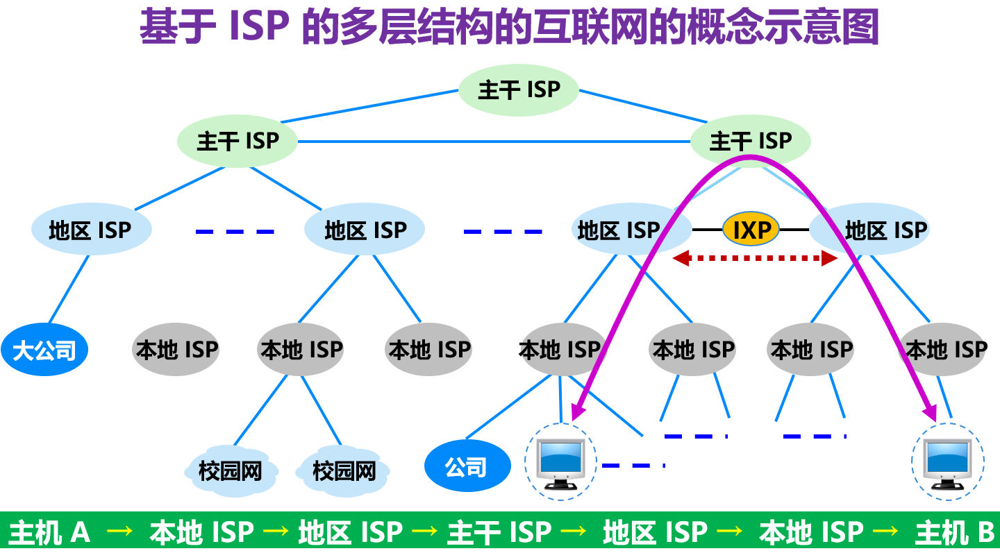
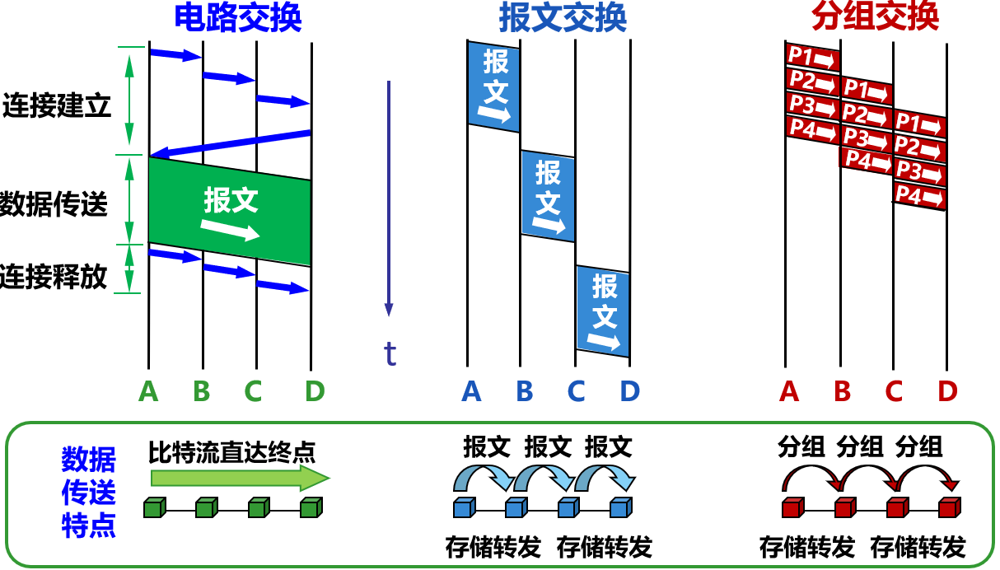
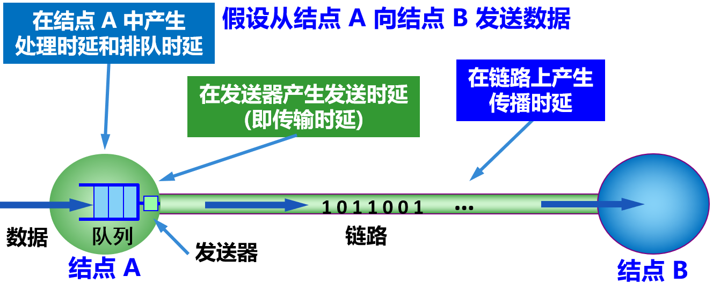
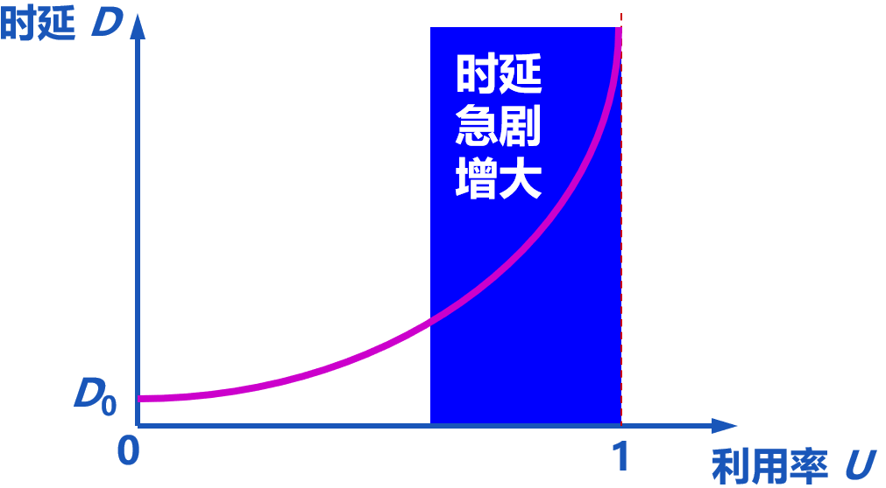
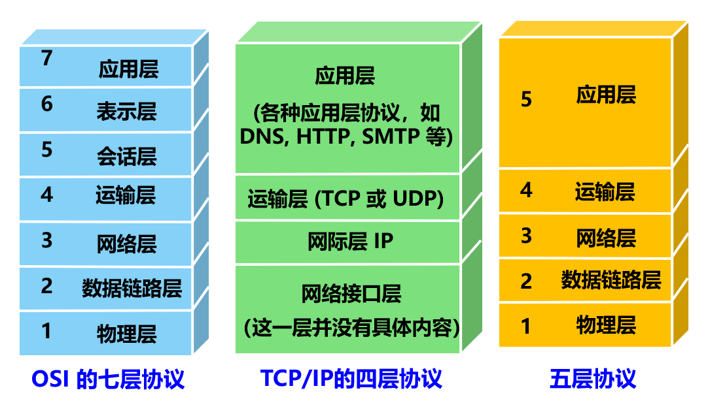
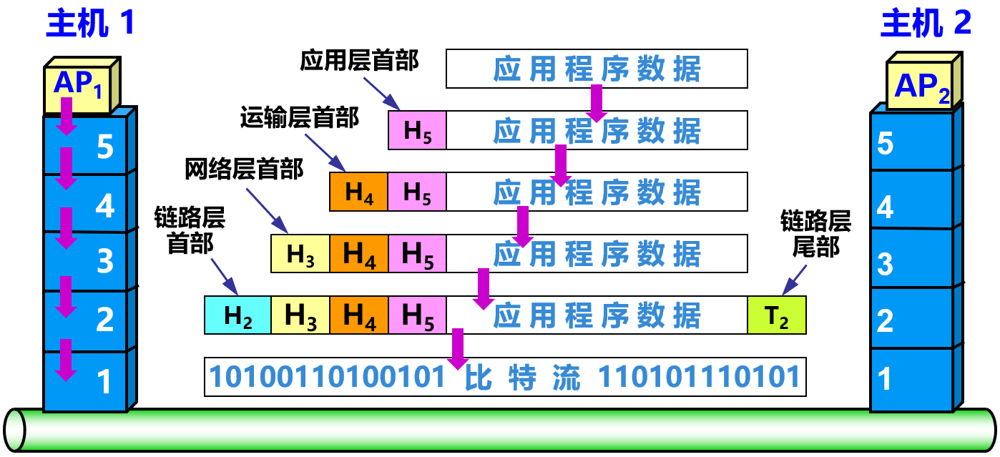
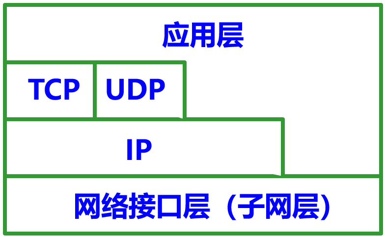
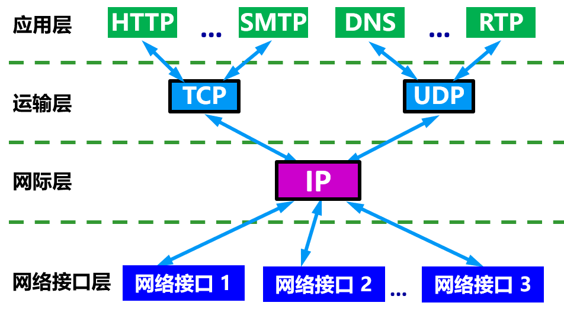

# 总结

本章是全书的概要

[toc]

# 1.计算机网络的作用

# 2.互联网Internet

## 2.1概述

计算机网络(简称为网络)

* 由若干结点(*node*)和连接这些结点的链路(*link*)组成
* 结点: 可以是计算机, 集线器, 交换机或路由器等

互连网(*internetwork*, *internet*)

* 由网络通过路由器互连起来
* 互连网, 是网络的网络(*network of network*)

因特网/互联网(*Internet*)

* 一种*internetwork*/互连网; 它起源于美国, 采用*TCP/IP*协议族作为通信规则, 是一个覆盖全球, 实现全球范围内连通性和资源共享的计算机网络
* 其前身是美国的*ARPANET*阿帕网
* 互连网和互联网的区别: *internet*和*Internet*
  * 互连网*internet*是一个概念
  * 互联网*Internet*是一个专用名词

主机(*host*)

* 与网络相连的计算机

### 互联网基础结构发展的三个阶段 

>  这三个阶段在时间划分上并非截然分开而是有部分重叠的, 这是因为网络的演进是逐渐的.

第一阶段: 从单个网络ARPANET向互连网发展的过程

* 1983 年, *TCP/IP*协议成为ARPANET上的标准协议, 使得所有使用*TCP/IP*协议的计算机都能利用互连网相互通信.
* 人们把 1983 年作为互联网的诞生时间
* 1990年, ARPANET正式宣布关闭

第二阶段: 建成了一个三级结构的互连网*NSFNET*

* 三级计算机网络, 分为主干网, 地区网和校园网(或企业网)
* 

第三阶段: 逐渐形成多层次*ISP*结构的互连网

* *ISP*(*Internet Service Provider*), 互联网服务提供者
* 任何机构和个人只要向某个*ISP*交纳规定的费用, 就可从该*ISP*获取所需IP地址的使用权, 并可通过该*ISP*接入到互联网
* 根据提供服务的覆盖面积大小以及所拥有的IP地址数目的不同, *ISP*也分成为不同层次的*ISP*: 主干*ISP*, 地区*ISP*和本地*ISP*
* *IXP*(*Internet eXchange Point*), 互联网交换点
* 

### 互联网的标准化工作(p8)

## 2.2互联网的组成

从互联网的工作方式上看, 可以划分为两大块:

* 边缘部分: 由所有连接在互联网上的主机组成. 这部分是用户直接使用的, 用来进行**通信和资源共享**(传送数据, 音频或视频)
* 核心部分: 由大量网络和连接这些网络的路由器组成. 这部分是为边缘部分提供服务的(**提供连通性和交换**)

### 互联网的边缘部分*

处在互联网边缘部分的是连接在互联网上的所有主机; 这些主机又称为端系统(*end system*)

* 端系统可以是
  * 一台普通个人电脑, 具有上网功能的智能手机, 甚至是一个很小的网络摄像头
  * 一台大型计算机

端系统之间通信:

* "主机 A 和主机 B 进行通信"实际上是指: "运行在主机A上的某个程序和运行在主机B上的另一个程序进行通信"
* 端系统的两种通信方式
  * 客户-服务器方式(Client/Server, C/S): 最常用的方式
    * 客户和服务器是指通信中所涉及的两个应用进程
    * 客户和服务器都要使用网络核心部分所提供的服务
    * 客户与服务器的通信关系建立后, 通信可以是双向的, 客户和服务器都可发送和接收数据
    * 客户程序是服务请求方
      1. 被用户调用后运行, 在通信时主动向服务器法其通信(请求服务). 因此, 客户程序必须知道服务器程序的地址
      2. 不需要特殊的硬件和很复杂的操作系统
    * 服务器程序是服务提供方
      1. 可同时处理多个请求
      2. 在系统启动后自动调用并一直不断地运行着, 被动地等待并接受客户的通信请求. 因此, 服务器程序不需要知道客户程序的地址
      3. 一般需要由强大的硬件和高级的操作系统支持
  * 对等连接方式(Peer-to-Peer, P2P)
    * 只要两台主机都运行P2P软件, 它们就可以进行平等的对等连接通信; 两个主机在通信时并不区分哪一个是服务请求方还是服务提供方
      * 双方都可以下载对方已经存储在硬盘中的共享文档
    * 对等连接方式从本质上看仍然是使用客户服务器方式, 只是对等连接中的每一个主机既是客户又是服务器
    * 对等连接方式可支持大量对等用户(如上百万个)同时工作

### 互联网的核心部分*

计算机数据的特点

* 突发性: 突然有数据传输, 突然没有
  * 导致在传送计算机数据时, 通信线路的利用率很低, 用来传送数据的时间往往不到10%甚至不到1%

互联网的核心部分采用分组交换技术

* 在网络核心部分起特殊作用的是一种专用计算机, 路由器(*router*)
  * 路由器是实现分组交换的关键构件, 用于转发收到的分组
  * 路由器与主机的区别
    * 主机为用户进行信息处理, 并可以和其他主机通过网络交换信息
    * 路由器用来转发分组

#### 交换技术

交换(*switching*)技术, 用于按照某种方式动态地分配传输线路的资源

典型的交换技术包括

* 电路交换
* 分组交换
* 报文交换

##### 电路交换

> 每一部电话都直接连接到交换机上, 而交换机使用电路交换技术, 让电话用户彼此之间可以很方便地通信

三个步骤
* 建立连接
  * 先拨号请求建立连接; 当被叫用户听到交换机送来的振铃音并摘机后, 从主叫端到被叫端建立了一条连接, 也就是一条专用的物理通路
    * 这条连接保证了双方通话时所需的通信资源, 而这些资源在双方通信时不会被其他用户占用
  * 若拨号呼叫时电信网的资源不足以支持这次的呼叫时, 主叫用户会听到忙音
* 通话
  * 建立连接后, 主叫和被叫双方就能进行通话
* 释放连接
  * 当通话完毕挂机后, 交换机释放刚才使用的这条专用物理通路

特点

* 在通话的全部时间内, 通话的两个用户始终占用端到端的通信资源
* 面向连接的

##### 分组交换packet switch

> 报文(*message*), 一整块需要发送的数据

过程

* 发送端
  * 先把较长的报文划分成为多个更小的等长数据段;
  * 然后, 在每个数据段前面加上header(包头, 首部), 这就构成一个packet(包, 分组)
    * 首部由一些必要的控制信息组成, 如目的地址和源地址
  * 然后依次发送各分组
* 结点交换机(如路由器)
  * 收到一个分组时, 先暂时存储, 并检查其首部, 查找转发表, 按照首部中的目的地址, 找到合适的接口转发出去, 把分组交给下一个计算机
    * 这过程被称为存储转发
  * 经过一个或多个结点交换机后, 以存储转发的方式把分组交付到目的主机
  * 注意
    * 各路由器之间必须经常交换彼此掌握的路由信息, 以便创建和动态维护路由器中的转发表, 使得转发表能够在整个网络拓扑发生变化时及时更新
* 接受端
  * 收到分组后, 从分组中还原成报文

说明

* 当分组正在某段链路上传送时才会占用该段链路的通信资源; 其他链路可为其他主机发送的分组使用
  * 因此在网络中可同时有多台主机进行通信
* 路由器可以在存储器(即内存)中暂存短分组, 保证了较高的交换速率
* 互联网采取一些措施, 保证数据的传送具有非常高的可靠性;
* 当网络中的某些结点或链路突然出现故障时, 在各路由器中运行的路由器选择协议(*protocol*)能够自动找到转发分组最适合的路径

问题

* 分组在各结点存储转发时需要排队, 这会造成一定的时延
* 分组必须携带首部, 这造成一定的开销

##### 报文交换

> 电报通信采用了基于存储转发原理的报文交换

报文交换的时延较长, 从几分钟到几小时不等

##### 比较

* 若要连续传送大量的数据, 且其传送时间远大于连接建立时间, 则电路交换的传输速率较快
* 报文交换和分组交换不需要预先分配传输带宽, 在传送突发数据时可提高整个网络的信道利用率
* 由于一个分组的长度往往远小于整个报文的长度, 因此分组交换比报文交换的时延小, 同时也具有更好的灵活性

# 3.计算机网络

> 计算机网络的精确定义并未统一

一种较好的定义: 计算机网络主要是由一些通用的可编程的硬件互连而成的, 而这些硬件并非专门用来实现某一特定目的(例如, 传送数据或视频信号). 这些可编程的硬件能够用来传送多种不同类型的数据, 并能支持广泛的和日益增长的应用

* 可编程的硬件, 表明这种硬件一定包含有CPU, 包括一般的计算机和智能手机

## 3.1类别

按照网络的作用范围分类

* 广域网(Wide Area Network, WAN), 也称为远程网(long haul network)
  * 作用范围通常为几十到几千公里
* 城域网(Metropolitan Area Network, MAN)
  * 作用范围一般是一个城市, 约为5~50公里; 通常采用以太网技术
* 局域网(Local Area Network, LAN)
  * 局限在较小范围(如1公里左右)
* 个人区域网(Personal Area Network, PAN), 无线个人区域网(Wireless PAN)
  * 大约10米作用的作用范围
* 注意: 若中央处理机之间的距离非常近(如1米的数量级或更小些), 则一般称之为多处理机系统, 而不称之为计算机网络

按照网络的使用者分类

* 公用网(public network): 按规定交纳费用的人都可以使用的网络
* 专用网(private network): 为特殊业务工作的需要而建造的网络

一类比较特殊的计算机网络: 接入网(Access Network, AN), 又称为本地接入网或居民接入网

* 用于将用户接入互联网
* 接入网本身既不属于互联网的核心部分, 也不属于互联网的边缘部分
* 接入网是从某个用户端系统到互联网中的第一个路由器(也称为边缘路由器)之间的一种网络
* 从覆盖的范围看, 很多接入网还是属于局域网
* 从作用上看, 接入网只是起到让用户能够与互联网连接的"桥梁"作用

## 3.2性能*

### 性能指标

#### 速率

* 即数据的传递速率; 又称为数据率(date rate), 比特率(bit rate)
  * 比特也是信息论中使用的信息量的单位
* 单位: bit/s, b/s, bps; 都表示比特每秒
  * k = 10^3 = 千, M = 10^4 = 兆
* 速率往往指的是额定速率或标称速率, 而不是网络实际上运行的速率

#### 带宽, bandwidth

* 带宽本来是指某个信号具有的频带宽度; 信号宽度是指该信号所包含的各种不同频率成分所占据的频率范围
  * 单位: Hz, 赫兹
* 在计算机网络中, 带宽是指在单位时间内网络中的某信道所能通过的最高数据率, 用来表示网络中某通道传送数据的能力
  * 单位: bit/s 比特每秒

#### 吞吐量(throughput)

* 表示在单位时间内通过某个网络(或信道, 接口)的数据量
* 吞吐量更经常地用于对现实世界中的网络的一种测量, 以便知道实际上到底有多少数据量能够通过网络
* 吞吐量受网络的带宽或网络的额定速率的限制

#### 时延(delay, latency)

* 指数据(一个报文或分组, 甚至比特)从网络(或链路)的一端传送到另一端所需的时间

* 又称为延迟或迟延

* 网络中的时延由以下几个不同的部分组成: 总时延=发送时延+传播时延+处理时延+排队时延

  * 发送时延/传输时延(transmission delay): 发送数据时, 数据帧从结点进入到传输媒体所需要的时间

    * 也就是从发送数据帧的第一个比特算起, 到该帧的最后一个比特发送完毕所需的时间
* 发生在机器内部的发送器中(如网络适配器)
    * $发送时延=\frac{数据帧(bit)}{发送速率(bit/s)}$
* 传播时延(propagation delay): 电磁波在信道中需要传播一定的距离而花费的时间
    * $传播时延=\frac{信道长度(m)}{电磁波在信道上的传播速率(m/s)}$
  * 电磁波在自由空间的传播速率是光速, 在网络传输媒体中的传播速率比在自由空间要略低一些
      * 1000km长的光纤线路产生的传播时延大约为5ms
* 处理时延: 主机或路由器在收到分组时, 为处理分组所花费的时间
    * 处理分组的操作, 有分析首部, 提取数据, 差错检验和查找路由等
  * 排队时延: 分组在路由器输入输出队列中排队等待处理所经历的时延
  * 

#### 时延带宽积, 以比特为单位的链路长度

* $时延带宽积 = 传播时延 \times 带宽$
* 表示链路可容纳多少个比特
* 只有在代表链路的管道都充满比特时, 链路才得到了充分利用

#### 往返时间(Round-Trip Time, RTT)

* 表示从发送方发送数据开始, 到发送方收到来自接收方的确认信息, 总共经历的时间
* 在互联网中, 往返时间还包括各中间结点的处理时延、排队时延以及转发数据时的发送时延
* 当使用卫星通信时, 往返时间 RTT 相对较长, 是很重要的一个性能指标

#### 利用率: 信道利用率和网络利用率

* 定义
  * 信道利用率: 某信道有百分之几的时间是被利用的(有数据通过)
    * 完全空闲的信道的利用率是零
  * 网络利用率: 全网络的信道利用率的加权平均值
* 时延与利用率的关系
  * 利用率并非越高越好; 根据排队论的理论, 当某信道的利用率增大时, 该信道引起的时延也就迅速增加
  * 若令$D_0$表示网络空闲时的时延, $D$表示网络当前的时延, $U$表示利用率(数值在0到1之间), 则在适当的假定条件下, 有: $D = \frac{D_0}{1 - U}$
    * 
    * 信道或网络的利用率过高会产生非常大的时延; 因此一些拥有较大主干网ISP通常控制信道利用率不超过50%, 如果超过了就要准备扩容, 增大线路的带宽

### 非性能指标

* 费用
* 质量
* 标准化
* 可靠性
* 可扩展性和可升级性
* 易于管理和维护

## 3.3体系结构*

### 计算机网络体系结构的形成

* 计算机网络是个非常复杂的系统, 所以提出了"分层"的方法: 可将庞大而复杂的问题, 转化为若干较小的局部问题，而这些较小的局部问题就比较易于研究和处理
* 1974 年, 美国的IBM公司宣布了系统网络体系结构SNA (System Network Architecture); 这个网络标准是按照分层的方法制定的
* 不久, 其他一些公司也相继推出自己公司的具有不同名称的体系结构
* 为了使不同体系结构的计算机网络都能互连, 国际标准化组织ISO于1977年成立了专门机构研究该问题
* 1983年, ISO形成了开放系统互连基本参考模型OSI/RM(Open Systems Interconnection Reference Model)
* 20世纪90年代初期, 由于基于TCP/IP的互联网已经抢先在全球相当大的范围成功低运行, OSI在市场化方面失败了
  * OSI是"法律上的国际标准"
  * 非国际标准TCP/IP获得最广泛的应用, 是"事实上的国际标准"

### 协议与划分层次

网络协议(*network protocol*), 简称为协议

* 明确规定在网络中所交换的数据的格式以及有关的同步问题
* 主要由以下三个要素组成
  * 语法: 数据与控制信息的结构或格式
  * 语义: 需要发出合中控制信息, 完成何种动作以及做出何种响应
  * 同步: 时间实现顺序的详细说明
* 协议的两种形式
  * 一种是使用便于人来阅读和理解的文字描述
  * 一种是使用便于人来阅读和理解的文字描述
  * 这两种形式的协议都必须能够对网络上的信息交换做出精确的解释

分层

* 各层通常所要完成的功能主要有以下一些(可以有一个或多个功能)
  * 差错控制: 使相应层次对等方的通信更加可靠
  * 流量控制: 发送端的发送速率必须使接收端来得及接收, 不要太快
  * 分段和重装: 发送端将要发送的数据块划分为更小的单位, 在接收端将其还原
  * 复用和分用: 发送端几个高层会话复用一条低层的连接, 在接收端再进行分用
  * 连接建立和释放: 交换数据前先建立一条逻辑连接，数据传送结束后释放连接
* 说明
  * 某一层不知道它的下一层的实现细节, 而仅仅通过层间的接口使用所提供的服务
  * 每一层只实现一种相对独立的功能

* 好处
  * 各层之间是独立的
  * 灵活性好
  * 结构上可分隔开
  * 易于实现和维护
  * 能促进标准化工作
* 缺点
  * 效率降低
  * 有些功能会在不同的层次中重复出现, 因而产生了额外开销

### 体系结构architecture的定义

计算机网络的体系结构, 是计算机网络的各层及其协议的集合

* 也就是说, 某个计算机网络的体系结构就是这个计算机网络及其部件所应完成的功能的精确定义
* 体系结构是抽象的, 而计算机网络的实现则是具体的
* 计算机网络的实现在遵循对应的体系结构下使用具体的硬件和软件完成这些功能

### 具有五层协议的体系结构

在学习计算机网络的原理时通常采用一种只有五层协议的体系结构进行说明; 原因是

* OSI的七层协议体系结构的概念清楚，理论也较完整，但它既复杂又不实用
* TCP/IP是四层体系结构: 应用层, 运输层, 网际层和网络接口层; 但最下面的网络接口层并没有具体内容
* 这种五层协议的体系结构综合OSI和TCP/IP的优点

五层协议的体系结构

* 应用层Application Layer
  * 任务: 通过应用进程间的交互来完成特定网络应用
  * 应用层协议定义的是应用进程间通信和交互的规则
    * 在互联网中的应用层协议有: 域名系统DNS, 支持万维网应用的HTTP协议, 支持电子邮件的SMTP协议等
  * 应用层交互的数据单元, 被称为报文(message)
* 运输层Transport Layer
  * 任务: 向两台主机中进程之间的通信提供通用的数据传输服务
  * 由于一台主机可同时运行多个进程, 因此运输层有复用和分用的功能
  * 运输层主要使用以下两种协议
    * 传输控制协议TCP(Transmission Control Protocol)
      1. 提供面向连接的, 可靠的数据传输服务
      2. 其数据传输的单位是报文段(segment)
    * 用户数据报协议UDP(User Datagram Protocol)
      1. 提供无连接的, 尽最大努力(best-effort)的数据传输服务(不保证数据传输的可靠性)
      2. 其数据传输的单位是用户数据报
* 网络层Network Layer
  * 任务: 
    * 为分组交换网上的不同主机提供通信服务
      * 在发送数据时, 网络层把运输层产生的报文段或用户数据报封装成分组或包进行传送
    * 选择合适的路由, 使得源主机运输层所传下来的分组, 能更通过网络中的路由器找到目的主机
  * 在TCP/IP体系中, 由于网络层使用IP协议, 因此分组也叫做IP数据报, 或简称为数据报
  * 互联网使用的网络层协议是无连接的网际协议(Internet Protocol, IP)和许多种路由器选择协议
    * 因此, 互联网中的网络层也叫做网际层或IP层
* 数据链路层Data Link Layer, 又称链路层
  * 任务: 将网络层的IP数据报**组装成帧**(framing)
    * 每一帧包括数据和必要的控制信息(如同步信息, 地址信息, 差错控制等)
  * 链路层所传的数据单元是帧
  * 控制信息的作用: 
    * 使接收端能够知道一个帧从哪个比特开始和到哪个比特结束
    * 可以使得接收端能够检测到所收到的帧中有无差错; 如发现有差错, 数据链路层可以简单地丢弃该帧, 或进行纠正差错
* 物理层Physical Layer
  * 任务：
    * 考虑用多大的电压代表1或0, 以及接收方如何识别发送方所发送的比特
    * 确定连接电缆的插头应当有多少根引脚以及各引脚应如何连接
  * 物理层所传的数据单元是比特
  * 注意: 传递信息所利用的物理媒体, 如双绞线, 同轴电缆等, 并不在物理层协议之内而是在物理层协议下面
    * 因此, 有人把物理层下面的物理媒体当作第0层

例子:  主机1向主机2发送数据

* OSI参考模型把对等层次之间传送的数据单位称为该层的协议数据单元(Protocol Data Unit, PDU); 这个名词被许多非OSI标准采用

### 实体, 协议, 服务和服务访问点

实体(entity)

* 定义: 任何可发送或接受信息的硬件或软件进程
* 在许多情况下,  实体是一个特定的软件模块

协议

* 协议是控制两个(或多个)对等实体进行通信的规则的集合
* 在协议的控制下, 两个对等实体间的通信使得本层能够向上一层提供服务
* 要实现某一层协议, 还需要使用下面一层所提供的服务

服务与协议的差异

* 协议的实现保证了能够向上一层提供服务
* 使用本层服务的实体只能看见服务而无法看见下面的协议
  * 即下面的协议对上面的实体是透明的
* 协议是"水平的", 即协议是控制对等实体之间通信的规则
* 服务是"垂直的", 即服务是由下层向上层通过层间接口提供的

服务访问点(Service Access Point, SAP)

* 定义: 同一系统相邻两层的实体进行交互的地方
* OSI把层与层之间交换的数据的单位称为服务数据单元(Service Data Unit, SDU)

### TCP/IP的体系结构

实际上, 现在的互联网使用的TCP/IP体系结构有时已经发生了演变, 即某些应用程序可以直接使用 IP 层, 或甚至直接使用最下面的网络接口层

分层次画出具体的协议来表示TCP/IP协议族

* everything over IP: TCP/IP协议可以为各式各样的应用提供服务
* IP over everything: IP协议可以在各式各样的网络构成的互联网生运行

## 3.4计算机网络在我国的发展(p17)