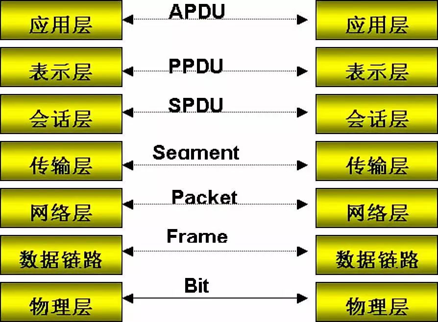

# 计算机网络

[计算机网络基础](https://www.runoob.com/w3cnote/summary-of-network.html#:~:text=%E8%AE%A1%E7%AE%97%E6%9C%BA%E7%BD%91%E7%BB%9C%E5%AD%A6%E4%B9%A0%E7%9A%84,%E8%8B%A6%E9%80%BC%E7%9A%84%E5%AD%A6%E4%B9%A0%E8%8B%B1%E8%AF%AD%E3%80%82)

[OSI七层模型详解](https://cloud.tencent.com/developer/article/1553405)

## OSI七层模型, TCP/IP五层模式, 及其对应关系

OSI七层模型的说明

* 物理层: 该层为上层协议提供了一个传输数据的可靠的物理媒体
  * 简单的说，物理层确保原始的数据可在各种物理媒体上传输
  * 两种重要的设备: 中继器和集线器
* 数据链路层: 将本质上不可靠的传输媒体变成可靠的传输通路提供给网络层
  * 链路连接的建立，拆除，分离
  * 帧定界和帧同步
  * 差错检测和恢复
* 网络层: 
  * 解决把任意两台数据终端设备的数据链接起来的问题
  * 逻辑信道技术和虚拟电路技术

* 传输层:
  * 传输层也称为运输层.传输层只存在于端开放系统中,是介于低3层通信子网系统和高3层之间的一层,但是很重要的一层.因为它是源端到目的端对数据传送进行控制从低到高的最后一层.

## TCP协议(三次握手,四次挥手)

## TCP协议和UDP协议的区别是什么

* TCP协议是有连接的，有连接的意思是开始传输实际数据之前TCP的客户端和服务器端必须通过三次握手建立连接，会话结束之后也要结束连接。而UDP是无连接的
* TCP协议保证数据按序发送，按序到达，提供超时重传来保证可靠性，但是UDP不保证按序到达，甚至不保证到达，只是努力交付，即便是按序发送的序列，也不保证按序送到
* TCP协议所需资源多，TCP首部需20个字节（不算可选项），UDP首部字段只需8个字节
* TCP有流量控制和拥塞控制，UDP没有，网络拥堵不会影响发送端的发送速率
* TCP是一对一的连接，而UDP则可以支持一对一，多对多，一对多的通信
* TCP面向的是字节流的服务，UDP面向的是报文的服务。

## http与https

[HTTP和HTTPS协议](https://blog.csdn.net/xiaoming100001/article/details/81109617)

- HTTPS是HTTP协议的安全版本，HTTP协议的数据传输是明文的，是不安全的，HTTPS使用了SSL/TLS协议进行了加密处理。
- http和https使用连接方式不同，默认端口也不一样，http是80，https是443。

# 操作系统

## 线程与进程

1. 进程是资源分配的基本单位; 线程是程序执行时的最小单位，它是进程的一个执行流，是CPU调度和分派的基本单位
2. 同一程序中的所有线程均会独立执行相同程序，且共享同一份全局内存区域，其中包括初始化数据段（initialized data）、未初始化数据段（uninitialized data），以及堆内存段（heap segment）
3. 线程的调度与切换比进程快很多

## 进程间通信

管道(pipe)

* 命名管道(FIFO)
* 匿名管道(PIPE)

套接字(socket)

XSI(system V)

* 消息队列
* 信号量数组
* 共享内存

## 线程间通信

锁

* 互斥锁
* 自旋锁
* 读写锁
* 条件变量

信号量（semaphore)

信号(single): 在一个单进程中，信号会打断进程的执行，并且递送到进程中处理，而对于多线程环境，信号会递送给其中的一个线程，这个被递送的线程是不确定的

* 每个线程有自己的信号屏蔽字

## linux常见命令

man

ls

uname

sudo

mkdir

touch

chmod, chown

cat

cp

mv

pwd

cd

