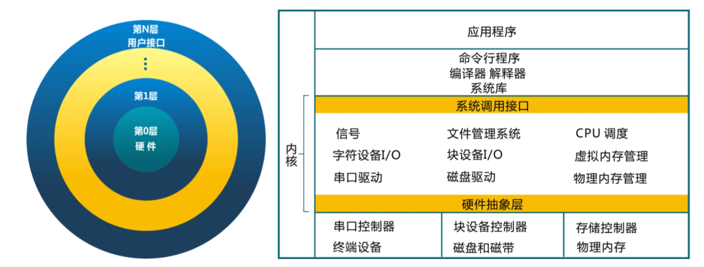
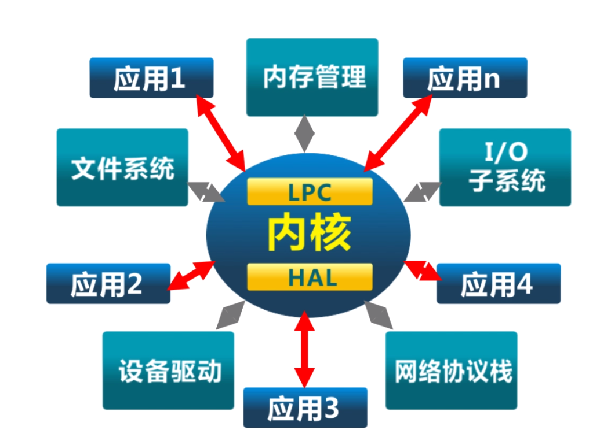
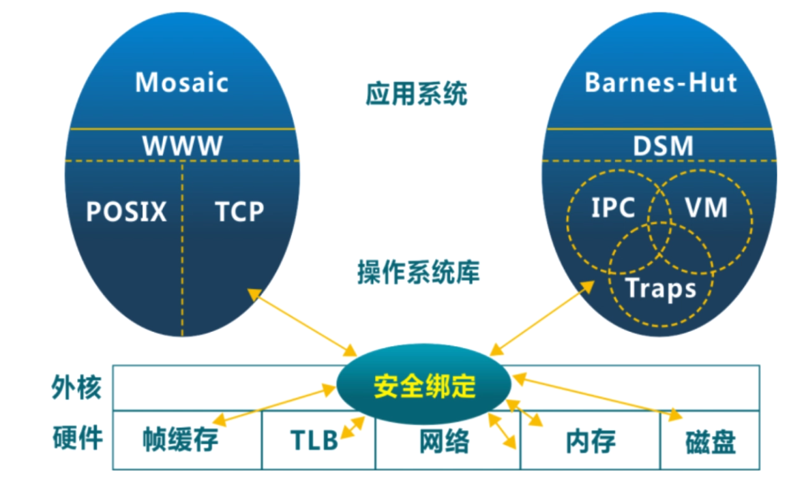
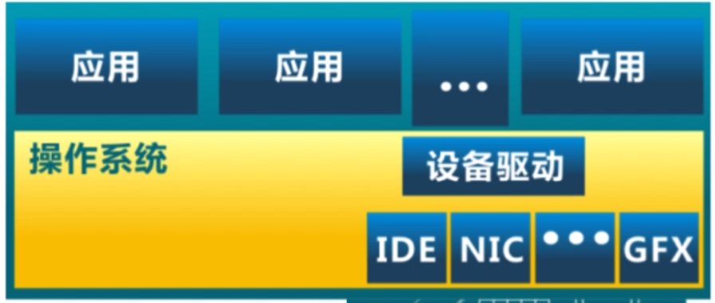

# 操作系统

* 定义: 一个程序
  *  控制其他程序
    * 控制其他程序执行过程
    * 给程序提供服务
    * 方便用户使用计算机系统
  * 管理资源
    * 应用与硬件之间的中间层
    * 管理软硬件之间的资源
    * 提供高效访问手段
    * 解决访问冲突

* 操作系统的软件分类
  * 命令行
  * gui
  * kernel
* 抽象
  * cpu<->进程
  * 磁盘<->文件
  * 内存<->地址空间

* 特征
  * 并发: 同时存在多个运行程序
  * 共享: 程序间"同时" 访问互斥共享各种资源
  * 虚拟: 每个程序"独占"一个完整的计算机
  * 异步: 服务的完成时间不确定, 也可能失败

## 操作系统的实例

* `multics os`: 当今操作系统的鼻祖
* `unix`家族: 学院, 公司
* `linux`家族: 开源社区
* `MacOS`家族
* `Windows`家族
* `Android`
* `Fuchsia`

## 历史

* 单用户系统(1945-1955)
* 批处理系统(1955-1965): 操作系统的雏形
* 多道程序系统(1955-1980): 内存
* 分时系统(1970-)
* 机器成本降低, 个人电脑出现(1981)
* 分布式系统(1990-)
* AIoT系统(2000-)

## 结构发展

* 简单结构: `MS-DOS`(1981-1994), 在最小空间中提供大部分功能

  * 

* 单体分层结构: 将单体操作系统划分为多层

  * 

*  微内核结构: 尽可能把内核功能移到用户空间; 灵活, 安全但效率差

  * 

* 同一个时段

  * 外核结构Exokernel: `libOS`

    * 

  * 虚拟机结构VMM
    * 

    * 每个虚拟机中

      

## 关键和挑战

* 关键问题
  * 并发
  * 操作系统庞大
  * 管理硬件
  * 高效, 低耗能, 安全可靠
* 系统思维
  * 权衡资源: 时间与空间
  * 软硬协同

# 学术资源

学术研究协会

* sosp, osdi, hotos
* acm, sogops, hall-of-fame awards

* usenix, usenix-atc