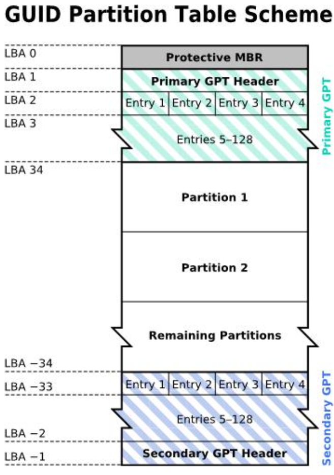

[toc]

# 1. 概要

学习Linux的基础

1. 计算机概论与硬件相关知识
2. Linux的安装与命令
3. Linux操作系统的基础技能
4. vi文本编辑器
5. Shell与Shell脚本
6. 软件管理
7. 网络基础

# 2. 主机规划与磁盘分区

在Linux系统中, 几乎所有的硬件设备文件都在`/dev`目录内

| 常见设备                  | 设备在Linux中的文件名(常用)                              |
| ------------------------- | -------------------------------------------------------- |
| SCSI, SATA, USB磁盘驱动器 | `/dev/sd[a-p]`                                           |
| USB闪存盘                 | `/dev/sd[a-p]`                                           |
| Virtio接口                | `/dev/vd[a-p]`(用于虚拟机内)                             |
| 软盘驱动器                | `/dev/fd[0-7]`                                           |
| 打印机                    | `/dev/lp[0-2]`(25针打印机), `/dev/usb/lp[0-15]`(USB接口) |
| 鼠标                      | `/dev/input/mouse[0-15]`, `/dev/psaux`, `/dev/mouse`     |

* 详见: [Linux支持的设备及其文件名](https://www.kernel.org/doc/html/v4.20/admin-guide/devices.html)

物理机器中大部分会使用`/dev/sd[a-p]`的磁盘文件名, 而虚拟机环境中, 为了加速就可能使用`/dev/vd[a-p]`

* 为了统一处理, 大部分Linux发行版以及将IDE接口的磁盘文件名模拟成跟SATA一样的
* 对于SATA, USB, SAS等磁盘接口都是使用SCSI模块来驱动的; 至于如何决定它们的设备文件名, 是根据Linux内核检测到磁盘的顺序来命名

## 2.1 磁盘分区

磁盘分区的意义

* 数据安全: 一个分区中的数据与其他分区中的数据是相互独立的
* 性能:
  * 分区使得数据集中在某个磁盘柱面区段中, 使得数据的读取更加高效

磁盘的分区表格式

* MBR(Master Boot Record, 主引导记录): 以磁盘的一个柱面为单位进行记录
  * 在磁盘的第一个扇区中存储了一个MBR和一个分区表
    * MBR是用于安装启动引导程序的地方, 大小通常为446字节
    * 分区表是记录整块硬盘分区的状态, 大小通常为64字节
  * 最大支持2.2TB磁盘(在一个扇区的大小是512字节且逻辑地址是32位的情况下)
  * 主分区和扩展分区, 一共最多能有4个(硬盘的限制)
  * 最多只能由一个扩展分区(操作系统的限制)
  * 逻辑分区是由扩展分区持续划分出来的分区
  * 扩展分区无法被格式化, 因为扩展分区可能有多个逻辑分区
* GPT(GUID partition table, GUID分区表): 以一个LBA(Logical Block Address)为单位进行记录
  * 使用34个LBA块来记录分区信息, 并在磁盘中最后使用34个LBA作为备份
  * LBA(逻辑区块地址)的区块默认为512字节
  * GPT的规划图
    * LBA0(MBR兼容区块): 与MBR类似, 存储了第一个阶段的启动引导程序; 在MBR分区表的记录区中仅放入一个特殊标志符, 以表示此磁盘为GPT格式, 并使得不懂GPT分区表的磁盘管理程序无法认识该磁盘
      * 若使用类似grub的启动程序时, 需要额外划分出一个`BIOS boot`的分区, 以防止其他开机过程所需的程序
    * LBA1(GPT表头记录): 记录分区表本身的位置与大小, 同时记录备用的GPT分区和校验码(CRC32)
    * LBA2~33(实际记录分区信息的区域): 从LBA2开始, 每个LBA都可以记录4组分区记录; 每组记录的大小为128字节, 其中分别使用64位来记载开始/结束的扇区号码

## 2.2 启动检测程序: BIOS与UEFI

在启动时, 计算机系统首先会执行一个程序, 被称为启动检测程序; 而这种程序主要有早期的BIOS, 和后来的UEFI两种机制

| 比较项目       | BIOS                                                  | UEFI                                  |
| -------------- | ----------------------------------------------------- | ------------------------------------- |
| 名字           | Basic input/output system                             | Unified extensible firmware interface |
| 使用程序语言   | 汇编语言                                              | C语言                                 |
| 硬件资源控制   | 使用中断管理; 不可变的内存存取; 不可变的输入/输出存取 | 使用驱动程序与协议                    |
| 处理器运行环境 | 16位                                                  | CPU保护模式                           |
| 扩充方式       | 通过IRQ连接                                           | 直接加载驱动程序                      |
| 第三方厂商支持 | 较差                                                  | 较佳且可支持多平台                    |
| 图形能力       | 较差                                                  | 较佳                                  |
| 内置简化OS环境 | 不支持                                                | 支持                                  |

BIOS加上MBR(或GPT)的启动流程

* 在启动时执行BIOS
* BIOS可以进行以下工作
  * 自诊断: 通过读取CMOS中的内容识别硬件配置, 并对齐进行自检和初始化
  * 系统自动装载程序: 在自检成功后, 根据启动顺序, 读取某个设备的第一扇区(即MBR), 然后执行其中的启动引导程序 
  * CMOST设置
  * 基本的I/O驱动程序和中断服务
* 启动引导程序可以进行以下工作: 启动引导程序是在操作系统安装在MBR上面的一个软件
  * 加载内核文件: 若分区表为GPT格式, 需要启动引导程序支持GPT
  * 转交其他启动引导程序: 将启动管理功能转交给其他启动引导程序负责;
    * 每个分区都可以拥有自己的启动扇区; 启动扇区是该分区的第一个扇区, 其中存储VBR(Volume Boot Record)

## 2.3 安装Linux前的规划

* 选择适当的Linux发行版
* 根据主机的用途选择合适的硬件
* 主机硬盘的规划

# 3. Linux的基本使用

在终端中使用命令: `COMMAND [option] [arg1] [arg2] ... `

| 命令   | 作用                       |
| ------ | -------------------------- |
| `date` | 显示/设置日期与时间        |
| `cal`  | 显示日历                   |
| `bc`   | 简单的计算器               |
| `man`  | 查看某个命令的手册(manual) |
| `info` |                            |

shell中重要的热键

* `[Tab]`: 在bash shell中该键具有命令补全与文件名补齐的功能, 在某些特殊的命令下也具有参数/选项补齐的功能
* `[Ctrl]-c`: 中断目前程序
* `[Ctrl]-d`: 键盘输入EOF(End Of File)
  * EOF表示文件的结束
* `[Shift]+{[Page UP] | [Page Down]}`: 往前/后翻

命令/可执行文件的说明文档

* `--help`, `-h`选项

* man page: 通常在`/usr/share/man`目录中
* info page: 通常在`/usr/share/info`目录中
* 其他文档: 通常在`/usr/share/doc/`目录中

由一般用户变为root用户

* `su -`, `sudo -i`

正确的关机/重启方法

1. 观察系统的使用状态:
   * 使用`who`命令查看哪些用户在线
   * 使用`netstat`命令查看网络的联机状态
   * 使用`ps -aux`命令查看后台执行的生效
2. 通知在线用户关机的时刻, 给在线用户一些时间来结束他们的工作
   * `shutdown`命令可以达到该功能
3. 将数据同步写入硬盘: `sync`命令
4. 正确使用关机/重启命令: 
   * `shutdown`, `reboot`, `halt`, `poweroff`
   * `init`
   * `systemctl`